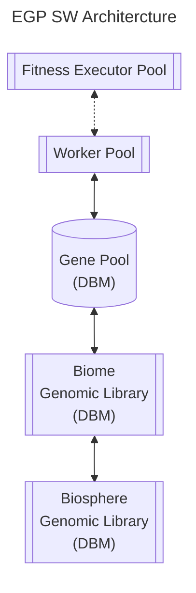

# Erasmus Genetic Programming - Architecture

## Top Level

TBD: K8s, Namespaces?

The entry point to the system is a worker. Workers are independent containers, gathered in a pool and maintain no state. Workers *may* use an independent fitness executor to evaluate genetic codes but can also be configured to work on predefined problems locally. Typically local evaluation is only done when the overhead of using a remote fitness executor significantly slows down the system. Fitness executors are also arranged in a pool, are independent containers and also maintain no state.

Workers retrieve genetic codes from the Gene Pool which is a postgres database managed by an EGP DB Manager. Whilst a pool of workers may connect to many Gene Pools a worker must connect to exactly one as defined by its configuration. Gene Pools are intended to be performant and should be implemented local to workers with fast persistent storage. In the absense of a Microbiome Genomic Library the Gene Pool is populated with the default set of GC's shipped with the version of the EGP DB Manager installed.

The Gene Pool may connect to a Genomic Library as a source and store of GC's  --- NEED TO THINK ABOUT THIS: HOW DO WE STAY COHERENT?

## Startup

At least the worker pool and the Gene Pool must be started before any evolution can take place.

## Storage

The (crude) intent of storage scale design in Erasmus GP is to *be able to* manage up to:

- Worker 1st level cache: 1MB
- Worker 2nd level cache: 1GB
- Gene Pool: 1TB
- Gene Pool archive: 1PB
- Biome: 1PB

Obviously implementation details (such as storage medium capacity) will impose its own, and likely lower, limits.
