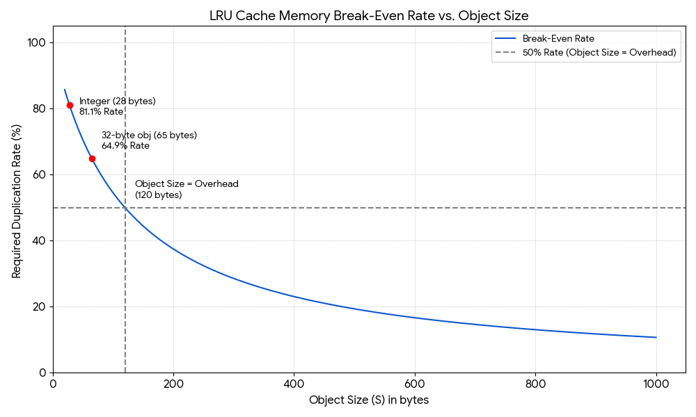

# **Analysis: Using lru\_cache for Object Deduplication and Memory Efficiency**

## **1\. Introduction: The Problem**

We explored using @functools.lru\_cache to deduplicate immutable objects (like bytes or int) in memory. The goal is to have multiple references to an object with the same value point to the *same* object in memory, thus saving space.

However, lru\_cache is not a "free" operation. The cache itself has a significant memory footprint. This analysis calculates the "break-even point" where the memory saved by deduplication equals the memory cost of the cache itself.

## **2\. Analyzing the Cache's Memory Overhead**

The lru\_cache (when typed=False) is implemented internally as a dictionary (for fast key lookups) and a doubly linked list (to track the "Least Recently Used" order). Both of these structures have a fixed memory overhead *per entry*, completely separate from the object you are storing.

* **Dictionary Overhead:** A hash table's entry.  
* **Linked List Overhead:** Each entry is a list like \[PREV, NEXT, KEY, RESULT\].

Based on our calculations, this fixed overhead is approximately **120 bytes per cache entry**.

This means that to store a 28-byte integer, the cache actually uses:  
28 bytes (for the int) \+ 120 bytes (for the overhead) \= 148 bytes  
This overhead is the "cost" we must pay back through deduplication.

## **3\. The Break-Even Formula**

The memory break-even point is reached when:  
Memory\_Saved \= Memory\_Overhead\_of\_Cache  
This can be expressed as a simple formula for the **required duplication rate (R)** as a function of the **object's size (S)**:

**Break-Even Rate (R) \= 120 / (S \+ 120\)**

This rate represents the percentage of your function calls that must be "hits" (i.e., duplicates) to justify the cache's 120-byte-per-item memory cost.

## **4\. Analysis of Break-Even Rate vs. Object Size**

The plot below visualizes this relationship.

*Figure: Break-even duplication rate R = 120 / (S + 120) vs object size S.*

### **Key Insights from the Chart:**

1. **Small Objects are Very Expensive to Cache:**  
   * A 28-byte integer (S=28) has a break-even rate of 120 / (28 \+ 120\) \= 81.1%.  
   * You would need over 81% of your calls to be duplicates just to *not lose* memory.  
2. **The 50% Break-Even Mark:**  
   * The rate is exactly 50% when the object's size (S) is equal to the overhead (120 bytes).  
   * If your objects are larger than 120 bytes, you need less than 50% duplicates to save memory.  
3. **Large Objects are "Cheaper" to Cache:**  
   * For a 1000-byte object, the rate is 120 / (1000 \+ 120\) \= 10.7%.  
   * Here, the 120-byte overhead is small in comparison, so even a low duplication rate saves memory.

## **5\. Conclusion and Recommendations**

Using lru\_cache for memory deduplication is a trade-off. It is **not** a guaranteed memory saver.

* **Recommended Use:**  
  * Caching **large objects** (e.g., \> 1KB) where even a low duplication rate is a clear memory win.  
  * Caching objects with a **provably high duplication rate** (e.g., \>80-90%) where you have many repeating small values.  
* **Warning:**  
  * **Do not** use lru\_cache on functions that produce many *unique*, *small* objects. You will not save any memory and will, in fact, add significant overhead (120 bytes for every object).  
* **How to Verify:**  
  * In a real application, use the .cache\_info() method on your cached function.  
  * Check the hits and misses. A high hit ratio (relative to your object's size, per the chart) is a good sign. A low hit ratio means you are likely wasting memory.
  