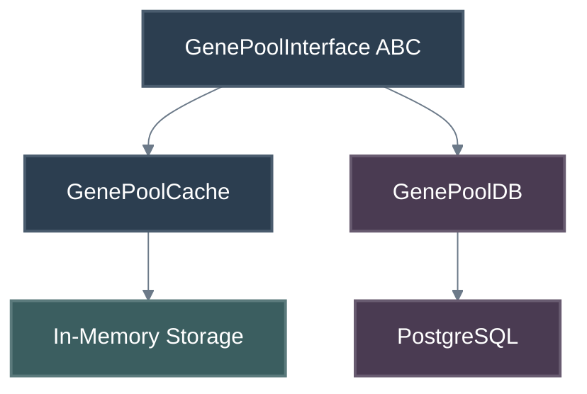

# Gene Pool Design

The Gene Pool provides the storage and retrieval layer for Genetic Codes (GCs)
within the Erasmus GP system.

## Overview

The Gene Pool is accessed through the `GenePoolInterface` abstract base class,
which defines the standard API for storing, retrieving, and managing GCs.
Concrete implementations include in-memory caches and PostgreSQL-backed
persistent stores.

## Architecture

## Key Components

- **GenePoolInterface**: ABC defining `get`, `put`, `delete`, and query operations.
- **GenePoolCache**: In-memory implementation for fast local access.
- **GenePoolDB**: Persistent implementation backed by PostgreSQL via `egpdb`.
