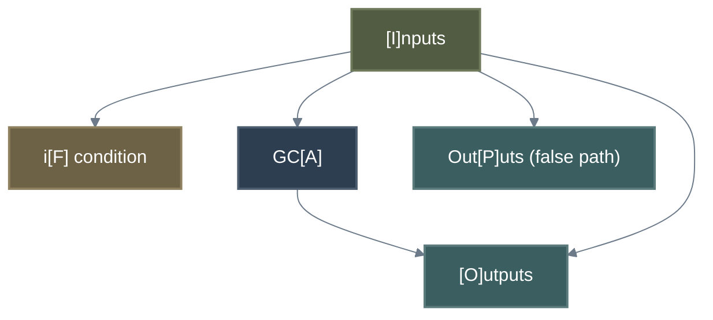
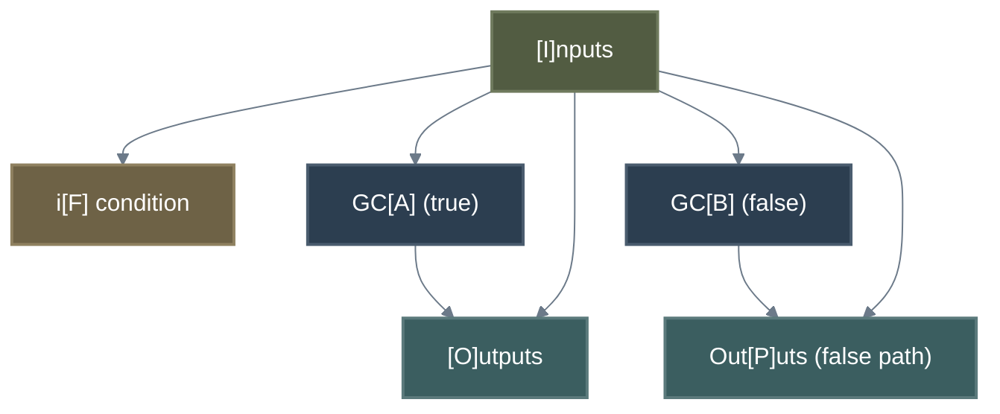
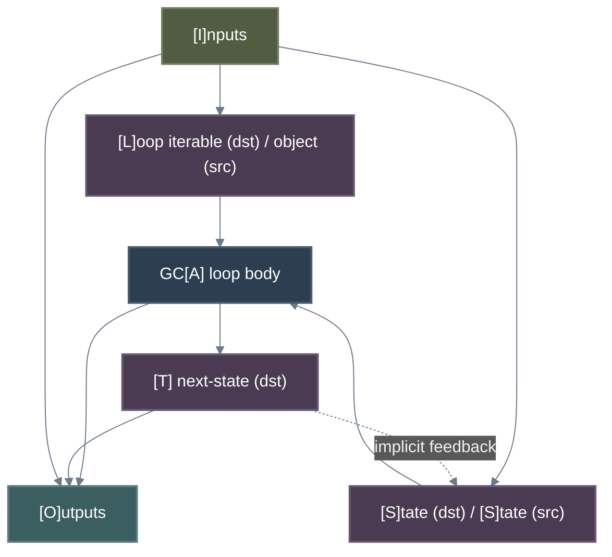
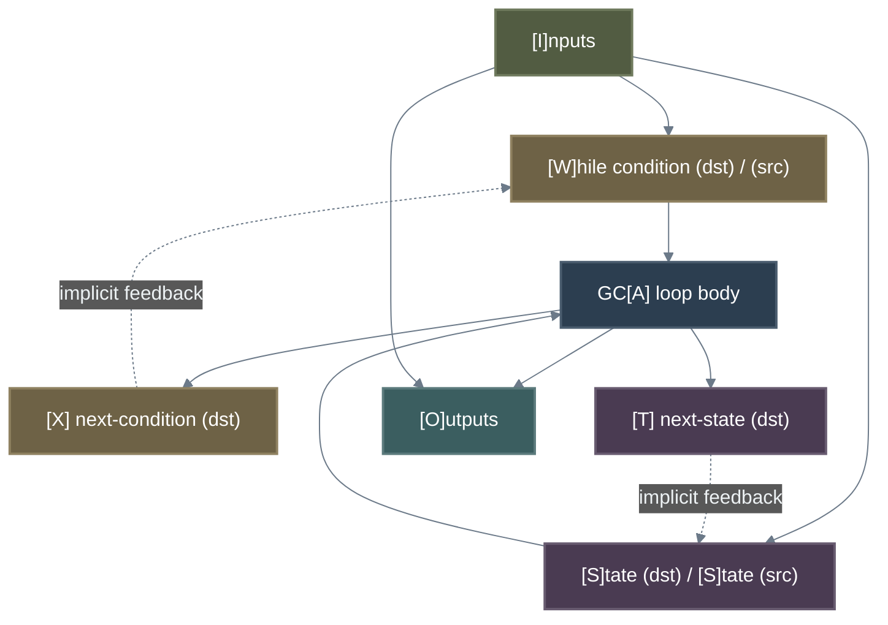
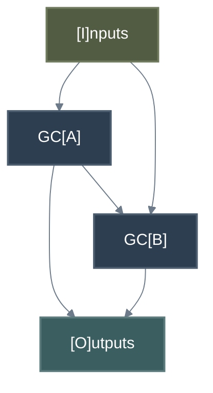
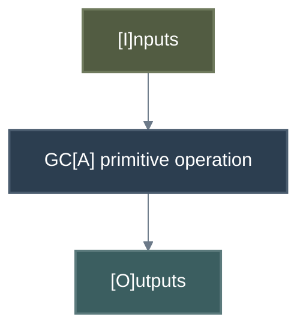
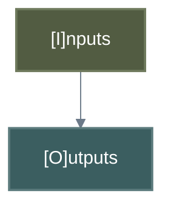

# Connection Graphs

A Genetic Code graph defines how values from the GC input are passed to sub-GC's and outputs from sub-GC's
(and directly from the input) are connected to the GC's outputs. There are 7 types of Connection Graph.

| Type | GC Type | Comments |
| :--- | :--- | :--- |
| **If-Then** | Ordinary | Conditional graph with a single execution path (GCA) chosen when condition is true. |
| **If-Then-Else** | Ordinary | Conditional graph with two execution paths (GCA/GCB) chosen based on condition. |
| **Empty** | Ordinary | Defines an interface. Has no sub-GCs and generates no code. Used to seed problems. |
| **For-Loop** | Ordinary | Loop graph that iterates over an iterable, executing GCA for each element. |
| **While-Loop** | Ordinary | Loop graph that executes GCA while a condition remains true. |
| **Standard** | Ordinary | Connects two sub-GC's together to make a new GC. This is by far the most common type. |
| **Primitive** | Codon, Meta | Simplified graph representing a primitive operator (e.g., addition, logical OR). Has no sub-GC's. |

## Row Requirements

All Connection Graphs may have either an input interface or an output interface or both but cannot have neither.
GC's with just inputs store data in memory, more persistent storage or send it to a peripheral. GC's that
just have an output interface are constants, read from memory, storage or peripherals.

### Row Definitions

* **I** = Input interface (source)
* **F** = Condition evaluation destination (for conditionals)
* **L** = Loop iterable destination (for loops) and loop object source
* **S** = Loop state destination (input) and source (output) - for both loop types
* **T** = Loop next-state destination - for both loop types
* **W** = While loop condition state destination (input) and source (output) - boolean only
* **X** = While loop next-condition destination - boolean only
* **A** = GCA input (destination) / GCA output (source)
* **B** = GCB input (destination) / GCB output (source)
* **O** = Output interface (destination)
* **P** = Alternate output interface (destination) - used when condition is false. (Not used for loops).
* **U** = Unconnected source endpoints (destination) - JSON format only

Note that row *P* only exists logically. It is the same interface as row O i.e. the functions return value (which is why it must have the same structure as row O), but the execution path to the physical return interface is different for row *O* and row *P* allowing conditional execution.

Similarly, rows *T* and *X* are semantically identical to *S* and *W* respectively, but serve as destination endpoints for loop body outputs while *S* and *W* serve as source endpoints providing state to the loop body. The implicit feedback connection from *Td→Ss* and *Xd→Ws* between iterations is handled in code generation, not the connection graph.

| Type | I | F | L | S | T | W | X | A | B | O | P | U |
| :--- | :--- | :--- | :--- | :--- | :--- | :--- | :--- | :--- | :--- | :--- | :--- | :--- |
| **If-Then** | X | X | - | - | - | - | - | X | - | M | M | m |
| **If-Then-Else** | X | X | - | - | - | - | - | X | X | M | M | m |
| **Empty** | o | - | - | - | - | - | - | - | - | o | - | m |
| **For-Loop** | X | - | X | m | m | - | - | X | - | M | - | m |
| **While-Loop** | X | - | - | m | m | X | X | X | - | M | - | m |
| **Standard** | o | - | - | - | - | - | - | X | X | o | - | m |
| **Primitive** | o | - | - | - | - | - | - | X | - | o | - | - |

* **X** = Must be present i.e. have at least 1 endpoint for that row.
* **-** = Must *not* be present
* **o** = Must have at least 1 endpoint in the set of rows.
* **M** = May be present and must be the same on each row.
* **m** = May be present.

## Connectivity Requirements

Empty and Primitive graphs have limited connections. If-Then, If-Then-Else, For-Loop, While-Loop, and Standard graphs have connections between row interfaces but not all combinations are permitted. In the matrix below the source of the connection is the column label and the destination of the connection is the row label.

| Dst\Src | I | L | S | W | A | B |
| :--- | :--- | :--- | :--- | :--- | :--- | :--- |
| **F** | IT,IE | - | - | - | - | - |
| **L** | FL | - | - | - | - | - |
| **S** | FL,WL | - | - | - | - | - |
| **T** | - | - | - | - | FL,WL | - |
| **W** | WL | - | - | - | - | - |
| **X** | - | - | - | - | WL | - |
| **A** | IT,IE,FL,WL,S,P | FL | FL,WL | WL | - | - |
| **B** | IE,S | - | - | - | S | - |
| **O** | IT,IE,FL,WL | - | - | - | IT,IE,FL,WL,S,P | S |
| **P** | IT,IE | - | - | - | - | IE |
| **U** | All | All | All | All | All | All |

**Legend:**
* **IT** = If-Then graph
* **IE** = If-Then-Else graph
* **FL** = For-Loop graph
* **WL** = While-Loop graph
* **S** = Standard graph
* **P** = Primitive graph
* **All** = All applicable graph types

---

## Execution Flows and Examples

Flow charts of the allowed connectivity for each graph type, alongside their logical Python implementations, are detailed below.

### 1. If-Then Connectivity Graph



#### If-Then Execution Flow
```python
# Execution Mapping:
# Is → Fd  : condition input 
# Is → Ad  : inputs to GCA 
# Is → Pd  : pass-through for false path 

def if_then_graph(I_src_condition, I_src_data):
    F_dst = I_src_condition      # Route I -> F
    
    if F_dst is True:
        A_dst = I_src_data       # Route I -> A
        A_src = GCA(A_dst)       # Execute Sub-GC
        O_dst = A_src            # Route A -> O
        return O_dst
    else:
        P_dst = I_src_data       # Route I -> P
        return P_dst             # Return alternate path
```

---

### 2. If-Then-Else Connectivity Graph



#### If-Then-Else Execution Flow
```python
# Execution Mapping:
# Is → Fd  : condition input 
# Is → Ad  : inputs to GCA 
# Is → Bd  : inputs to GCB

def if_then_else_graph(I_src_condition, I_src_data):
    F_dst = I_src_condition      # Route I -> F
    
    if F_dst is True:
        A_dst = I_src_data       # Route I -> A
        A_src = GCA(A_dst)       # Execute True Sub-GC
        O_dst = A_src            # Route A -> O
        return O_dst
    else:
        B_dst = I_src_data       # Route I -> B
        B_src = GCB(B_dst)       # Execute False Sub-GC
        P_dst = B_src            # Route B -> P
        return P_dst             # Return alternate path (maps to same physical output)
```

---

### 3. For-Loop Connectivity Graph



#### For-Loop Execution Flow
```python
# Execution Mapping:
# 0 iterations naturally fall through via Is -> Od. 
# Implicit feedback loop routes Td -> Ss between iterations.

def for_loop_graph(I_src_iterable, I_src_state):
    L_dst = I_src_iterable       # Route I -> L
    S_dst = I_src_state          # Route I -> S
    
    # Route I -> O directly (used as final output if 0 iterations occur)
    O_dst = S_dst 
    
    for L_src in L_dst:          # Internal iteration over L
        A_dst_item = L_src       # Route L -> A
        A_dst_state = S_dst      # Route S -> A
        
        # Execute loop body
        A_src_next_state, A_src_out = GCA(A_dst_item, A_dst_state)
        
        T_dst = A_src_next_state # Route A -> T
        O_dst = A_src_out        # Route A -> O
        
        S_dst = T_dst            # Implicit Feedback: T -> S
        
    return O_dst
```

---

### 4. While-Loop Connectivity Graph



#### While-Loop Execution Flow
```python
# Execution Mapping:
# 0 iterations naturally fall through via Is -> Od.
# Implicit feedback routes Td -> Ss and Xd -> Ws between iterations.

def while_loop_graph(I_src_condition, I_src_state):
    W_dst = I_src_condition      # Route I -> W
    S_dst = I_src_state          # Route I -> S
    
    W_src = W_dst
    O_dst = S_dst                # Route I -> O directly (fall-through output)
    
    while W_src is True:         # Internal condition check
        A_dst_cond = W_src       # Route W -> A
        A_dst_state = S_dst      # Route S -> A
        
        # Execute loop body
        A_src_next_cond, A_src_next_state, A_src_out = GCA(A_dst_cond, A_dst_state)
        
        X_dst = A_src_next_cond  # Route A -> X
        T_dst = A_src_next_state # Route A -> T
        O_dst = A_src_out        # Route A -> O
        
        W_src = X_dst            # Implicit Feedback: X -> W
        S_dst = T_dst            # Implicit Feedback: T -> S
        
    return O_dst
```

---

### 5. Standard Connectivity Graph



#### Standard Execution Flow
```python
# Execution Mapping:
# Connects two sub-GC's together to make a new GC.

def standard_graph(I_src_a_data, I_src_b_data):
    A_dst = I_src_a_data         # Route I -> A
    A_src = GCA(A_dst)           # Execute first Sub-GC
    
    B_dst = (I_src_b_data, A_src) # Route I -> B AND Route A -> B
    B_src = GCB(B_dst)           # Execute second Sub-GC
    
    O_dst = B_src                # Route B -> O (and/or A -> O)
    return O_dst
```

---

### 6. Primitive Connectivity Graph



#### Primitive Execution Flow
```python
# Execution Mapping:
# Single primitive operation (builtin function or operator)

def primitive_graph(I_src_data):
    A_dst = I_src_data           # Route I -> A
    
    # Execute Primitive (e.g., standard library math function)
    A_src = PRIMITIVE_OP(A_dst)  
    
    O_dst = A_src                # Route A -> O
    return O_dst
```

---

### 7. Empty Connectivity Graph



#### Empty Execution Flow
```python
# Execution Mapping:
# Defines an interface only. No sub-GCs. Used to seed problems.

def empty_graph(I_src_data):
    O_dst = I_src_data           # Route I -> O directly
    return O_dst                 # Pass-through
```
