# Genetic Code Overview

This document provides a high-level overview of what a "Genetic Code" is within the Erasmus GP system, how it is designed to solve the problems inherent in Genetic Programming, and how the various software components in the `genetic_code` package work together to implement it.

## What is a Genetic Code (GC)?

In the context of Erasmus GP, a **Genetic Code (GC)** is the fundamental unit of computation and evolution. It represents an executable function, varying from a single primitive operation (like addition or equality) up to a massive, complex composite program.

Conceptually, a Genetic Code acts as a strictly typed, immutable directed acyclic graph (DAG) representing an Abstract Syntax Tree (AST) combined with a data-flow graph. It takes strongly-typed inputs, passes them through a specific execution logic (the *Connection Graph*), and produces strongly-typed outputs.

## How it solves the problem

Genetic Programming (GP) attempts to solve computational problems by evolving programs: breeding them, mutating them, and selecting the most fit. This introduces a major challenge: **how do you randomly mutate or combine code without constantly generating invalid, crashing syntax?**

Erasmus GP solves this through rigorous structure, type-safety, and immutability:

1. **Strict Composition:** Unlike arbitrary text or free-form ASTs, a complex GC is constructed by connecting exactly two sub-GCs (GCA and GCB) together using a **Connection Graph**. This binary tree structure simplifies crossover (swapping a sub-GC) and mutation.
2. **Type Safety (Endpoints and Interfaces):** The inputs and outputs of every GC are defined as **Endpoints** grouped into **Interfaces**. An integer output cannot be connected to a string input unless a valid conversion exists. The system guarantees that an evolved program is semantically valid before it is ever executed.
3. **Immutability and Deduplication:** Because evolution evaluates thousands or millions of GCs, memory and performance are bottlenecks. GCs are designed as **immutable objects** (using `FrozenCGraph` and deduplication). Once a GC is created, its signature (a SHA256 hash) is unique and permanent. If evolution independently discovers the same code twice, the system relies on the deduplication stores (and the database Gene Pool) to use a single instance in memory.

## Architectural Overview

The code in the `egppy.genetic_code` package handles the in-memory representation, validation, and manipulation of Genetic Codes.

```mermaid
%%{init: { 'theme': 'dark', 'themeVariables': { 'lineColor': '#6c7a89', 'textColor': '#edf2f4', 'mainBkg': '#2b2d42', 'primaryBorderColor': '#4a4e69' }}}%%
flowchart TB
    %% Base/Default (Dark Slate)
    classDef default fill:#2b2d42,stroke:#4a4e69,stroke-width:2px,color:#edf2f4
    
    %% CORE CLASSIFICATIONS
    classDef dataBlue fill:#3a506b,stroke:#5c6b73,stroke-width:2px,color:#ffffff
    classDef dataGreen fill:#425c52,stroke:#5d7a6f,stroke-width:2px,color:#ffffff
    classDef dataGold fill:#6e6246,stroke:#8f8160,stroke-width:2px,color:#ffffff
    classDef dataRed fill:#6e4646,stroke:#8f6060,stroke-width:2px,color:#ffffff
    
    %% EXTENDED CLASSIFICATIONS
    classDef dataPurple fill:#594a5c,stroke:#7b687f,stroke-width:2px,color:#ffffff
    classDef dataTeal fill:#3b5e60,stroke:#5b7a7c,stroke-width:2px,color:#ffffff
    classDef dataPlum fill:#4a3b52,stroke:#685b70,stroke-width:2px,color:#ffffff
    classDef dataOlive fill:#525c42,stroke:#6f7a5d,stroke-width:2px,color:#ffffff
    classDef dataNavy fill:#2c3e50,stroke:#4a5c6e,stroke-width:2px,color:#ffffff

    %% ZONES
    classDef zonePrimary fill:#1f2130,stroke:#3a3e59,stroke-width:2px,stroke-dasharray: 5 5
    classDef zoneExternal fill:#221f2e,stroke:#4a3b52,stroke-width:2px,stroke-dasharray: 5 5

    subgraph Genetic_Code_Package [egppy.genetic_code]
        class Genetic_Code_Package zonePrimary

        subgraph Core_Dicts [Core Representations]
            EGC[EGCDict<br/>Evolved GC]:::dataBlue
            GGC[GGCDict<br/>Gene Pool GC]:::dataBlue
            GPG[GPGView<br/>Gene Pool View]:::dataBlue
        end

        subgraph Graph_System [Connection Graph]
            CGRAPH[CGraph<br/>Mutable]:::dataPlum
            FCGRAPH[FrozenCGraph<br/>Immutable]:::dataPlum
            JCG[JSONCGraph<br/>Serialization]:::dataPlum
            
            CGRAPH -.-> |Freezes to| FCGRAPH
            FCGRAPH <--> |to_json / from_json| JCG
        end

        subgraph Interface_System [Endpoints & Interfaces]
            IFACE[Interface]:::dataOlive
            FIFACE[FrozenInterface]:::dataOlive
            EP[Endpoint]:::dataOlive
            FEP[FrozenEndpoint]:::dataOlive
            TYPES[TypesDef<br/>Type System]:::dataOlive

            IFACE --> EP
            FIFACE --> FEP
            EP --> TYPES
        end

        EGC --> FCGRAPH
        GGC --> FCGRAPH
        CGRAPH --> IFACE
        FCGRAPH --> FIFACE
    end

    EGC -.-> |Represents| ExecutableCode[Executable Evolution Tree]:::dataTeal
```

## What parts are used for what?

If you are navigating the codebase, here is how the components fit together:

### 1. The Core Representations (`egc_dict.py`, `ggc_dict.py`, `gpg_view.py`)

These are the top-level dictionary-like objects that hold the properties, connection graphs, and parent signatures of a Genetic Code.

* **`EGCDict` (Embryonic Genetic Code)**: The **mutable** representation used during active evolution. It represents the minimal subset of a Genetic Code needed to evolve and mutate (like a working scratchpad). It allows direct references to parent/sub-GC objects in memory rather than just their signatures, making traversing the tree during execution and code-generation much faster.
* **`GGCDict`**: The full, complete representation of a GC. It extends `EGCDict` and strictly enforces immutability, tracking modifications and utilizing cryptographic signatures (SHA256) to identify sub-GCs and parent history before being committed to the database.
* **`GPGView` (Gene Pool Genetic Code View)**: A read-only projection used specifically for interacting with the database schema efficiently, stripping away runtime overhead.

### 2. The Connection Graphs (`c_graph.py`, `frozen_c_graph.py`, `json_cgraph.py`)

The Connection Graph dictates how inputs flow into GCA and GCB, and how their outputs flow to the final GC output.

* **`CGraph`**: A **mutable** builder object used during evolution (e.g., during crossover or mutation) to connect endpoints together and validate that the graph rules are satisfied.
* **`FrozenCGraph`**: A heavily optimized, memory-efficient, **immutable** representation of the graph. When a GC is finalized, its `CGraph` is frozen so it can be hashed, deduplicated, and safely shared across thousands of individuals.
* **`json_cgraph.py`**: Handles the deterministic serialization/deserialization to JSON formats for database storage and signature generation.

### 3. Interfaces and Endpoints (`interface.py`, `endpoint.py`, `frozen_interface.py`, `frozen_endpoint.py`)

* **`Endpoint`**: Represents a single input or output variable, heavily bound to an Erasmus GP type (`TypesDef`). It manages the references (connections) to other endpoints.
* **`Interface`**: A collection of Endpoints grouped by a "Row" (e.g., all inputs to GCA belong to row "A").
* **Mutable Structure**: A standard `Interface` object physically contains a list of mutable `Endpoint` objects, allowing easy wiring and logic testing during mutation.
* **The Frozen Optimization**: To save memory across millions of evaluations, a `FrozenInterface` **does not** store a list of `FrozenEndpoint` objects. Instead, it stores highly compact, deduplicated tuples of type definitions and references. It acts as a virtual view, generating `FrozenEndpoint` instances *on-the-fly* only when accessed.

### 4. Type System (`types_def.py`, `types_def_store.py`)

* The type system strictly governs what can connect to what. `TypesDef` handles inheritance, abstract types, and signatures to ensure a Python `int` acts exactly as expected within the evolutionary constraints.

## Development Lifecycle Example

When the system creates a new composite Genetic Code through mutation:

1. It instantiates a mutable `CGraph`.
2. It fetches the type signatures for GCA and GCB, creating `Interface` and `Endpoint` objects representing their inputs and outputs.
3. It calls `connect()` to wire up data flows, relying on `TypesDef` to validate the connections.
4. Once the logical graph is stable, it converts the `CGraph` to a `FrozenCGraph`.
5. It wraps this in an `EGCDict`, calculates a SHA256 signature, and stores it in deduplication pools for evaluation.
