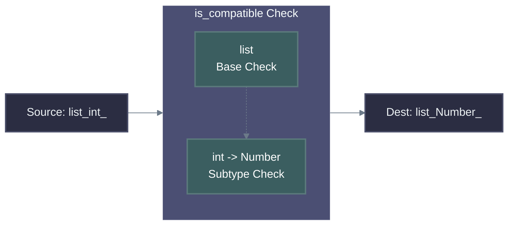

# EGP Type System

The Erasmus GP Type System is the backbone of the evolutionary engine's structural integrity. Because GP systems automatically generate and combine massive amounts of code, an extremely strict, rigorous type system is necessary to prevent runtime crashes and invalid logic.

Every input (Source Endpoint) and output (Destination Endpoint) within a `CGraph` is heavily typed. The execution engine enforces that connections between sub-components mathematically satisfy type inheritance and covariance rules before they are even instantiated.

## Architecture

The Type System consists of three main operational layers:

1. **`TypesDef`**: The immutable, canonical representation of a single type (e.g. `int`, `dict[str, float]`).
2. **Database Backing (`types_def` table)**: Types are fundamentally persistent. A local PostgreSQL database defines the canonical hierarchy of standard Python types and custom Erasmus types.
3. **`TypesDefStore`**: A high-performance, double-dictionary caching layer that intercepts database lookups, dynamically generates missing compound types, and calculates complex relationships like Generic Covariance.

```mermaid
%%{init: { 'theme': 'dark', 'themeVariables': { 'lineColor': '#6c7a89', 'textColor': '#edf2f4', 'mainBkg': '#2b2d42', 'primaryBorderColor': '#4a4e69' }}}%%
flowchart TD
    classDef default fill:#2b2d42,stroke:#4a4e69,stroke-width:2px,color:#edf2f4
    classDef dataBlue fill:#3a506b,stroke:#5c6b73,stroke-width:2px,color:#ffffff
    classDef dataOlive fill:#525c42,stroke:#6f7a5d,stroke-width:2px,color:#ffffff
    classDef dataPlum fill:#4a3b52,stroke:#685b70,stroke-width:2px,color:#ffffff
    classDef zoneExternal fill:#221f2e,stroke:#4a3b52,stroke-width:2px,stroke-dasharray: 5 5

    subgraph Memory_Layer [Application Memory]
        TDS[TypesDefStore<br/>Cache & Resolver]:::dataBlue
        TD1[TypesDef: int]:::dataOlive
        TD2["TypesDef: dict[str, int]"]:::dataOlive
        
        TDS -->|Caches| TD1
        TDS -->|Dynamically Generates| TD2
    end

    subgraph DB_Layer [PostgreSQL]
        class DB_Layer zoneExternal
        DB[(types_def<br/>Table)]:::dataPlum
        
        DB -.->|Reads Hierarchy| TDS
        TDS -.->|Writes New Types| DB
    end

    EP[Endpoint Validator]:::default -->|Requests Compatibility| TDS
```

## `TypesDef` Properties

A `TypesDef` object is an immutable descriptor. The most critical properties include:

* **`name`** (str): The string representation (e.g. `"int"`, `"list[str]"`)
* **`abstract`** (bool): `True` if the type cannot be directly instantiated (e.g., `Number`, `Sequence`). Abstract types are critical for generic polymorphic templates.
* **`parents`** (array[int]): A list of UIDs representing the immediate ancestors.
* **`children`** (array[int]): A list of UIDs representing known descendants.
* **`template`** (list[str]): For generic types, this breaks down the template. For example, `dict[str, int]` has a template of `["dict", "str", "int"]`.
* **`subtypes`** (array[int]): The UIDs of the types parameterized within a template.

## Dynamic Compound Types

Because the system is theoretically capable of generating infinitely deep compound types (e.g. `list[dict[str, tuple[int, float]]]`), the database cannot come pre-loaded with every possible permutation.

When the `TypesDefStore` receives a request for a type that does not exist in the database, it intercepts the miss and **dynamically generates the type**.

It uses the `TypeStringParser` to break down the string into its base class and subtypes, ensuring the subtypes exist, and recursively figures out its parents (e.g., `dict[str, int]` requires generating a parent link to `MutableMapping[str, int]`). It then silently pushes these new types into the PostgreSQL database, expanding the known Type Hierarchy dynamically during an evolutionary run.

## Polymorphism and Covariance

In a standard Object-Oriented model, type inheritance is simple: `int` inherits from `Number`. If a function expects a `Number`, you can pass it an `int`.

However, generic types introduce a problem known as covariance. If an Endpoint expects a `list[Number]`, can we connect a `list[int]` to it?

Because the Type System dynamically creates discrete entries for every compound type in the database, the strict SQL hierarchy does not inherently know that `list[int]` is a child of `list[Number]`. It only knows that `list[int]` is a child of `MutableSequence[int]`.

To solve this, `TypesDefStore` implements an **on-the-fly Covariance Validator** (`is_compatible`).

When validating connections, the system executes duck-typing on generics:

1. **Direct Ancestry:** It first checks standard, database-backed inheritance (is A an ancestor of B?).
2. **Template Validation:** If direct ancestry fails, it checks if both types are templates.
3. **Base Compatibility:** It verifies the root template structures are compatible (e.g., `dict` is compatible with `Mapping`).
4. **Subtype Covariance:** It recursively executes `is_compatible` on their internal parameters (e.g., mapping `int` to `Number`).

This allows the mutation engine (`CGraph.connect_all()`) to aggressively build polymorphic and highly reusable Generic Codes without bloating the SQL database with combinatorial permutations.
