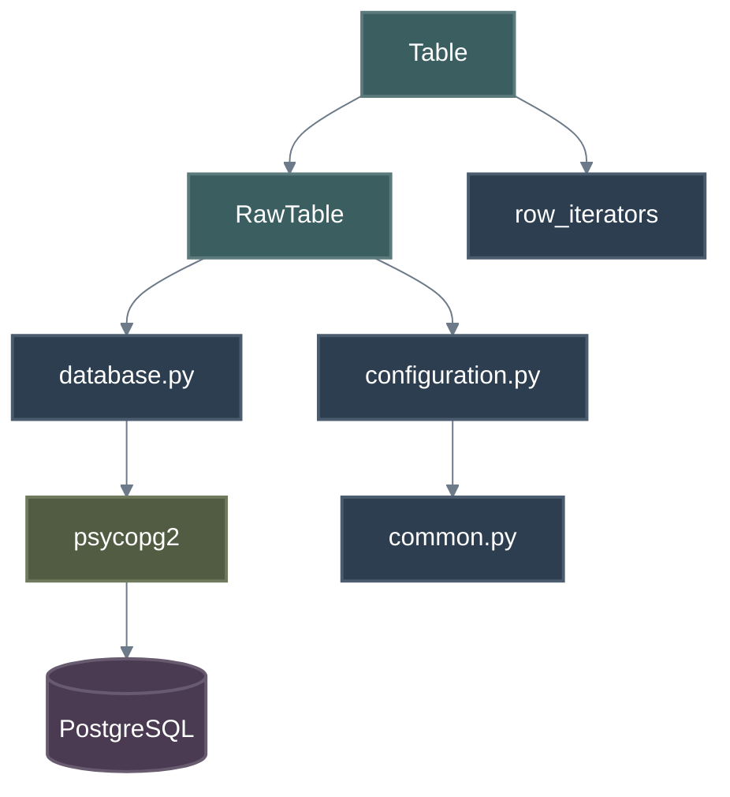
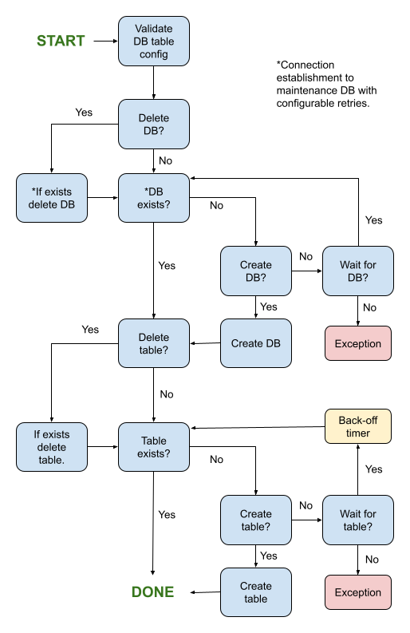

# egpdb — Database Module

## Overview

The `egpdb` package provides a layered PostgreSQL database interface for the Erasmus GP framework. It manages connections, table lifecycle, and CRUD operations with automatic retry and reconnection logic.

## Architecture



### Module Responsibilities

| Module | Responsibility |
| --- | --- |
| `configuration.py` | `DatabaseConfig`, `ColumnSchema`, `TableConfig` — validated configuration objects |
| `common.py` | Backoff generator, connection string builder |
| `database.py` | Connection pool management, SQL transaction execution with retry |
| `raw_table.py` | Table lifecycle (create/delete/wait), raw SQL operations (select/insert/update/upsert/delete) |
| `table.py` | Application-layer wrapper adding encode/decode conversions and dict-based row access |
| `row_iterators.py` | Iterator classes that decode raw cursor rows into tuples, namedtuples, dicts, or generators |

## Connection Management

Connections are tracked globally in `database._connections` with the structure:

```python
_connections: dict[str, dict[str, dict[int, Any]]]
# {host: {dbname: {thread_ident: connection_or_None}}}
```

- One connection per database per thread.
- `db_connect()` reuses existing connections; creates new ones via `db_reconnect()`.
- `db_reconnect()` closes any existing connection then retries with exponential backoff.
- `_clean_connections()` removes entries for terminated threads.
- `db_disconnect_all()` closes all connections and clears internal state.

## Transaction Retry Logic

`db_transaction()` implements a two-level retry strategy:

1. **Transaction attempts**: On `InterfaceError`/`OperationalError`, retry up to `_DB_TRANSACTION_ATTEMPTS` (3) times with backoff.
2. **Reconnections**: If all transaction attempts fail, reconnect and retry the whole cycle up to `recons` times.

## Initialization Flow



## Configuration Reference

### DatabaseConfig

| Field | Type | Default | Description |
| --- | --- | --- | --- |
| `dbname` | `str` | `"erasmus_db"` | Database name (regex: `[a-zA-Z][a-zA-Z0-9_-]{0,62}`) |
| `host` | `str` | `"localhost"` | Host IP or hostname |
| `password` | `str` | `"/run/secrets/db_password"` | Path to password file |
| `port` | `int` | `5432` | Port (1024–65535) |
| `maintenance_db` | `str` | `"postgres"` | Maintenance database for admin operations |
| `retries` | `int` | `3` | Connection retry attempts (1–10) |
| `user` | `str` | `"postgres"` | Database username |

### TableConfig

| Field | Type | Default | Description |
| --- | --- | --- | --- |
| `database` | `DatabaseConfig` | defaults | Database connection config |
| `table` | `str` | `"default_table"` | Table name |
| `schema` | `dict[str, ColumnSchema]` | `{}` | Column definitions |
| `ptr_map` | `dict[str, str]` | `{}` | Graph edge definitions for recursive queries |
| `data_file_folder` | `str` | `"."` | Folder for data population files |
| `data_files` | `list[str]` | `[]` | JSON files to populate table on creation |
| `delete_db` | `bool` | `False` | Drop DB before creation |
| `delete_table` | `bool` | `False` | Drop table before creation |
| `create_db` | `bool` | `False` | Create DB if it doesn't exist |
| `create_table` | `bool` | `False` | Create table if it doesn't exist |
| `wait_for_db` | `bool` | `False` | Wait for DB to appear |
| `wait_for_table` | `bool` | `False` | Wait for table to appear |
| `conversions` | `Conversions` | `()` | Encode/decode functions per column |

### ColumnSchema

| Field | Type | Default | Description |
| --- | --- | --- | --- |
| `db_type` | `str` | `"VARCHAR"` | PostgreSQL type expression |
| `volatile` | `bool` | `False` | Column may be updated after init |
| `default` | `str \| None` | `None` | SQL DEFAULT expression |
| `description` | `str \| None` | `None` | Column description |
| `nullable` | `bool` | `False` | Allow NULL values |
| `primary_key` | `bool` | `False` | Primary key (implies NOT NULL, UNIQUE) |
| `index` | `str \| None` | `None` | Index algorithm: btree, hash, gist, gin |
| `unique` | `bool` | `False` | UNIQUE constraint |
| `alignment` | `int` | `1` | Byte alignment for column ordering |
