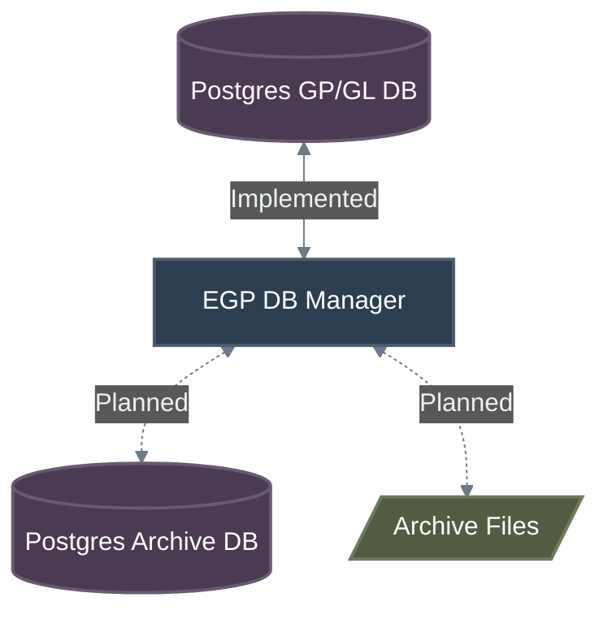
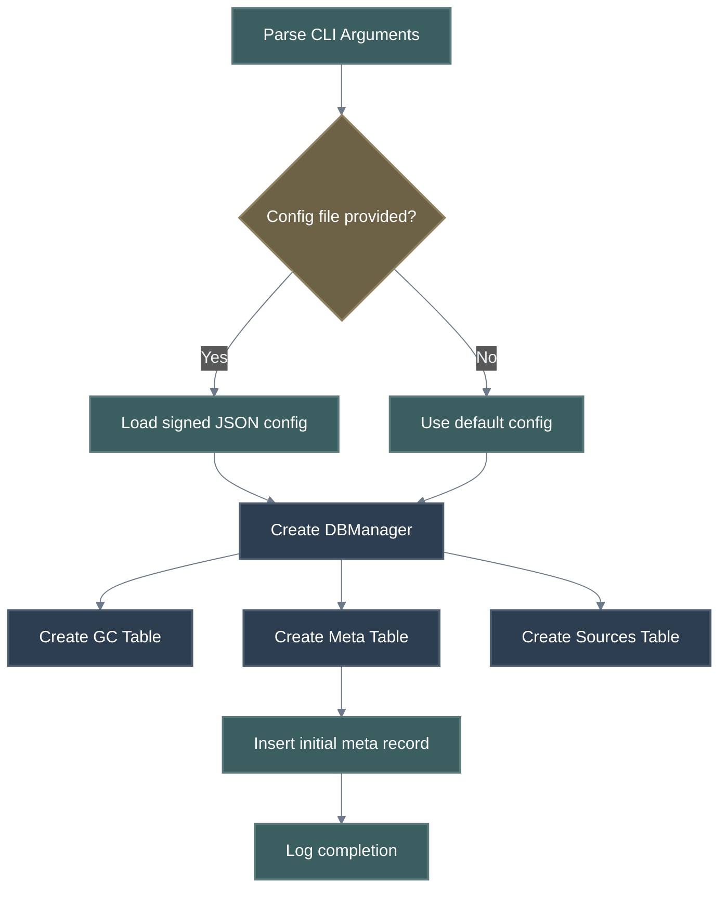
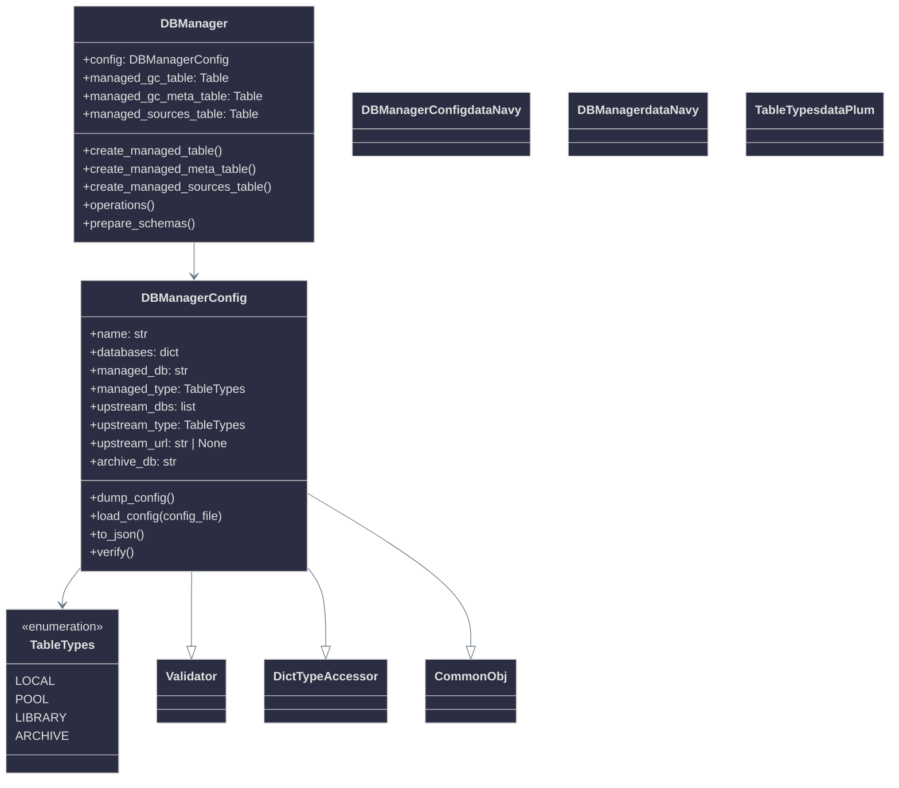

# EGP Database Manager - Architecture

## Top Level

The EGP DB Manager is an independent process (container) that manages a PostgreSQL database for a storage role in EGP. The storage role (Local, Gene Pool, Genomic Library, Archive) is defined by the `DBManagerConfig` upon creation via the `TableTypes` enum.

### Current Implementation

The DB Manager currently supports:

- **Configuration** — `DBManagerConfig` with validated properties for databases, managed table type, upstream references, and archive database name. Configurations are loaded from signed JSON files.
- **Table Creation** — Three tables are created during initialization:
  - **Genetic Code Table** — Schema derived from `GGC_KVT` with encode/decode conversions for `cgraph`, `properties`, and signature fields.
  - **Meta Table** — Stores `created` (timestamp) and `creator` (UUID) records.
  - **Sources Table** — Tracks source file provenance: `source_path`, `creator_uuid`, `timestamp`, `file_hash`, `signature`, `algorithm`.
- **CLI Entry Point** — `main.py` with argument parsing for config file, default config, gallery display.

### Planned Features (Not Yet Implemented)

The following are design goals, not yet reflected in code:

- Syncing the DB back to higher layer databases (micro-biome → biome etc.).
- Pulling data from higher layer databases (biome → micro-biome etc.).
- DB backup and restore.
- DB migration (e.g. from one version to another).
- Archive process (purging low-value GC data to archive DB / files).
- REST API, analytics, and health monitoring.
- Universal Archive file management.

## Configuration

The `DBManagerConfig` class (`configuration.py`) provides validated configuration with the following properties:

| Property | Type | Default | Description |
| --- | --- | --- | --- |
| `name` | `str` | `"DBManagerConfig"` | User-defined name (1–64 chars). |
| `databases` | `dict[str, DatabaseConfig]` | `{"erasmus_db": DatabaseConfig()}` | Database server definitions. |
| `managed_db` | `str` | `"erasmus_db"` | Key into `databases` for the managed DB. |
| `managed_type` | `TableTypes` | `POOL` | Table type: LOCAL, POOL, LIBRARY, or ARCHIVE. |
| `upstream_dbs` | `list[str]` | `[]` | Keys into `databases` for upstream DBs. |
| `upstream_type` | `TableTypes` | `LIBRARY` | Table type for upstream databases. |
| `upstream_url` | `str \| None` | `None` | Optional URL for remote DB file download. |
| `archive_db` | `str` | `"erasmus_archive_db"` | Archive database name. |

Cross-field validation in `verify()` ensures `managed_db` and all `upstream_dbs` entries exist as keys in `databases`.

## Initialization

The current initialization flow:

## Module Structure

## Database Auxiliary Tables

Besides the GC's in the main database table, the DBM creates and manages auxiliary data tables.

### Meta Table (Implemented)

| Column | DB Type | Description |
| --- | --- | --- |
| `created` | `TIMESTAMP` | When the database was created. |
| `creator` | `UUID` | UUID of the creator. |

### Sources Table (Implemented)

| Column | DB Type | Description |
| --- | --- | --- |
| `source_path` | `VARCHAR` | Path to the source file. |
| `creator_uuid` | `VARCHAR` | UUID of the source creator. |
| `timestamp` | `VARCHAR` | Timestamp of the source. |
| `file_hash` | `VARCHAR` | Hash of the source file. |
| `signature` | `VARCHAR` | Cryptographic signature. |
| `algorithm` | `VARCHAR` | Signing algorithm used. |

### Planned Auxiliary Tables

The following are design goals for future implementation:

- **DB Metadata** — UUID, version, migration history, host list, archive/sync info.
- **Timeseries Analytics** — DB size, archived/updated/synced GC counts, fitness distributions.
