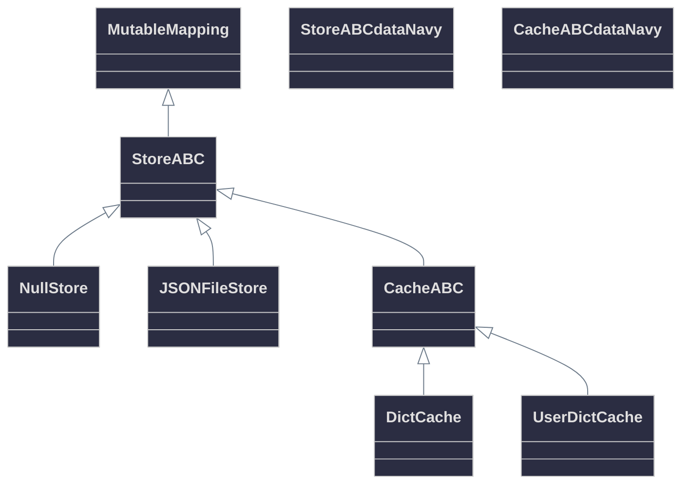
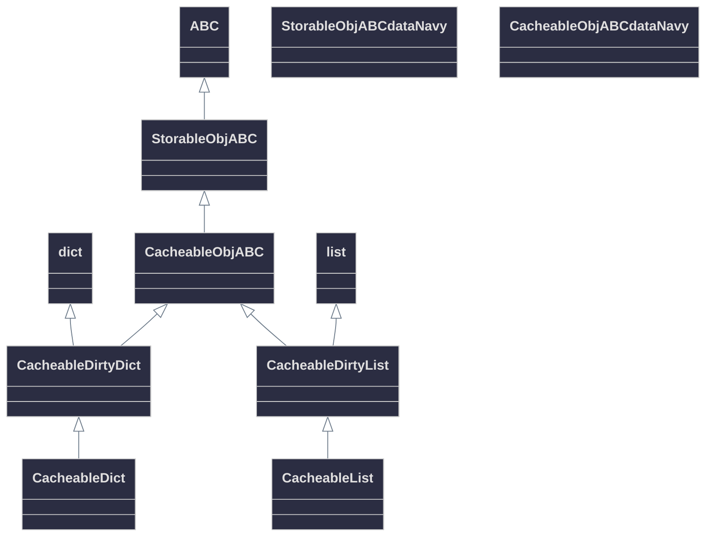
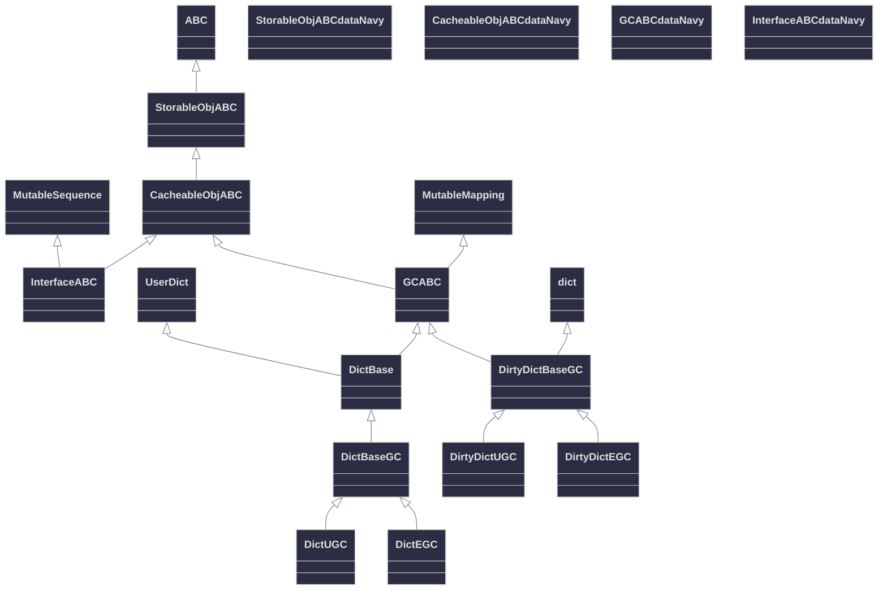
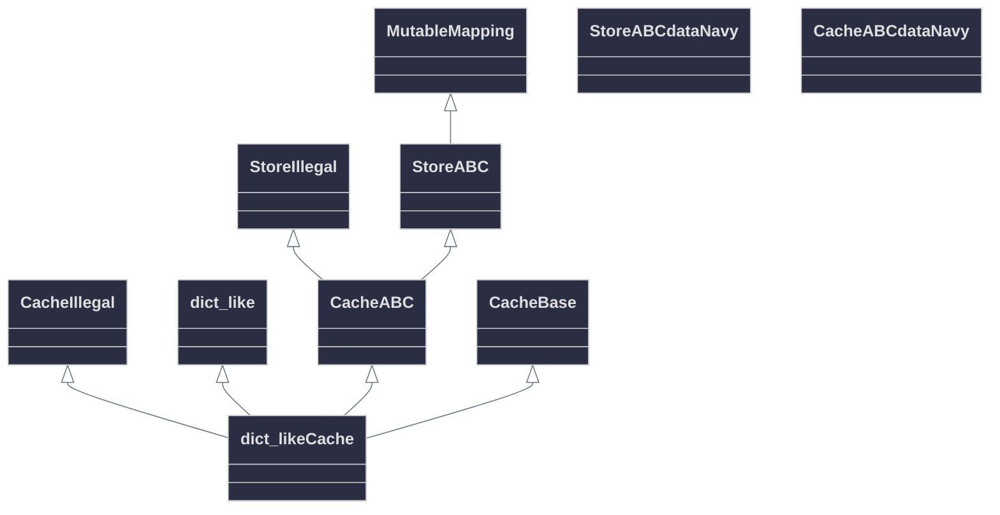

# Genetic Code Storage

The evolution process needs to be fast and scalable. Erasmus GP generates huge numbers of GCs and the balance between accessibility, speed of access and genetic mixing must be considered.

```mermaid
%%{init: { 'theme': 'dark', 'themeVariables': { 'lineColor': '#6c7a89', 'textColor': '#edf2f4', 'mainBkg': '#2b2d42', 'primaryBorderColor': '#4a4e69' }}}%%
flowchart TB
    %% Base/Default (Dark Slate)
    classDef default fill:#2b2d42,stroke:#4a4e69,stroke-width:2px,color:#edf2f4
    classDef dataTeal fill:#3b5e60,stroke:#5b7a7c,stroke-width:2px,color:#ffffff
    classDef dataPlum fill:#4a3b52,stroke:#685b70,stroke-width:2px,color:#ffffff
    classDef dataNavy fill:#2c3e50,stroke:#4a5c6e,stroke-width:2px,color:#ffffff
    classDef zonePrimary fill:#1f2130,stroke:#3a3e59,stroke-width:2px,stroke-dasharray: 5 5
    classDef zoneExternal fill:#221f2e,stroke:#4a3b52,stroke-width:2px,stroke-dasharray: 5 5

    subgraph LOCAL["Local Python Process"]
        direction TB
        L["Logic"]:::dataNavy
        A["fast_cache(CacheABC)"]:::dataTeal
        subgraph CACHE["genetic_code_cache(CacheABC)"]
            B["compact_cache(CacheABC)"]:::dataTeal
            C["remote_cache_client(CacheABC)"]:::dataTeal
        end
    end
    subgraph REMOTE["GC Cache Chart"]
        direction TB
        D[Remote Cache]:::dataPlum
        E[DB REST Client]:::dataTeal
    end
    subgraph DB["Database Chart"]
        direction TB
        F[DB REST API]:::dataTeal
        G[Postgresql]:::dataPlum
        H[DB REST Client]:::dataTeal
    end
    L <--> A
    L <--> B
    A --> B
    B <--> C
    C <--> D
    D <--> E
    E <--> F
    F <--> G
    G <--> H

    class LOCAL zonePrimary
    class CACHE zonePrimary
    class REMOTE zoneExternal
    class DB zoneExternal
```

## Stores

Stores are all derived from the Abstract Base Class *StoreABC* which provide a dictionary like interface for storing *StorableObj*s in a data structure aka store e.g. database, file or compact memory store. Store's exist to implement the EGP runtime object verification and consistency philosophy and provide a common interface to data storage technologies (and thier space/performance/remoteness tradeoffs). Stores are typically tightly bound to the storable objects they store.

Stores work with storable objects modified() method to efficiently store only those fields that have been modified. For the store is is not mandatory to use the method but it is required
for the storable object to implement it (even if it returns a constant tuple of all the fields). In addition storable objects are required to provide a method to convert the object to JSON compatible builtin python types and be initialised by the same object structure i.e. type(self)(self.to_json()) == self shall be True for StorableObjABC types.

## Caches

Caches are all derived from the Abstract Base Class *CacheABC* which provides a dictionary like interface plus a few other cache like methods. CacheABC is derived from StoreABC. A cache is a store that and pushes and pulls *CacheableObjABC* types to/from a next level store or cache. There are two different implementation behaviors of caches determined by the configuration.

| Behavior | ABC | max_items | purge_count | Description |
|-------|:------------:|:----:|:-------------:|---------|
| Dirty Cache | CacheABC | 0 | 0 | Fast access with limitless space requiring manual purging of items to the next_level. No items can be pulled from the next_level into the cache. |
| Cache | CacheABC | >= 1 | >= 1 | Quite fast. If the cache has max_items in it and a new object is added it will first push purge_count items to the next_level. Items that have been purged or initially exists in the next_level will be pulled in automatically if accessed via the cache interface. |

Caches cache *CacheableObjABC* types. Because the object cached is a container there is no way for the CacheABC to know if the object it is caching has been accessed or changed without some sort of expensive checking or comparison or hashing. CacheableObjABC's have methods provided to explicitly and implicitly track access and set dirty/clean state that can be introspected by CacheABC's. CacheableObjABC's may include other CacheableObjABC's using the same methods to roll up state.

## Implementations

\* A fast cache is a Dirty Cache, like a temporary store with some convinient configuration to push data to the next level. It cannot pull data from the next level (see one way arrow between the fast_cache and the compact_cache in the top level store flow diagram). In order to use all the optimized builtin dict methods without wrappers, a FastCache does not track access order or dirty state and has no size limit. It is intended as a "work area" for evolution.

## Class Hierarchy

