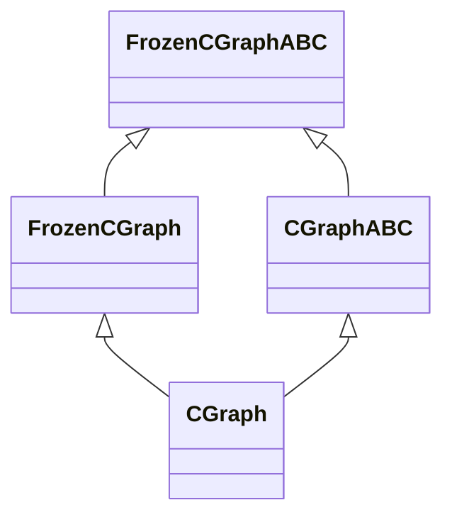
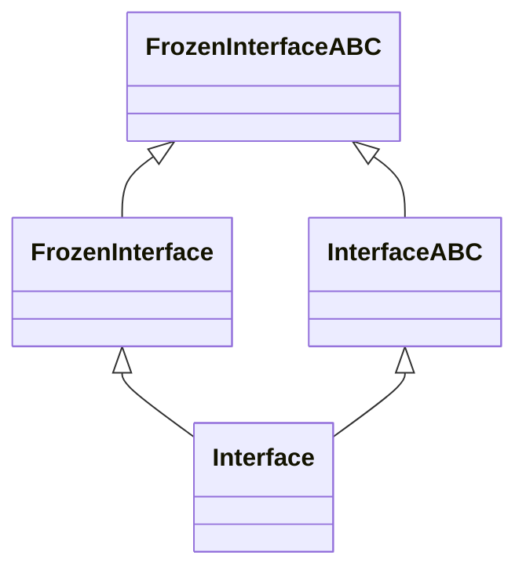
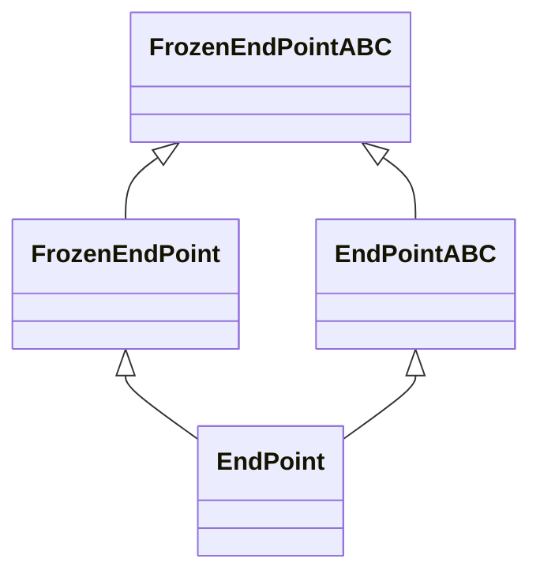
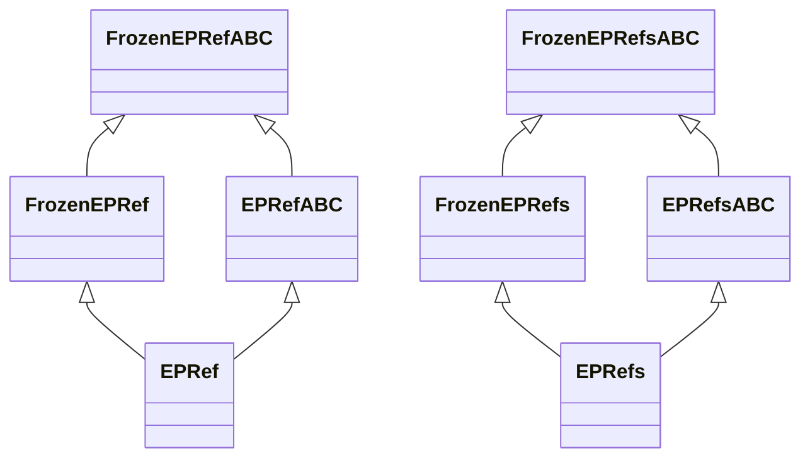

# Diamond Inheritance In `egppy.genetic_code`

## Scope

This reference documents the intentional class hierarchy used by the genetic-code
runtime in `egppy/egppy/genetic_code/`.

- Families: 4 (`CGraph`, `Interface`, `EndPoint`, `EPRef/EPRefs`)
- Diamonds: 5 (`CGraph`, `Interface`, `EndPoint`, `EPRef`, `EPRefs`)
- Classes covered: 20 (4 roles x 5 diamonds)

## Canonical Inventory

| Family | Diamond | Frozen ABC | Frozen Concrete | Mutable ABC | Mutable Concrete |
|---|---|---|---|---|---|
| CGraph | CGraph | `FrozenCGraphABC` | `FrozenCGraph` | `CGraphABC` | `CGraph` |
| Interface | Interface | `FrozenInterfaceABC` | `FrozenInterface` | `InterfaceABC` | `Interface` |
| EndPoint | EndPoint | `FrozenEndPointABC` | `FrozenEndPoint` | `EndPointABC` | `EndPoint` |
| EPRef/EPRefs | EPRef | `FrozenEPRefABC` | `FrozenEPRef` | `EPRefABC` | `EPRef` |
| EPRef/EPRefs | EPRefs | `FrozenEPRefsABC` | `FrozenEPRefs` | `EPRefsABC` | `EPRefs` |

## Why The Diamonds Exist

The mutable concrete classes intentionally inherit both:

- a frozen concrete implementation branch (state layout, reusable read-only behavior)
- a mutable ABC branch (mutation API contract)

This creates a diamond shape where the frozen ABC is the shared grandparent.
Python C3 linearization resolves this safely with deterministic method dispatch.

## Family Diagrams

### CGraph Family



### Interface Family



### EndPoint Family



### EPRef Family (EPRef + EPRefs Diamonds)



## Full MRO Listings

The following are canonical `__mro__` sequences for mutable concretes.

### `CGraph`

`CGraph -> FrozenCGraph -> CGraphABC -> FrozenCGraphABC -> MutableMapping -> Mapping -> Collection -> Sized -> Iterable -> Container -> CommonObj -> CommonObjABC -> ABC -> object`

### `Interface`

`Interface -> CommonObj -> FrozenInterface -> InterfaceABC -> FrozenInterfaceABC -> CommonObjABC -> ABC -> MutableSequence -> Sequence -> Reversible -> Collection -> Sized -> Iterable -> Container -> object`

### `EndPoint`

`EndPoint -> FrozenEndPoint -> CommonObj -> EndPointABC -> FrozenEndPointABC -> CommonObjABC -> ABC -> Hashable -> object`

### `EPRef`

`EPRef -> FrozenEPRef -> CommonObj -> EPRefABC -> FrozenEPRefABC -> CommonObjABC -> ABC -> Hashable -> object`

### `EPRefs`

`EPRefs -> FrozenEPRefs -> CommonObj -> EPRefsABC -> FrozenEPRefsABC -> CommonObjABC -> ABC -> Hashable -> MutableSequence -> Sequence -> Reversible -> Collection -> Sized -> Iterable -> Container -> object`

## Subclass Contract

Positive contracts:

- Mutable concrete is a subclass of its frozen ABC.
- Mutable concrete is a subclass of its mutable ABC.

Negative contracts:

- Frozen concrete is not a subclass of mutable ABC in the same diamond.

These contracts are enforced by `tests/test_egppy/test_genetic_code/test_mro_diamond.py`.

Risk notes by family:

- `CGraph`: parent-order regressions can change mapping/mutation dispatch and break
    constructor chain assumptions.
- `Interface`: parent-order regressions can bypass mutable endpoint-list setup and
    degrade initialization guarantees.
- `EndPoint`: parent-order regressions can alter hash and reference behavior routing.
- `EPRef`/`EPRefs`: parent-order regressions can alter sequence/reference mutation
    semantics expected by endpoint and interface layers.

## Initialization Patterns

### 1. Optional Args With Early Return

Canonical label: `optional-args-with-early-return`

Used to support MRO-safe `super().__init__()` calls from mutable subclasses
without forcing frozen initialization values.

Observed in:

- `FrozenInterface.__init__`
- `FrozenEPRefs.__init__`

### 2. Separated Hash Computation

Canonical label: `separated-hash-computation`

Frozen classes separate attribute initialization from hash caching so mutable
subclasses can override caching behavior.

Observed in:

- `FrozenEndPoint._cache_hash` (overridden by `EndPoint`)

### 3. Template Method With Override

Canonical label: `template-method-with-override`

Frozen base constructor calls a helper method overridden by mutable subclass,
allowing shared constructor chain with branch-specific object creation.

Observed in:

- `FrozenCGraph._init_graph` overridden by `CGraph._init_graph`

## MRO Regression Demonstration

1. Run baseline test:

```bash
python -m unittest tests/test_egppy/test_genetic_code/test_mro_diamond.py
```

1. Temporarily reorder a mutable concrete parent list (example only):

`class CGraph(CGraphABC, FrozenCGraph): ...`

1. Re-run tests and verify exact-MRO tests fail with mismatch message.

1. Revert parent order to canonical declaration and verify tests pass again.

## Contributor Playbook For New Frozen/Mutable Pairs

1. Define roles explicitly:
   - `FrozenFooABC` (frozen ABC)
   - `FrozenFoo` (frozen concrete)
   - `FooABC` (mutable ABC)
   - `Foo` (mutable concrete)
1. Keep parent order intentional and document why in all class docstrings.
1. Ensure mutable concrete combines frozen concrete + mutable ABC branches.
1. Add exact `__mro__` and subclass contract tests for the new diamond.
1. If frozen constructor performs cached-hash setup, provide an override seam
   for mutable branch behavior.
1. Update this document inventory table, family diagram, and MRO listing.
