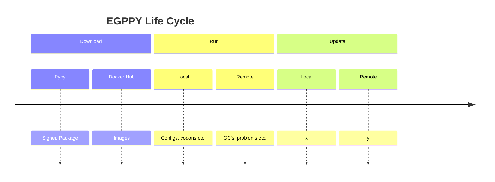

# EGPPY Lifecycle

```mermaid
timeline
    title EGPPY Life Cycle
    section Download
        Pypy : Signed Package
        Docker Hub : Images
    section Run
        Local : Configs, codons etc.
        Remote : GC's, problems etc.
    section Update
        Local : x
        Remote : y
```
