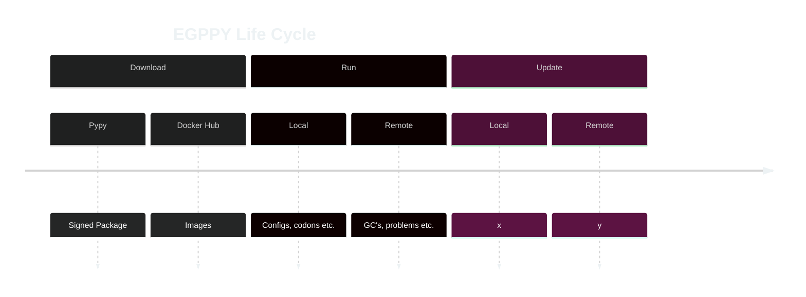

# EGPPY Lifecycle

```mermaid
%%{init: { 'theme': 'dark', 'themeVariables': { 'lineColor': '#6c7a89', 'textColor': '#edf2f4', 'mainBkg': '#2b2d42', 'primaryBorderColor': '#4a4e69' }}}%%
timeline
    title EGPPY Life Cycle
    section Download
        Pypy : Signed Package
        Docker Hub : Images
    section Run
        Local : Configs, codons etc.
        Remote : GC's, problems etc.
    section Update
        Local : x
        Remote : y
```
