# Eramsus Style

These conventions are to be used throughout the application.

## Mermaid Charts

A subtle dark theme for Mermaid diagrams balances readability with a sophisticated color palette. The key is using desaturated (muted) background fill colors paired with borders that are only slightly lighter than the fill. This creates a soft, tactile depth rather than a harsh contrast.

**Matte Slate & Muted Jewels**: This theme uses a deep slate-gray foundation. The classification colors are inspired by gemstone hues, but heavily desaturated to maintain a calm, authoritative, and corporate-friendly aesthetic.

Why this works:

* **Low-Contrast Borders:** The stroke color is simply a slightly lighter shade of the fill color. This avoids the stark, harsh lines that make diagrams look like retro neon signs.
* **Desaturated Core:** Even the "Gold" and "Purple" have a high amount of gray mixed into them, making them suitable for long periods of viewing.
Warm/Cool Balance: You have cool blues and greens alongside warmer mauves and golds, giving you plenty of logical classification pairs (e.g., using green for success paths and gold for exceptions).

Here is a comprehensive master template for the Matte Slate & Muted Jewels theme. It includes a wide spectrum of desaturated colors so you can categorize complex data flows without the diagram becoming visually overwhelming. The classDef statements are organized into a copy-pasteable dictionary at the top of the code block.

```mermaid
%%{init: {
  'theme': 'dark',
  'themeVariables': {
    'lineColor': '#6c7a89',
    'textColor': '#edf2f4',
    'fontFamily': 'sans-serif',
    'primaryBorderColor': '#4a4e69',
    'clusterTextColor': '#edf2f4'
  }
}}%%
graph TD
    %% ==========================================
    %% MASTER COLOR DICTIONARY: MATTE & JEWELS
    %% ==========================================
    
    %% Base/Default (Dark Slate)
    classDef default fill:#2b2d42,stroke:#4a4e69,stroke-width:2px,color:#edf2f4
    
    %% CORE CLASSIFICATIONS
    classDef dataBlue fill:#3a506b,stroke:#5c6b73,stroke-width:2px,color:#ffffff
    classDef dataGreen fill:#425c52,stroke:#5d7a6f,stroke-width:2px,color:#ffffff
    classDef dataGold fill:#6e6246,stroke:#8f8160,stroke-width:2px,color:#ffffff
    classDef dataRed fill:#6e4646,stroke:#8f6060,stroke-width:2px,color:#ffffff
    
    %% EXTENDED CLASSIFICATIONS
    classDef dataPurple fill:#594a5c,stroke:#7b687f,stroke-width:2px,color:#ffffff
    classDef dataTeal fill:#3b5e60,stroke:#5b7a7c,stroke-width:2px,color:#ffffff
    classDef dataPlum fill:#4a3b52,stroke:#685b70,stroke-width:2px,color:#ffffff
    classDef dataOlive fill:#525c42,stroke:#6f7a5d,stroke-width:2px,color:#ffffff
    classDef dataNavy fill:#2c3e50,stroke:#4a5c6e,stroke-width:2px,color:#ffffff

    %% SUBGRAPH / ZONE CLASSIFICATIONS
    %% Very dark slate with a dashed border for primary system areas
    classDef zonePrimary fill:#1f2130,stroke:#3a3e59,stroke-width:2px,stroke-dasharray: 5 5
    %% Very dark plum with a dashed border for external/storage areas
    classDef zoneExternal fill:#221f2e,stroke:#4a3b52,stroke-width:2px,stroke-dasharray: 5 5

    %% ==========================================
    %% VISUAL REFERENCE GUIDE
    %% ==========================================
    
    %% --- Level 1: Categories ---
    Base[Default Node Style<br/>Dark Slate Base] --> Core{Core Colors}
    Base --> Extended{Extended Colors}
    Base --> Links{Link Styles}
    
    %% --- Subgraph 1: Primary Zone ---
    subgraph SG_Core [Primary Processing Zone]
        Core --> BlueNode[class: dataBlue<br/>Standard Processing]
        Core --> GreenNode[class: dataGreen<br/>Success / Validated]
        Core --> GoldNode[class: dataGold<br/>Warning / Evaluation]
        Core --> RedNode[class: dataRed<br/>Error / Critical]
    end
    
    %% --- Subgraph 2: External Zone ---
    subgraph SG_Extended [External & Storage Zone]
        Extended --> PurpleNode[class: dataPurple<br/>Specialized Logic]
        Extended --> TealNode[class: dataTeal<br/>I/O & External]
        Extended --> PlumNode[(class: dataPlum<br/>Storage / DBs)]
        Extended --> OliveNode[class: dataOlive<br/>Background Tasks]
        Extended --> NavyNode[class: dataNavy<br/>Infrastructure]
    end

    %% --- Level 2: Link Styles ---
    Links -->|Standard / Sync Flow| L_Sync[syntax: -->]
    Links ==>|Primary / Heavy Data| L_Heavy[syntax: ==>]
    Links -.->|Async / Event / Optional| L_Async[syntax: -.->]
    Links --o|Read Only / Fetch| L_Read[syntax: --o]
    Links --x|Blocked / Terminated| L_Block[syntax: --x]

    %% ==========================================
    %% APPLY NODE & SUBGRAPH CLASSES
    %% ==========================================
    
    class BlueNode dataBlue
    class GreenNode dataGreen
    class GoldNode dataGold
    class RedNode dataRed
    
    class PurpleNode dataPurple
    class TealNode dataTeal
    class PlumNode dataPlum
    class OliveNode dataOlive
    class NavyNode dataNavy

    %% Apply classes to the subgraphs
    class SG_Core zonePrimary
    class SG_Extended zoneExternal

    %% ==========================================
    %% APPLY LINK STYLES
    %% Indices: 0-2 (Base to categories), 3-6 (Core), 7-11 (Extended), 12-16 (Links)
    %% ==========================================
    
    linkStyle 13 stroke:#5c6b73,stroke-width:3px;
    linkStyle 16 stroke:#8f6060,stroke-width:2px;
```

