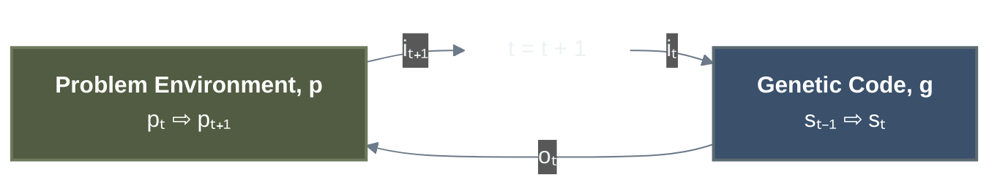

# Overview of How Erasmus Works

This section assumes a basic understanding of Evolutionary Algorithms and Genetic Programming (GP).

For the purposes of this overview, a **Genetic Code** ($g$) is a Python program that acts as an agent (or solution) within a problem environment. In Erasmus Genetic Programming (EGP), the program's structure is a recursively embedded graph—specifically, a binary tree structure.

A genetic code $g$ has an input interface ($i$), an output interface ($o$), and contains either exactly zero, one or two embedded sub-genetic codes. If a genetic code has zero embedded sub-codes, it is called a **Codon**. A Codon represents a functional primitive, such as an arithmetic operator (e.g., `+`) or a string method (e.g., `str.replace(x, y)`).

The genetic code agents interact with a problem environment, within which their fitness is measured over time ($t$).



Where:

* $g$ = The genetic code (Python program)
* $i$ = Input data provided to $g$
* $o$ = Output data produced by $g$
* $s$ = Internal state of $g$
* $p$ = Internal state of the Problem (i.e., $g$'s external environment)
* $t$ = Time (in arbitrary discrete units)

The interaction loop is initiated by the Problem environment at $t=0$, which generates the initial input data $i_0$ for the genetic code. The state updates follow these functions:

* $p_{t+1} = f(p_t, o_t, \dots)$
* $i_t = f(p_t)$
* $s_t = f(s_{t-1}, i_t)$
* $o_t = f(s_t, i_t)$

*(Note: The $\dots$ in the $p_{t+1}$ function represents other environmental factors, such as competing agents acting in the same time interval).*

## The Meta-Evolutionary Architecture

Standard GP evolves a population of solutions using fixed mutation and crossover operators. EGP is a **Meta-Genetic Programming** system: it simultaneously evolves the solutions *and* the evolutionary operators themselves.

EGP maintains three distinct populations:

1. **$G$ (Agents/Solutions):** The population of genetic codes attempting to solve the user-defined problem environments.
2. **$M$ (Mutators):** A population of genetic codes whose "problem environment" ($p_m$) is the task of mutating codes in $G$ to produce fitter offspring.
3. **$Z$ (Selectors):** A population of genetic codes whose "problem environment" ($p_z$) is the task of optimally pairing mutations from $M$ with targets in $G$.

Phrased this way, a mutation $m_j \in M$ is an agent acting in environment $p_m$, taking $g_i$ as input and producing a mutated offspring $g_i'$ as output. As the population $M$ evolves and concentrates fitter mutations, the evolution of $G$ accelerates.

### Recursive Evolution: Mutators Mutating Mutators

Because $M$ and $Z$ are constructed exactly like the solution programs in $G$, they are subject to the exact same evolutionary rules. Once a Mutator has been used enough times to establish its fitness, it becomes a *target* for evolution itself. The system will use a Selector to choose *another* Mutator to mutate the original Mutator, creating a new generation of evolutionary operators. This recursive "turtles all the way down" approach allows the system to continuously refine how it evolves.

However, a single mutator $m_j$ is rarely universally suitable (e.g., a mutation excellent at tuning floats is destructive to string-manipulation code). To mitigate this, **Selectors ($Z$)** choose mutations based on the context of the target genetic code. The process starts with the **Master Selector ($z_0$)**, a primitive Codon that serves as the root of the selection process.

### The Genetic Library

EGP maintains all physically and historically useful genetic codes in a hierarchical database. This library links every code to its ancestry, descendants, associated problem environments, and the specific mutators/selectors that created it. This graph can be traversed to inform future selections, allowing the system to learn which evolutionary pathways yield the best results for specific problem classes.

## System Algorithm (Pseudo-Code)

The following describes the core execution loop of the EGP system.

### Initialization

1. For the initial problem $p_0$, randomly generate a population $G$ that meets the required input/output interface specifications.
2. Initialize population $M$ consisting strictly of **Mutation Codons** (functional mutation primitives).
3. Initialize population $Z$ consisting of a single **Random Selector Codon** (acting as $z_0$).

### Main Evolutionary Loop

```text
For each user problem p in the universal problem set P:
    // Iterate over ALL populations, enabling recursive evolution
    For each population X in {G, M, Z}:
        For each target genetic code x_i in the active population X:
            
            // Only evolve if its fitness in its environment (p, p_m, p_z) is established
            If x_i is ready for evolution (e.g., evaluated N times):
            
                // 1. Selector Resolution Loop
                Let z_active = z_0 (Master Selector)
                While z_active chooses to delegate:
                    z_active = z_active's selection from population Z
                    
                // 2. Mutation Selection
                Let m_i = z_active's selection from population M
                
                // 3. Execution of Mutation
                Let x_i' = m_i(x_i)  // m_i mutates the target (which could be another mutator!)
                
                // 4. Fitness Evaluation of Offspring
                Evaluate fitness of x_i' in its respective environment (p for G, p_m for M, p_z for Z)
                If fitness goal achieved for user problem p:
                    Halt and return x_i'
                    
                // 5. Meta-Fitness Evaluation
                // (The operators that just created this offspring gain/lose reputation)
                Update relative fitness of m_i and z_active
                
    // 6. Pruning and Selection
    For each population X in {G, M, Z}:
        Apply survivability criteria to X to select the next generation
```

### Line-by-Line Discussion

* **For each user problem $p$ in $P$:** EGP is a distributed system with a centralized database of validated problem definitions served to edge workers. Problems must scale in complexity. Parallel to biological evolution (Abiogenesis $\rightarrow$ Eukaryotes $\rightarrow$ Multicellular life), EGP starts with trivial tasks and builds complexity. Once a threshold of complexity is mastered across a broad range of problems, EGP approximates a general problem solver.
* **For each population $X$ in $\{G, M, Z\}$:** This is the core of EGP's meta-evolution. By iterating over all three populations, the system applies the exact same evolutionary mechanics to the agents ($G$), the mutators ($M$), and the selectors ($Z$). A mutator is mutated by another mutator, allowing the evolutionary mechanisms themselves to adapt over time.
* **If $x_i$ is ready for evolution:** The 'is complete' condition is necessary because physical genetic codes (and complex agent codes) cannot have their fitness evaluated on a single data point. By default, physical genetic codes must be executed at least $N=8$ times to reliably assess their relative fitness before they are allowed to reproduce.
* **Selector Resolution (`While z_active chooses to delegate`):** The Master Selector ($z_0$) makes a weighted selection from $Z$. A selected $z$ can either pick a mutator from $M$, or delegate to a more specialized selector in $Z$. Because selectors are evolved programs, their exact decision logic is emergent. However, fitness functions for selectors penalize excessive execution time, naturally suppressing infinite delegation loops.
* **Let $x_i' = m_i(x_i)$:** The chosen mutation is applied. Note that the parent $x_i$ remains in the population until the generation pruning phase.
* **Evaluate fitness of $x_i'$:** The new agent is evaluated against its respective environment ($p$ if it's a solution, $p_m$ if it's a new mutator, $p_z$ if it's a new selector). Evolvability (the probability of a lineage producing superior descendants) is also tracked and updated retroactively here.
* **Update relative fitness of $m_i$ and $z_{active}$:** The "parents" (the mutator and selector) of the newly created offspring have their own fitness updated based on how successful the offspring was compared to the population average.
* **Pruning and Selection:** The active populations of $G$, $Z$, and $M$ are pruned based on their Survivability score ($s$), which aggregates fitness, evolvability, and diversity (via the Crowding Penalty). Codes that fail to survive are not deleted; they are retired to the Genetic Library. The bar for permanent deletion from the database is set exceptionally low, ideally preserving the entire phylogenetic tree of all executed code. See [The Erasmus Selection Algorithm](../egppy/docs/selection_algorithm.md) for more details.
