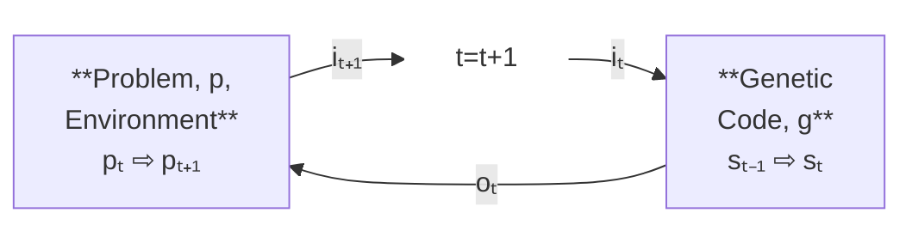

# Overview of How EGP Works

This section assumes a basic grip of evolutionary algorithms.

For the purposes of this overview a [genetic code](../egppy/egppy/gc_types/docs/gc_logical_structure.md), g, is a python program that runs as an agent (solution) acting in a problem environment. In EGP the programs 'genetic code' is a recursively embedded structure. A genetic code has an input interface, i, and an output interface, o, as well as none or two embedded sub-sub-genetic codes that are connected together as a graph. If a genetic code has no embedded genetic codes it is call a codon which represents a functional primitive like '+' or 'str.replace(x, y)'. The genetic code agent/solutions interact with a problem environment within which thier fitness is measured



where:

- **g** = the genetic code (python program)
- **i** = Input data to GC
- **o** = Output data from GC
- **s** = G internal state
- **p** = Problem internal state (G's external environment)
- **t** = time in arbitary units

The loop is initiated in the _Problem_ stage at **pₜ₊₁₌₀** which generates the initial input data set into the genetic code. Note that:

- pₜ₊₁(pₜ, oₜ, ...)
- iₜ(pₜ)
- sₜ₊₁(sₜ, iₜ)
- oₜ(sₜ, iₜ)

and **...** represents other problem environmental inputs e.g. other agents impacting the problem environment in that time interval. EGP evolves each individual genetic code, gᵢ, in the population, G, in the problem environment, p, with a mutation genetic code, mⱼ, from the population of mutations, M, to create the next generation gᵢ' i.e. gᵢ' = mⱼ(gᵢ). The suitability of gᵢ' to solve p can then be evaluated and natural selection occur for the next iteration.

Phrased like this mⱼ can be considered a genetic code agent acting in the mutation problem environment, pₘ, taking in gᵢ as its input and producing gᵢ' as it output and the same process may be applied recursively. As the next generation of M concentrates fitter mutations the generations of G improve more quickly.

However, mⱼ is unlikely to be universally suitable and so random selection in this environment does not scale well. A mutation that increases a value (in gᵢ) when the value needs to decrease, or acts on floating point types when the problem is regarding strings is not useful, and likely detrimental, which means the fitness of mⱼ is problem environment and agent dependent. To mitigate this EGP employs a third type of genetic code called a selector, zₖ, with a population, Z. Selectors choose mutations, or choose another selector to delegate mutation selection too, based on the fitness of the mutation/selector and the relationship it has to the problem and the genetic code that is to be mutated. There is a special selector called the Master Selector, z₀, which is a codon (i.e. functional primitive genetic code). The Master Selector is the first step in the selection process and can only choose other selectors. Selectors, including master selectors, are also evolved through the same process.

Relationships are defined by the genomic library. EGP maintains all (notionally useful) genetic codes in a hierarchical database system linking each one to its ancestory, descendants, problem environments, mutation & selector. This graph can be traversed to select from genetic codes that are fittest (or likely to be fittest) in a problem environment.

Selector and mutation genetic codes and collectively termed 'physical' genetic codes.

## Pseudo Code

Note that this code describes the function of the entire EGP system not just the core algorithm.

### Initialization

```text
For the initial problem, p₀, randomly generate population G meeting the interface (inputs and outputs) specification.
Population M comprises of only mutation codons i.e. mutation primitives
Population Z comprises of the random selector codon (i.e. is a population of 1)
```

### Main Loop

```text
for p in P if p not in (pz, pₘ):
  for X in (G, Z, M):
    for xᵢ in X if pₓ is complete
      z₀ selects zᵢ from Z
      zᵢ = zᵢ if zᵢ selects mutation else zᵢ = zi choice from Z and goto 2.
      zᵢ selects mi from M
      mᵢ mutates xᵢ to create xᵢ'
      xᵢ' is evaluated for fitness in pₓ, break if fitness goal achieved
    The next generation of X is selected (empty if fitness goal achieved)
```

The following is a line by line discission of the system algorithm:

**for p in P if p not in (pz, pₘ):** EGP is a distributed system with a database of validated problem definitions centrally served to the workers at the edge. i.e. there are always problems in the universal problem set that are not the intrinsic problems of selection or mutation (those require a third problem so thier fitness can be defined). It is important to note that whilst the problem set can theoretically be arbitary in practicality problems must start simply and increase in complexity by adding related problems. The parallel can be drawn to biological evolution: humans did not just self assemble one fine day, physics does not prevent it, but the probability is not worth seriously discussing. Things started simple (even if we do not know exactly how) and built from there: Abiogenesis, RNA world, DNA world, Prokaryotes, Eukaryotes, Multicellular organisms and so on. Once a certain level of complexity is achieved across a broad range of problems EGP will approximate to a general problem solver.

**for X in (G, Z, M):** for each problem EGP attempts to find a solution for, 3 populations evolve, the agent/solution population, G, the selector population, Z and the mutation population, M. The mechanism of evolution is identical for all three.

**for xᵢ in X if pₓ is complete** for every genetic code in the population X, evolve it if the problem environment is sufficiently defined for fitness to be evaluated (complete). The 'is complete' condition is present because for physical genetic codes and probably some complex agent genetic codes the fitness function will not necessarily be able to be evaluated every iteration. For example, most physical genetic codes will not be used in the evolution of an agent/solution and thus have no fitness. It is also not wise to evaluate the fate of a genetic code on a single data point, by default physical genetic codes must be executed at least 8 times to assess thier fitness. Note that each iteration of the inner loop is independent of the other allowing an extremely high degree of parallelization at scale.

**z₀ selects zᵢ from Z** this line is the Master Selector choosing the selector. The Master Selector makes its weighted random selection based on the fitness and evolvability of the the selectors in Z. This drives the system to evolve a hierarchy of more specialised selectors (in theory).

**zᵢ = zᵢ if zᵢ selects mutation else zᵢ = zi choice from Z and goto 2.** a selector can select a mutation or delegate to another more specialised selector based on pₓ and xᵢ. Since selectors evolve, exactly how it makes the selection is not defined, however the random selector is always an option. This line only moves to the next when a mutation is selected. Note that the fitness function for selectors puts pressure on the time it takes to make a decision so excessive delegation is penalized.

**zᵢ selects mi from M** the selection of the mutation for xᵢ.

**mᵢ mutates xᵢ to create xᵢ'** the mutation of xᵢ to xᵢ'. Note that xᵢ still remains in the population for now.

**xᵢ' is evaluated for fitness in pₓ, break if fitness goal achieved** For physical genetic codes the fitness function is very simple and fast; over the last N (8 by default) executions did this genetic code do better than the population average. _NOTE: this is very experimental_. For agent/solution genetic codes it is the fitness function defined in the problem. As problems become harder or fitness more refined the execution time/resources of this line dominates the entire process. _NOTE: Evolvability is also evaluated at this point. Evolvability is the characteristic of a genetic code to produce better descendants which is is an advantage to the population (ignoring diversity). This is also very experimental._

**The next generation of X is selected (empty if fitness goal achieved)** The active populations of G, Z and M are pruned by a survivability criteria based mostly on fitness, evolvability and diversity for the next iteration. Those genetic codes not eligible to be part of the population are not deleted but remain stored in the genomic library. Ideally EGP would never discard a genetic code so that the entire ancestory of all genetic codes could be studied. This is not practically possible but the bar is set very high (low?) to permanently delete a genetic code.
