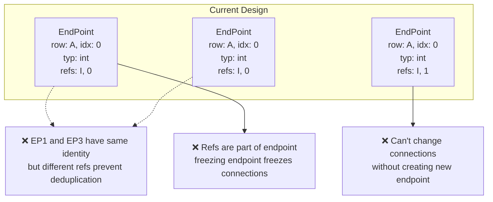
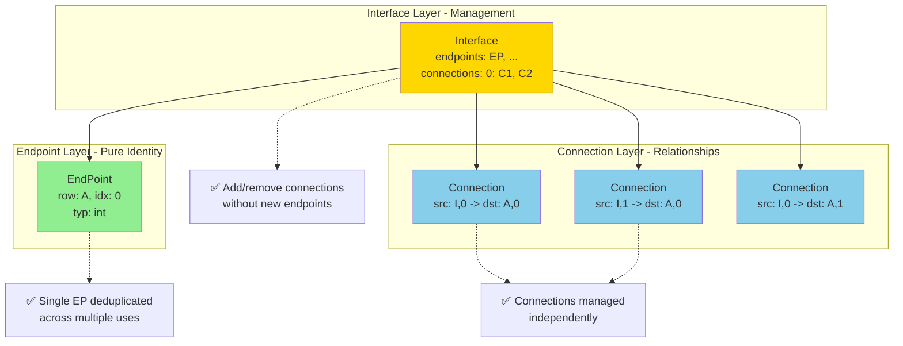
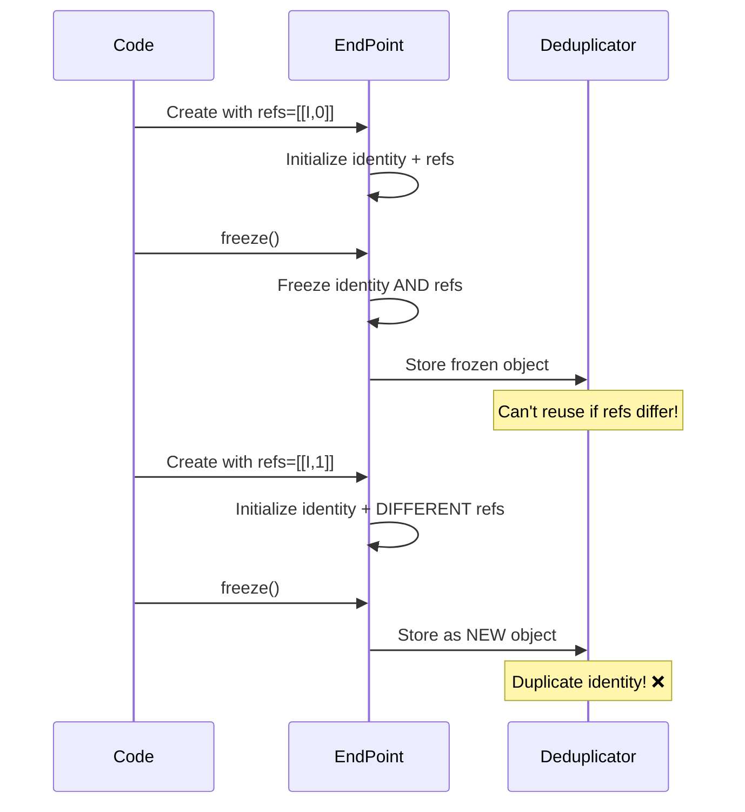
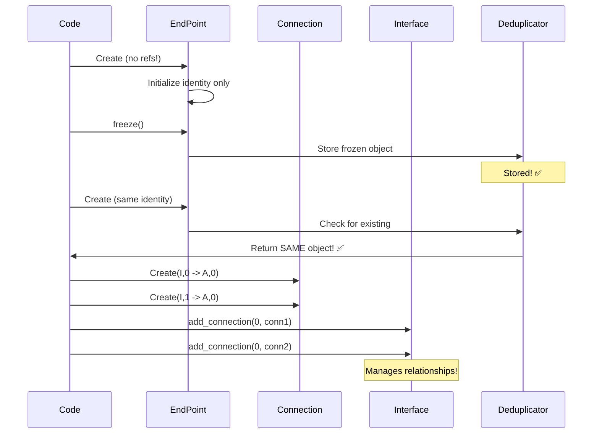
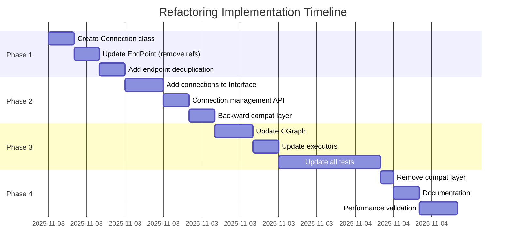

# Endpoint-Connection Architecture Refactoring

## Current Architecture (Before)



## Proposed Architecture (After)



## Data Flow Comparison

### Before: Tightly Coupled



### After: Decoupled



## Memory Efficiency Improvement

### Before

```
Memory Usage Example (10,000 similar endpoints with different connections):

EndPoint objects: 10,000 × 200 bytes = 2,000,000 bytes
├─ Identity data: 10,000 × 50 bytes  =   500,000 bytes (duplicated! ❌)
└─ Connection data: 10,000 × 150 bytes = 1,500,000 bytes

Total: ~2.0 MB with lots of duplication
```

### After

```
Memory Usage Example (10,000 similar endpoints with different connections):

EndPoint objects: 1 × 50 bytes = 50 bytes (deduplicated! ✅)
Connection objects: 10,000 × 100 bytes = 1,000,000 bytes
Interface overhead: ~50,000 bytes

Total: ~1.05 MB (47.5% reduction!)
```

## API Changes

### Endpoint Creation

**Before:**
```python
ep = EndPoint(DstRow.A, 0, EndPointClass.DST, "int", refs=[["I", 0]])
ep.connect(other_ep)
if ep.is_connected():
    refs = ep.refs
```

**After:**
```python
ep = EndPoint(DstRow.A, 0, EndPointClass.DST, "int")
# No refs, no connect() method

# Connection managed by Interface
interface = Interface([ep])
interface.add_connection(0, Connection(SrcRow.I, 0, DstRow.A, 0))
if interface.is_connected(0):
    conns = interface.get_connections(0)
```

### Interface Usage

**Before:**
```python
# Refs embedded in endpoint
interface = Interface([
    EndPoint(DstRow.A, 0, EndPointClass.DST, "int", refs=[["I", 0]]),
    EndPoint(DstRow.A, 1, EndPointClass.DST, "float", refs=[["I", 1]]),
])

# Access refs through endpoint
for ep in interface:
    for ref in ep.refs:
        row, idx = ref[0], ref[1]
```

**After:**
```python
# Endpoints and connections separate
interface = Interface(
    endpoints=[
        EndPoint(DstRow.A, 0, EndPointClass.DST, "int"),
        EndPoint(DstRow.A, 1, EndPointClass.DST, "float"),
    ],
    connections={
        0: [Connection(SrcRow.I, 0, DstRow.A, 0)],
        1: [Connection(SrcRow.I, 1, DstRow.A, 1)],
    }
)

# Access connections through interface
for idx, ep in enumerate(interface):
    for conn in interface.get_connections(idx):
        src_row, src_idx = conn.src_row, conn.src_idx
```

## Implementation Phases



## Validation Checklist

- [ ] All existing tests pass
- [ ] New connection tests added
- [ ] Deduplication working as expected
- [ ] Memory usage improved (benchmark)
- [ ] No performance regression
- [ ] Documentation updated
- [ ] Code review completed
