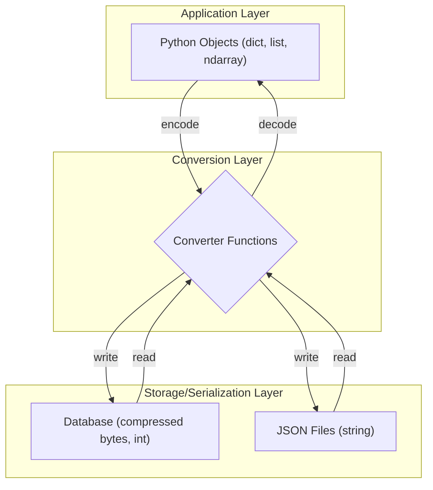

# Design Analysis of the `conversions` Module

## 1. Overview

This report provides a design and architectural analysis of the `conversions.py` module, part of the `egpcommon` package. The module serves as a dedicated utility library for data type conversions, acting as a crucial marshalling layer within the Erasmus-GP ecosystem.

The stated purpose of this module is to bridge the gap between different data representations required by various parts of the system:

1. **Efficient Database Storage:** Converting application-level objects into compact formats (e.g., compressed bytes, integers) suitable for a database.
2. **Efficient Python Execution:** Using high-performance types like `numpy.ndarray` and `memoryview` within the application logic.
3. **Human-Readable Formats:** Interfacing with serialization formats like JSON.

The module consists of a collection of stateless, pure functions, each responsible for a specific, well-defined conversion.

## 2. Core Functionalities and Design Patterns

The conversion utilities can be grouped into several key areas:

### a. JSON Serialization and Compression

* **Functions:** `compress_json`, `decompress_json`
* **Purpose:** To convert Python dictionaries or lists into a compressed binary format for efficient storage.
* **Mechanism:** The functions use the standard `json` library to serialize the object to a string, encode it to bytes, and then apply `zlib` compression. This is a standard and effective pattern for reducing the storage footprint of structured text data.

### b. NumPy Array and Binary Data Handling

* **Functions:** `memoryview_to_ndarray`, `ndarray_to_memoryview`, `ndarray_to_bytes`, `memoryview_to_bytes`, `list_int_to_bytes`, `bytes_to_list_int`
* **Purpose:** To facilitate seamless conversion between raw binary data (`bytes`, `memoryview`) and high-performance `numpy` arrays.
* **Design Intent:** The use of these functions, particularly the conversion to a `numpy.ndarray` of `uint8` with a fixed count of 32, strongly implies that they are designed to handle 256-bit cryptographic hashes (e.g., SHA-256). Using `numpy` for this is a deliberate choice for performance, as it allows for vectorized operations and efficient numerical computation on these hashes if needed. The use of `memoryview` where possible suggests an awareness of performance and a desire to avoid unnecessary data copies.

### c. Bit-Encoded Property Management

* **Functions:** `encode_properties`, `decode_properties`
* **Purpose:** To convert a dictionary of properties into a single integer and back.
* **Mechanism:** This functionality is delegated to a `PropertiesBD` class. The design pattern here is **bitmasking**. Each property or flag is assigned a specific bit in an integer. This is an extremely space-efficient method for storing a set of boolean flags or enumerated states in a database, as it collapses a dictionary into a single numeric column.

### d. Special Value Handling

* **Function:** `null_sha256_to_none`
* **Purpose:** To translate a specific constant (`NULL_SHA256`) into Python's idiomatic `None`.
* **Design Intent:** This function abstracts away the concept of a "magic number" or sentinel value. Instead of forcing other parts of the application to check for a specific 32-byte hash that represents "null," this conversion allows them to use a standard Pythonic check like `if my_hash is None:`. This improves code readability and maintainability.

## 3. Architectural Role and Design Philosophy

* **Data Marshalling:** The module's primary architectural role is data marshalling. It isolates the rest of the application from the specific data formats required by the database or other external systems. This is a good design practice, as it means the storage format can be changed with minimal impact on the application logic, and vice-versa.
* **Efficiency-Driven:** Every function in this module is geared towards efficiency, either for storage space (`compress_json`, `encode_properties`) or execution speed (`numpy` conversions).
* **Stateless and Functional:** The module is designed as a library of pure functions. There is no state, and the functions are deterministic. This makes them easy to test, reason about, and use throughout the codebase without side effects.
* **Type Safety and Robustness:** The extensive use of type hints and runtime `isinstance` checks makes the API robust. The functions are designed to handle `None` inputs gracefully, which is a practical consideration that prevents common `NoneType` errors in the application logic.

## 4. Conclusion

The `conversions.py` module is a well-defined and practical utility library that serves a critical function within the Erasmus-GP project. Its design is focused, efficient, and follows best practices for creating a data marshalling layer. It successfully abstracts complex and storage-specific data formats, providing the rest of the application with a clean, Pythonic, and high-performance interface.
