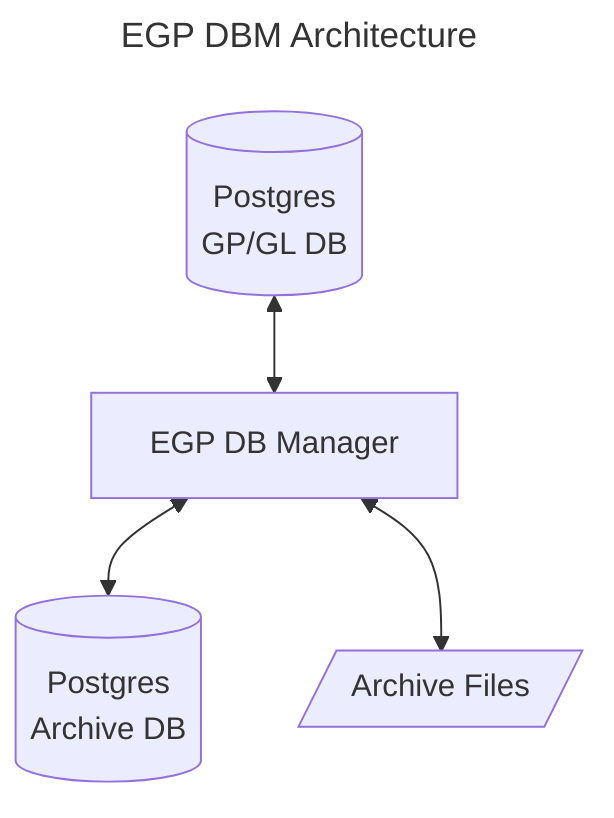
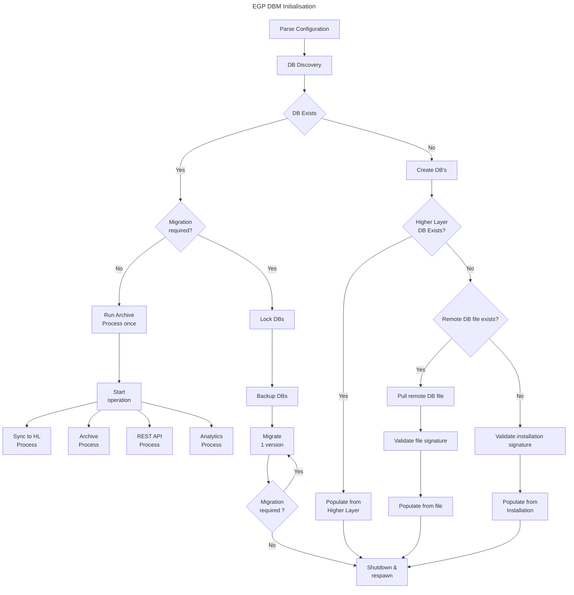
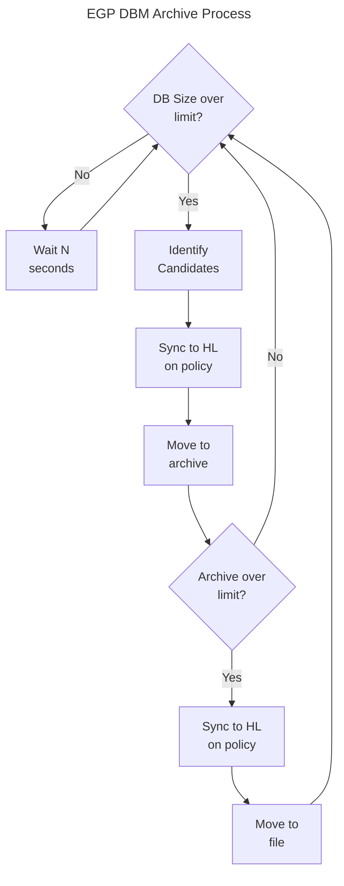

# EGP Database Manager - Architecture

## Top Level

The EGP DB Manager is an independent process (container) that manages a postgres database for a storage role in EGP. The storage role (Local, Gene Pool, Genomic Library, Archive) is defined by the DBM configuration upon creation. The DBM manages its database as a cache to the upstream databases but also takes care of low value data archiving to reduce noise and data volume at the higer layers (upstream).

The database being managed by the DBM is called the 'Managed' database. It is initially populated with data from one or more upstream databases or from local static file storage in the event that the upstream storage is unavailible or not configured. Low value data, based on configuration rules, is periodically purged to the archive.

The Postgres DB should be more performant that the archive DB and is typically configured with more indexes & other parameters for speed. The Postgres Archive DB is used as a slower store of less frequently used GC's when the main DB reaches its size limit. When the Archive DB reaches its size limit unused GC's (the entire gene line of a poorly performing GC) are placed in to encrypted compressed database back up files.

## Configuration

The Database Manager is configured.

## Initialisation

When the DBM intializes it will create or migrate the DB's as required and then respawn. This is to ensure any potential additional memory claim by these one-off processes are freed to the system before long term operation commences.

## Operation

### Archive Process

### Sync to Higher Layer Process

### REST API Process

### Analytics Process

### File Archive

The file archive created from the EGP DBM is an unordered, size limited, encrypted, signed, binary, compressed file that is
background transfered to the Universal Archive Queue (a remote process that queues archive files for indexed storage).

## The Universal Archive

The Universal Archive, UA, is a centralized archive of GC's stored in files. The archive files are binary, in order, fixed size
records keyed by the GC signature. Archive files are required to be limited to 2**24 entries. When an archive file reaches its
entry limit it splits into two files one covering the lower signature range and the other the upper signature range. This means
the two files are unlikely to have the same number of entries but should be similar. e.g. The first archive files contains
signatures in the range 0x000...000 to 0xFFF...FFF. When it reaches its size limit it splits into two archives one holding
signatures in the range 0x000...000 to 0x7FF...FFF and the other 0x800...000 to 0xFFF...FFF. By convention archive files are named
with the lower bound significant hexadecimal characters followed by a hyphen and the upper bound significant hexadecimal characters
with the .bin extension e.g.

- 0-F.bin for the 1st archive file covering all signatures (0x000...000 to 0xFFF...FFF).
- 0-7.bin and 8-F.bin when the 1st archive file exceeds 2**24 entries and is split into two.
- 107-10F.bin for the signature range 0x10700...000 to 0x10FFF...FFF

All files are signed but not encrypted to enable storage based direct record access.

## Database Auxillary Tables

Besides the GC's in the main database table the DBM creates and manages some auxillary data tables to performance and analytics.

### DB Metadata

- UUID
- Version
- Created time
- Migration list (to version and timestamp)
- Host list (more than one if the DB moved hosts)
- Creator UUID
- Archive information
- HL Sync information
- Worker Session information

### Timeseries Analytics

- DB Size in GC's
- Number GC's archived
- Number GC's updated
- Number GC's sync'd
- Number problems
- Number populations
- Fitness distributions

etc.
