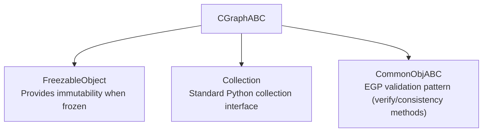

# CGraphABC - Connection Graph Abstract Base Class

## Overview

The `CGraphABC` class is an abstract base class that defines the essential interface for all Connection Graph implementations in the Erasmus GP genetic programming framework. It ensures consistency and provides a contract that all concrete Connection Graph classes must follow.

## Purpose

Connection Graphs represent the internal connectivity structure of genetic code nodes, defining how inputs, outputs, and internal components are connected through various interface types. The abstract base class provides:

1. **Interface Consistency**: Ensures all implementations provide the same methods and behaviors
2. **Type Safety**: Provides proper type hints for better IDE support and static analysis
3. **Extensibility**: Allows for different optimized implementations while maintaining compatibility
4. **Documentation**: Serves as authoritative documentation of the expected interface

## Inheritance Hierarchy



## Required Abstract Methods

All concrete implementations must provide the following methods:

### Container Protocol

- `__contains__(self, key: object) -> bool`
- `__iter__(self) -> Iterator[str]`
- `__len__(self) -> int`

### Mapping Protocol

- `__getitem__(self, key: str) -> InterfaceABC`
- `__setitem__(self, key: str, value: Interface) -> None`
- `__delitem__(self, key: str) -> None`

### Graph State Methods

- `is_stable(self) -> bool`
- `graph_type(self) -> CGraphType`

### Serialization

- `to_json(self, json_c_graph: bool = False) -> dict | JSONCGraph`

### Connection Management

- `connect_all(self, if_locked: bool = True) -> None`
- `stabilize(self, if_locked: bool = True) -> None`

### Object Operations

- `copy(self) -> CGraphABC`
- `__eq__(self, other: object) -> bool`
- `__hash__(self) -> int`
- `__repr__(self) -> str`

## Usage Example

```python
from egppy.genetic_code.c_graph_abc import CGraphABC
from egppy.genetic_code.c_graph import CGraph

# Create a concrete implementation
graph: CGraphABC = CGraph({...})

# Use the abstract interface
if graph.is_stable():
    graph_data = graph.to_json()
    copy_graph = graph.copy()
```

## Design Patterns

The abstract base class enforces several key design patterns from the Erasmus GP framework:

1. **Common Object Pattern**: Inherits from `CommonObjABC` for validation methods
2. **Freezable Object Pattern**: Supports immutability when frozen for memory efficiency
3. **Defensive Programming**: All methods should validate inputs and handle edge cases
4. **Type Safety**: Comprehensive type hints for better development experience

## Implementation Guidelines

When implementing a concrete Connection Graph class:

1. **Inherit from CGraphABC**: This ensures all required methods are implemented
2. **Call super().\__init__()**: Properly initialize parent classes
3. **Implement all abstract methods**: The class cannot be instantiated otherwise
4. **Follow validation patterns**: Use `self.value_error()`, `self.type_error()` etc.
5. **Maintain type consistency**: Ensure method signatures match the abstract definitions
6. **Document behavior**: Provide clear docstrings for all methods

## Benefits

- **Consistency**: All Connection Graph implementations provide the same interface
- **Maintainability**: Changes to the interface are centralized in the abstract class
- **Testing**: Common test patterns can be applied to all implementations
- **IDE Support**: Better autocomplete and type checking
- **Architecture**: Clear separation of interface from implementation

## Related Classes

- `CGraph`: The main concrete implementation of the abstract base class
- `Interface`: Represents endpoints within the graph
- `FreezableObject`: Provides immutability support
- `CommonObjABC`: Provides validation method contracts
