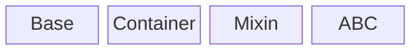

# Software Design Principles

Currently a collection of Software Design Principles

## Abstraction and Isolation

Erasmus GP has a roadmap of function & optimisation to be implemented. To enable work to start with the most basic function and expand later the objects passed around are abstract, interfaces assumed asynchronous and functions as stateless as possible.

The general inheretance of EGP classes is shown below.

From left to right:

- **Base** classes provide highet priority (method reolution order) members and methods. It is used to provide mixin methods that overide any Container class definitions.
- **Container** classes are either builtin containers or from collections.abc e.g. dict, list, MutableMapping etc.
- **Mixin** classes provide methods that are built from primitive methods. Mixin classes are often defined with a Protocol class to support type checking.
- **ABC** abstract base class defines the required methods of the class.

## Logging

Any and all assumptions are coded into API's as assertions that can be enabled with the logging level.
Logging level *VERIFY* performs basic value and type checking.
Logging level *CONSISTENCY* does a more thourough check that all data in scope is sefl consistent.

## JSON and Dictionaries

Erasmus GP uses data in human readable JSON format where ever practical. This encourages the use of basic types and python dictionaries as viable object base classes.

## Security

1. All data at rest is digitially signed.
1. All data in transit is encrypted between authenticated points.
1. All data read from rest is verified before any use e.g. verify expectations before unzipping.
