# Connection Graphs

A Genetic Code graph defines how values from the GC input are passed to sub-GC's and outputs from sub-GC's
(and directly from the input) are connected to the GC's outputs. There are 6 types of Connection Graph.

| Type | Comments |
|------|------------|
| Codon | Defines an interface & represents a primitive operator such addition or logical OR. Has no sub-GC's. |
| Conditional | Chooses an execution path through one of the sub-GCs based the inputs. |
| Empty | Defines an interface. Has no sub-GCs and generates no code. Used to seed problems. |
| Standard | Connects two sub-GC's together to make a new GC. This is by far the most common type.|

## Row Requirements

Note that both GCA and GCB are present or neither are present. This simplifies the rules for insertion.
All Connection Graphs may have either an input interface or an output interface or both but cannot have neither.
GC's with just inputs store data in memory, more presistant storage or send it to an output port. GC's that
just have an output interface are constants, read from memory, storage or input ports.

| Type | I | F | A | B | O | P |
|------|---|---| ---|---|---|---|
| Codon | o | - | - | - | o | - |
| Conditional | X | X | X | X | m | m |
| Empty | o | - | - | - | o | - |
| Standard | o | - | X | X | o | - |

- **X** = Must be present i.e. have at least 1 endpoint for that row.
- **-** = Must _not_ be present
- **o** = Must have at least 1 endpoint in the set of rows.
- **m** = May be present and must be the same on each row.

## Connectivity Requirements

Codons and Empty graphs have no connections only Input and Output row definitions i.e. an IO interface definition. Standard, Hardened and Conditional graphs have connections between row interfaces but not all combinations are permitted. In the matrix below the source of the connection is the column label and the destination of the connection is the row label.

| Dst | I | F | A | B | O | P |
|------|---|---|---|---|---|---|
|  I  | - | - | - | - | - | - |
| F | **C** | - | - | - | - | - |
|  A  | SC | - |  - | - | - | - |
|  B  | SC | - | S | - | - | - |
|  O  | SC | - | SC | S | - | - |
|  P  | C | - | - | C | - | - |

- S = Allowed in a Standard graph
- C = Allowed in a Conditional graph
- \- = Not allowed in any case
- **bold** = Required

Note that the required connections are a consequence of the rule that an interface must have at least 1 endpoint and all destination endpoints must be connected to a source. In all of these cases only one row is capable of connecting to the other and so the connection must exist.

Flow charts of the allowed connectivity standard and conditional graphs are below.

### Standard Connectivity Graph

```mermaid
%% Standard GC
flowchart TB
    I["[I]nputs"]
    A["GC[A]"]
    B["GC[B]"]
    O["[O]utputs"]
    A --> O
    I --> A --> B --> O
    I --> B
    I --> O
    
classDef Icd fill:#999,stroke:#333,stroke-width:1px
classDef Acd fill:#900,stroke:#333,stroke-width:1px
classDef Bcd fill:#009,stroke:#333,stroke-width:1px
classDef Ocd fill:#000,stroke:#333,stroke-width:1px

class I Icd
class A Acd
class B Bcd
class O Ocd
```

### Conditional Connectivity Graph

```mermaid
%% Conditional GC
flowchart TB
    I["[I]nputs"]
    F["i[F]"]
    A["GC[A]"]
    B["GC[B]"]
    O["[O]utputs"]
    P["Out[P]uts"]
    I --> F
    I --> A --> O
    B --> P
    I --> B
    I --> O
    I --> P
    
classDef Icd fill:#999,stroke:#333,stroke-width:1px
classDef Acd fill:#900,stroke:#333,stroke-width:1px
classDef Bcd fill:#009,stroke:#333,stroke-width:1px
classDef Ocd fill:#000,stroke:#333,stroke-width:1px
classDef Pcd fill:#099,stroke:#333,stroke-width:1px

class I Icd
class A Acd
class B Bcd
class O Ocd
class P Pcd
```

### Codon & Empty Connectivity Graphs

```mermaid
%% Codon & Empty GC
flowchart LR
    I["[I]nputs"]
    O["[O]utputs"]
    
classDef Icd fill:#999,stroke:#333,stroke-width:1px
classDef Ocd fill:#000,stroke:#333,stroke-width:1px

class I Icd
class O Ocd
```

## Types

Types are represented by signed 32 bit integer unique identifiers and a unique name string
of no more than 64 characters, for example 0x1, "bool" for the builtin python type bool. The integer UIDs are
for efficient storage and look up, the strings for import names. As well as concrete types (like bool, int,
list etc.) there are _abstract_ types and _meta_ types which differ by the scopes in which they can be resolved
into concrete types.

| Class        | **Runtime** | **Buildtime** | **In Storage** |
|--------------|:-----------:|:-------------:|:--------------:|
| **Meta**     |     Yes     |       -       |        -       |
| **Abstract** |     Yes     |      Yes      |        -       |
| **Concrete** |     Yes     |      Yes      |       Yes      |

Where _runtime_ is when the GC is executed, _buildtime_ is when the GC is being modified / mutated and _in storage_
is when the GC is persisted in the Gene Pool or Genomic Library caches or databases.

### Meta-Types

There are several meta-types:

- **egp_invalid**: The invalid type. Used for error conditions and testing.
- **egp_number**: A base type that defines the numeric operators which can be inherited by all builtin python and custom numeric types.
- **egp_complex**: Similar to number but for complex types.
- **egp_rational**: Similar to number but for rational types.
- **egp_real**: Similar to number but for rational types.
- **egp_integral**: Similar to number but for rational types.
- **egp_highest**: Is an output type that matches the highest (closest to 'object') type of the inputs. Useful in arithmetic operations.
- **egp_wc_X_Y**: Output wildcard types. These define output types based on the input types. See below for more details.

In addition, meta-types (except egp_highest and egp_wc_*) or abstract types (see below) have a corresponding homogeneous any meta-type e.g. egp_number1, object7.
where all reference to the homogeneous any meta-type refer to the same runtime type. The unextended type name e.g. 'egp_number' or 'object' is the heterogeneous any meta-type i.e. each reference to it in an interface may be referencing a different concrete type.

### Abstract Types

Abstract types are like abstract classes in python, they cannot be instanciated themselves but may represent any type that conforms to thier
protocol. Abstract types get resolved at build time when a GC with compatible types is instanciated. Abstract EP types enable Abstract GC's which are a key optimisation for EGP. Examples of abstract EP types are the [python numbers abstract base classes](https://docs.python.org/3/library/numbers.html).

### Concrete types

Concrete types are always known and can be any sort of python concrete class. The majority of EP types are concrete types.

### Integer UID Format

The EP Type integer UID value Has the following format:

|    31    | 30:28 | 27 | 26:24 |   23:16  | 15:0 |
|:--------:|:-----:|:--:|:-----:|:--------:|:----:|
| Reserved |   TT  | IO |  FX   | Reserved | XUID |

When IO = 1, TT = b'000, FX = b'000 and XUID is is split as follows:

|   15:14  | 13:8 |    7:4   | 3:0 |
|:--------:|:----:|:--------:|:---:|
| Reserved |   X  | Reserved |  Y  |

The Template Types bits, TT, define the number of templated types that need to be defined for the 65536 possible XUID types. TT has a value in the range 0 to 7. A 0 template types object is a scalar object like an _int_ or a _str_ that requires no other type to define it. Template types of 1 or more define various dimensions of containers e.g. a _list_ or _set_ only requires the definition of one template type (TT = 1) for a _list[str]_ or _set[object]_ (**NOTE:** The template type is the type of **all** of the elements hence a list or set etc. only can define one template type. A hetrogeneous container of elements is defined using an abstract type such as _object_ or _Number_ abstract types). A dict is an example of a container that requires two template types to be defined e.g. _dict[str, float]_. The UID does not encode the template types, they are defined in the End Point Type.

The IO bit defines a set of meta-types call _wildcard_ types. Wildcard types are numbered from X = 0 to 63 and Y = 0 to 15 in thier names i.e. 'egp_wc_0_0', 'egp_wc_0_1', ... 'egp_wc_63_15' i.e. 64 * 16 = 1024 different types. These meta-types define output types from input types, X is the index of the input type in the GC input type array (which has a maximum of 64 elements) and Y the depth of type definition. The use case for this type is identifying the type of an element extracted from a container or returned from a conditional e.g. if the single input type to a list.pop() codon was list\[float\] the output type would be float as identfied by the wildcard type egp_wc_0_1 (egp_wc_0_0 is 'list', egp_wc_0_1 is 'float').

The FX or 'fixed' bits expand the set of abstract and meta-types. Each value of FX creates another instance of the type as defined by the other bits in the UID. The purpose is to be able to define input types where the type can be abstract (and thus one of many) but each reference is to the same concrete type.  For example if 'object' is the abstract type then there are 8 object types represented by the stings 'object', 'object1', 'object2' ... 'object7'. The base 'object' type can match any derived type at any position in the input interface, however 'object1' to 'object7' may match any concrete object type but it must be the **same** concrete object type in all positions where the number object type appears. This enables codons to represent functions like 'max([1, 2, 3, 4], default=3)' with a known output type by defining the abstract fixed types e.g. max(Iterable[Number1], default=Number1).

### End Point Types

End Point Types , EPTs, are complete types defined by a sequence (usually a tuple) of types with the format:

(type[0], \*template_type[1], ..., \*template_type[n])

where _n_ is the value of TT in the type[0] type UID. For scalar types type[0] == scalar_type UID_ and _n == 0_ i.e. _(scalar_type,)_ is the EPT for a scalar type. For container types the template types are EPTs defined in the order of the container definition which permits nested containers of almost arbitary depth to be supported (limited by the number of types that may be defined in an interface). For example:

- list[str]: (list_type, str_type, )
- dict[str, float]: (dict_type, str_type, float_type)
- dict[str, list[int]]: (dict_type, str_type, list_type, int_type)
- dict[tuple[int, ...], list[list[any]]]: (dict_type, tuple_type, int_type, list_type, list_type, heany_type)

Note that the TT bit format of the UID means that the EPT sub-groupings do not have to be explicit in the implementation i.e. an array of types without grouping for an EPT is uniquely decodable which in turn enables an interface (see later) to be defined as a single array of types. This is efficient for
database storage.

### Interfaces

An interface is an ordered sequence (usually an array or tuple) of 0 or more End Point Types but with no more
than a total of 256 types elements i.e. sum(len(ept for ept in interface)) <= 256. The EPTs are stored in lexicographical ascending order which puts scalar types first.

## JSON Format

TO DO: Explain more
In row U the connections are stored in alphabetical order, then index order. This is specified for reproducablility.

## Rows, Interfaces & Connections

A Genetic Code has two interfaces, the input and the output interface. When viewed from within the
Connection Graph the input interface is a source interface i.e. it is a source of connections
to other rows, and the output interface a destination interface. Row A and row B represent the input
and output interfaces to GCA and GCB reprectively. Within the graph though GCA's input interface is
a destination and its output a source.

### Source Interfaces

Source interface endpoints may have 0, 1 or many connections to destination interface endpoints (but
only one connection to the same destination endpoint).

### Destination Interfaces

All destination interface endpoints must be connected to one (and only one) source interface endpoint.
