# GC Graphs

A Genetic Code graph defines how values from the GC input are passed to sub-GC's and outputs from sub-GC's
(and directly from the input) are connected to the GC's outputs. There are 6 types of GC Graph.

| Type | Comments |
|------|------------|
| Codon | Defines an interface & represents a primitive operator such addition or logical OR. Has no sub-GC's. |
| Conditional | Chooses an execution path through one of the sub-GCs based on an input boolean. |
| Empty | Defines an interface. Has no sub-GCs and generates no code. Used to seed problems. |
| Standard | Connects two sub-GC's together to make a new GC. This is by far the most common type.|

## Row Requirements

Note that both GCA and GCB are present or neither are present. This simplifies the rules for insertion.
All GC graphs may have either an input interface or an output interface or both but cannot have neither.
GC's with just inputs store data in memory, more presistant storage or send it to an output port. GC's that
just have an output interface are constants, read from memory, storage or input ports.

| Type | I | F | A | B | O | P |
|------|---|---| ---|---|---|---|
| Codon | o | - | - | - | o | - |
| Conditional | o | X | X | X | o | o |
| Empty | o | - | - | - | o | - |
| Standard | o | - | X | X | o | - |

- **X** = Must be present i.e. have at least 1 endpoint for that row.
- **-** = Must _not_ be present
- **o** = Must have at least 1 endpoint in the set of rows.

## Connectivity Requirements

Codons and Empty graphs have no connections only Input and Output row definitions i.e. an IO interface definition. Standard and Conditional graphs have connections between row interfaces but not all combinations are permitted. In the matrix below the source of the connection is the column label and the destination of the connection is the row label.

| Dst | I | F | A | B | O | P |
|------|---|---|---|---|---|---|
|  I  | - | - | - | - | - | - |
| F | **C** | - | - | - | - | - |
|  A  | SC | - |  - | - | - | - |
|  B  | SC | - | S | - | - | - |
|  O  | SC | - | SC | S | - | - |
|  P  | C | - | - | C | - | - |

- S = Allowed in a Standard graph
- C = Allowed in a Conditional graph
- \- = Not allowed in any case
- **bold** = Required

Note that the required connections are a consequence of the rule that an interface must have at least 1 endpoint and all destination endpoints must be connected to a source. In all of these cases only one row is capable of connecting to the other and so the connection must exist.

Flow charts of the allowed connectivity standard and conditional graphs are below.

### Standard Connectivity Graph

```mermaid
%% Standard GC
flowchart TB
    I["[I]nputs"]
    A["GC[A]"]
    B["GC[B]"]
    O["[O]utputs"]
    A --> O
    I --> A --> B --> O
    I --> B
    I --> O
    
classDef Icd fill:#999,stroke:#333,stroke-width:1px
classDef Acd fill:#900,stroke:#333,stroke-width:1px
classDef Bcd fill:#009,stroke:#333,stroke-width:1px
classDef Ocd fill:#000,stroke:#333,stroke-width:1px

class I Icd
class A Acd
class B Bcd
class O Ocd
```

### Conditional Connectivity Graph

```mermaid
%% Conditional GC
flowchart TB
    I["[I]nputs"]
    F["i[F]"]
    A["GC[A]"]
    B["GC[B]"]
    O["[O]utputs"]
    P["Out[P]uts"]
    I --> F
    I --> A --> O
    B --> P
    I --> B
    I --> O
    I --> P
    
classDef Icd fill:#999,stroke:#333,stroke-width:1px
classDef Acd fill:#900,stroke:#333,stroke-width:1px
classDef Bcd fill:#009,stroke:#333,stroke-width:1px
classDef Ocd fill:#000,stroke:#333,stroke-width:1px
classDef Pcd fill:#099,stroke:#333,stroke-width:1px

class I Icd
class A Acd
class B Bcd
class O Ocd
class P Pcd
```

### Codon & Empty Connectivity Graphs

```mermaid
%% Codon & Empty GC
flowchart LR
    I["[I]nputs"]
    O["[O]utputs"]
    
classDef Icd fill:#999,stroke:#333,stroke-width:1px
classDef Ocd fill:#000,stroke:#333,stroke-width:1px

class I Icd
class O Ocd
```

## JSON Format

TO DO: Explain more
In row U the connections are stored in alphabetical order, then index order. This is specified for reproducablility.

## Rows, Interfaces & Connections

An interface is an array of endpoints with 0 to 256 elements each defining the endpoint type.
A Genetic Code has two interfaces, the input and the output interface. When viewed from within the
GC Graph the input interface is a source interface i.e. it is a source of connections
to other rows, and the output interface a destination interface. Row A and row B represent the input
and output interfaces to GCA and GCB reprectively. Within the graph though GCA's input interface is
a destination and its output a source.

### Source Interfaces

Source interface endpoints may have 0, 1 or many connections to destination interface endpoints (but
only one connection to the same destination endpoint).

### Destination Interfaces

All destination interface endpoints must be connected to one (and only one) source interface endpoint.

## Types

Types are represented by a signed integer.  