# GC Graphs

A Genetic Code graph defines how values from the GC input are passed to sub-GC's and outputs from sub-GC's
(and directly from the input) are connected to the GC's outputs. There are 6 types of GC Graph.

| Type | Comments |
|------|------------|
| Codon | Defines an interface & represents a primitive operator such addition or logical OR. Has no sub-GC's. |
| Conditional | Chooses an execution path through one of the sub-GCs based on an input boolean. |
| Empty | Defines an interface. Has no sub-GCs and generates no code. Used to seed problems. |
| Standard | Connects two sub-GC's together to make a new GC. This is by far the most common type.|

## Row Requirements

Note that both GCA and GCB are present or neither are present. This simplifies the rules for insertion.
All GC graphs may have either an input interface or an output interface or both but cannot have neither.
GC's with just inputs store data in memory, more presistant storage or send it to an output port. GC's that
just have an output interface are constants, read from memory, storage or input ports.

| Type | I | F | A | B | O | P |
|------|---|---| ---|---|---|---|
| Codon | o | - | - | - | o | - |
| Conditional | o | X | X | X | o | o |
| Empty | o | - | - | - | o | - |
| Standard | o | - | X | X | o | - |

- **X** = Must be present i.e. have at least 1 endpoint for that row.
- **-** = Must _not_ be present
- **o** = Must have at least 1 endpoint in the set of rows.

## Connectivity Requirements

Codons and Empty graphs have no connections only Input and Output row definitions i.e. an IO interface definition. Standard and Conditional graphs have connections between row interfaces but not all combinations are permitted. In the matrix below the source of the connection is the column label and the destination of the connection is the row label.

| Dst | I | F | A | B | O | P |
|------|---|---|---|---|---|---|
|  I  | - | - | - | - | - | - |
| F | **C** | - | - | - | - | - |
|  A  | SC | - |  - | - | - | - |
|  B  | SC | - | S | - | - | - |
|  O  | SC | - | SC | S | - | - |
|  P  | C | - | - | C | - | - |

- S = Allowed in a Standard graph
- C = Allowed in a Conditional graph
- \- = Not allowed in any case
- **bold** = Required

Note that the required connections are a consequence of the rule that an interface must have at least 1 endpoint and all destination endpoints must be connected to a source. In all of these cases only one row is capable of connecting to the other and so the connection must exist.

Flow charts of the allowed connectivity standard and conditional graphs are below.

### Standard Connectivity Graph

```mermaid
%% Standard GC
flowchart TB
    I["[I]nputs"]
    A["GC[A]"]
    B["GC[B]"]
    O["[O]utputs"]
    A --> O
    I --> A --> B --> O
    I --> B
    I --> O
    
classDef Icd fill:#999,stroke:#333,stroke-width:1px
classDef Acd fill:#900,stroke:#333,stroke-width:1px
classDef Bcd fill:#009,stroke:#333,stroke-width:1px
classDef Ocd fill:#000,stroke:#333,stroke-width:1px

class I Icd
class A Acd
class B Bcd
class O Ocd
```

### Conditional Connectivity Graph

```mermaid
%% Conditional GC
flowchart TB
    I["[I]nputs"]
    F["i[F]"]
    A["GC[A]"]
    B["GC[B]"]
    O["[O]utputs"]
    P["Out[P]uts"]
    I --> F
    I --> A --> O
    B --> P
    I --> B
    I --> O
    I --> P
    
classDef Icd fill:#999,stroke:#333,stroke-width:1px
classDef Acd fill:#900,stroke:#333,stroke-width:1px
classDef Bcd fill:#009,stroke:#333,stroke-width:1px
classDef Ocd fill:#000,stroke:#333,stroke-width:1px
classDef Pcd fill:#099,stroke:#333,stroke-width:1px

class I Icd
class A Acd
class B Bcd
class O Ocd
class P Pcd
```

### Codon & Empty Connectivity Graphs

```mermaid
%% Codon & Empty GC
flowchart LR
    I["[I]nputs"]
    O["[O]utputs"]
    
classDef Icd fill:#999,stroke:#333,stroke-width:1px
classDef Ocd fill:#000,stroke:#333,stroke-width:1px

class I Icd
class O Ocd
```

## JSON Format

TO DO: Explain more
In row U the connections are stored in alphabetical order, then index order. This is specified for reproducablility.

## Rows, Interfaces & Connections

An interface is an array of endpoints with 0 to 256 elements each defining the endpoint type.
A Genetic Code has two interfaces, the input and the output interface. When viewed from within the
GC Graph the input interface is a source interface i.e. it is a source of connections
to other rows, and the output interface a destination interface. Row A and row B represent the input
and output interfaces to GCA and GCB reprectively. Within the graph though GCA's input interface is
a destination and its output a source.

### Source Interfaces

Source interface endpoints may have 0, 1 or many connections to destination interface endpoints (but
only one connection to the same destination endpoint).

### Destination Interfaces

All destination interface endpoints must be connected to one (and only one) source interface endpoint.

## End Point Types

End Point, EP, types are represented by signed 32 bit integer unique identifiers and a unique name string
of no more than 64 characters, for example 0x1, "bool" for the builtin python type bool. The integer UIDs are
for efficient storage and look up, the strings for import names. As well as concrete types (like bool, int,
list etc.) there are _abstract_ types and _meta_ types which differ by the scopes in which they can be resolved
into concrete types.

| Class        | **Runtime** | **Buildtime** | **In Storage** |
|--------------|:-----------:|:-------------:|:--------------:|
| **Meta**     |     Yes     |       -       |        -       |
| **Abstract** |     Yes     |      Yes      |        -       |
| **Concrete** |     Yes     |      Yes      |       Yes      |

Where _runtime_ is when the GC is executed, _buildtime_ is when the GC is being modified / mutated and _in storage_
is when the GC is persisted in the Gene Pool or Genomic Library caches or databases.

### Meta-Types

There are two meta-types:

- **hoany**: Homogeneous any type. This meta type is used to show that a container holds only one type of object that will be resolved at runtime. It means that an 'is_instance_of' codon can confirm the type of one element and the container type can become more concrete.
- **heany**: Hetrogeneous any type. This meta type means that the objects in a container cannot be assumed to be the same and must individually by made more concrete is 'is_instance_of' codons.

_hoany_ can be thought of as an optimisation of _heany_. In both cases the type(s) they represent can only be resolved at runtime.

### Abstract Types

Abstract types are like abstract classes in python, they cannot be instanciated themselves but may represent any type that conforms to thier
protocol. Abstract types get resolved at build time when a GC with compatible types is instanciated. Abstract EP types enable Abstract GC's which are a key optimisation for EGP. Examples of abstract EP types are the [python numbers abstract base classes](https://docs.python.org/3/library/numbers.html).

There is a group of special abstract types call _wildcard_ types. Wildcard types are numbered from 0 to 63 in thier names i.e. 'wildcard0', 'wildcard1', ... 'wildcard63'. These abstract types define output types from input types, the number of the wildcard is the index of the input type in the GC input types array (which has a maximum of 64 elements). The use case for this type is identifying the type of an element extracted from a container e.g. if the input type type to a list.pop() codon was list\[float\] the output type would be float as identfied by the appropriate wildcard type.

### Concrete types

Concrete types are always known and can be any sort of python concrete class. The majority of EP types are concrete types.

### Integer UID Format

The EP Type integer UID value Has the following format:

|    31    | 30:28 |   27:16  | 15:0 |
|:--------:|:-----:|:--------:|:----:|
| Reserved |   TT  | Reserved | XUID |

The Template Types bits, TT, define the number of templated types that need to be defined for the 65536 possible XUID types. TT has a value in the range 0 to 7. A 0 template types object is a scalar object like an _int_ or a _str_ that requires no other type to define it. Template types of 1 or more define various dimensions of containers e.g. a _list_ or _set_ only requires the definition of one template type (TT = 1) for a _list[str]_ or _set[object]_. A dict is an example of a container that requires two template types to be defined e.g. _dict[str, float]_. The UID does not encode the template types, they are defined by the input/output types array in the GC definition.
