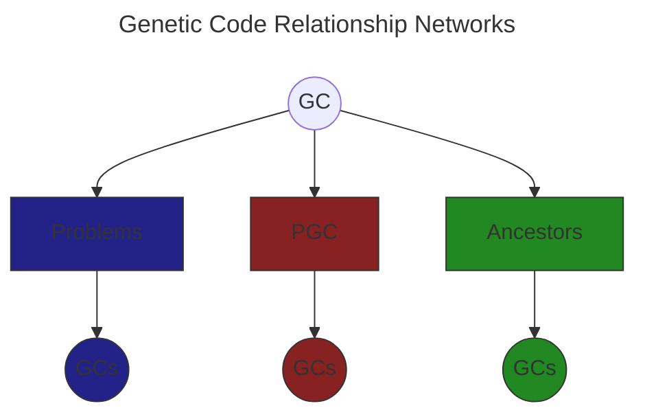

# Genetic Code Relationship Networks

GC's are connected to other GC's by up to 3 relationship networks. The problem network, the PGC network and the ancestor network. All GC's except codons have ancestors and by definition they are one step away from thier parents and two from thier siblings, more so from thier half siblings and so on. They are also, more distantly, related to GC's created 

