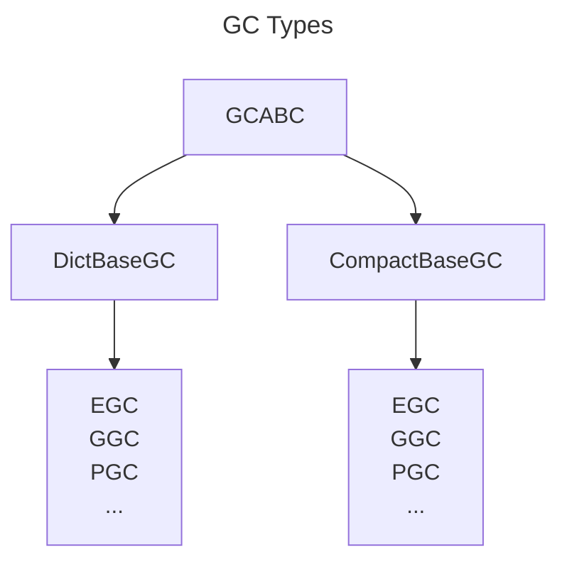

# Genetic Code Types

Genetic Code access and storage is critical to the performance of Erasmsus GP. Due to the large data volume there are significant trade offs to be made in GC storage design: compact and a lot of GC's can be stored locally but high frequency access to the same ones is expensive etc. Erasmus GP tries to get the most out of these competing limitations by supporting multiple different ways to store GC's depending on the needs.

All Genetic Code types are derived from the Abstract Base Class *GCABC* which provides a dictionary like interface to a GC along with some other methods.

