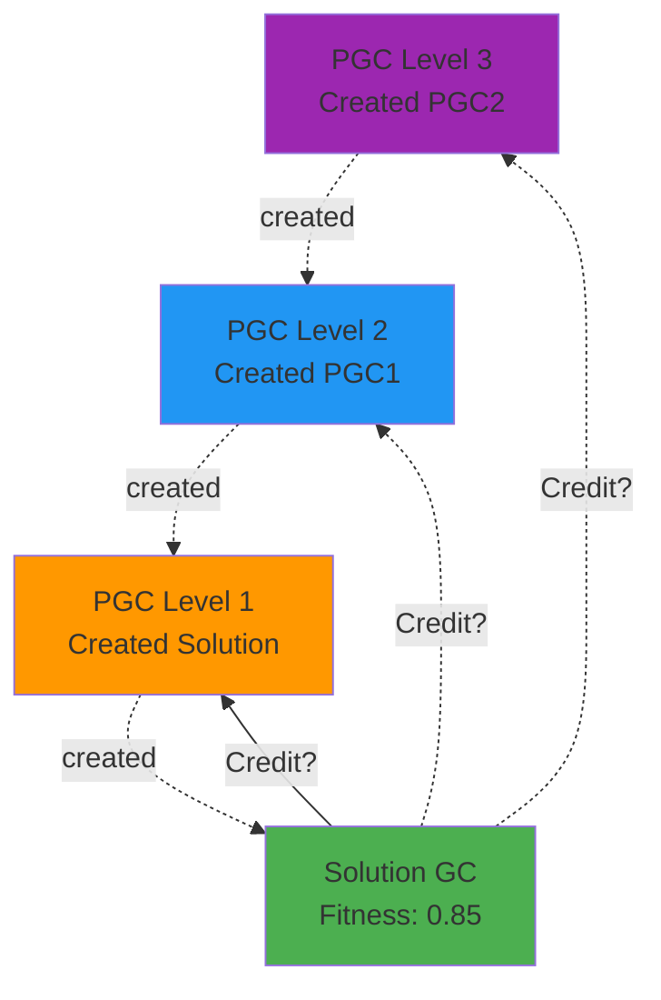

# Credit Assiognment

## PGSs

### Herditary Credit

Exponential Decay with Recency Bias. Assign credit that decays exponentially with genealogical distance, weighted by recency.

#### Advantages

- ✅ Mathematically principled (temporal difference learning)
- ✅ Naturally handles infinite recursion
- ✅ Prevents credit from exploding at deep levels
- ✅ Recent innovations valued more than ancient ones



```python
def calculate_pgc_credit(
    offspring_fitness: float,
    pgc_depth: int,  # How many levels up the PGC chain
    decay_rate: float = 0.5,  # Half-life per generation
    time_discount: float = 0.95  # Recency factor
) -> float:
    """
    Credit = fitness × decay^depth × time_discount^age
    
    Example:
    - Direct parent PGC (depth=1): 0.85 × 0.5^1 = 0.425
    - Grandparent PGC (depth=2): 0.85 × 0.5^2 = 0.2125
    - Great-grandparent (depth=3): 0.85 × 0.5^3 = 0.10625
    """
    return offspring_fitness * (decay_rate ** pgc_depth) * (time_discount ** age_in_generations)
```

### Sub-PGC Credit

Since PGCS have an internal fitness function, whenever they are run they can be assessed relative to their fitness function. And get credit. From that. However, for the wider context. Of the overall PGC. And its success. Credit needs to be given at some proportion.
