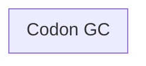
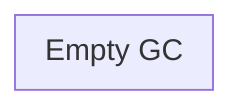
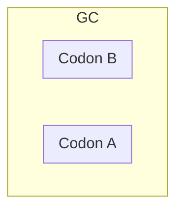

# Genetric Code Logical Structure

A genetic codes, GC, is a recursively embedded structure. A GC has an input interface, I, and an output interface, O as well as none or two embedded sub-GCs that are connected together as a graph. The Connection Graph is described in ... A GC with no sub-GCs is called a codon or an empty GC. Codons represent a functional primitive.

Any Empty GC is just an interface definition and represents no function.

Most GC's are Standard or Conditional which have the same logical structure of 2 sub-GCs identified as A and B. The diagram below shows a GC with GC A and GC B both of which are codons in this case but may be a mixture of any type of GC except an Empty GC.

GCs can be infinitely embedded. The diagram below shows a GC with a depth of 5 with the maximum possible number of codons (leaves) which is 32.

```mermaid
flowchart TB
    subgraph Top Level GC
        direction TB
        subgraph A
            direction TB
            subgraph AA
                direction TB
                subgraph AAA
                    direction TB
                    subgraph AAAA
                        direction TB
                    end
                    subgraph AAAB
                        direction TB
                    end
                end
                subgraph AAB
                    direction TB
                    subgraph AABA
                        direction TB
                    end
                    subgraph AABB
                        direction TB
                    end
                end
            end
            subgraph AB
                direction TB
                subgraph ABA
                    direction TB
                    subgraph ABAA
                        direction TB
                    end
                    subgraph ABAB
                        direction TB
                    end
                end
                subgraph ABB
                    direction TB
                    subgraph ABBA
                        direction TB
                    end
                    subgraph ABBB
                        direction TB
                    end
                end
            end
        end
        subgraph B
            direction TB
            subgraph BA
                direction TB
                subgraph BAA
                    direction TB
                    subgraph BAAA
                        direction TB
                    end
                    subgraph BAAB
                        direction TB
                    end
                end
                subgraph BAB
                    direction TB
                    subgraph BABA
                        direction TB
                    end
                    subgraph BABB
                        direction TB
                    end
                end
            end
            subgraph BB
                direction TB
                subgraph BBA
                    direction TB
                    subgraph BBAA
                        direction TB
                    end
                    subgraph BBAB
                        direction TB
                    end
                end
                subgraph BBB
                    direction TB
                    subgraph BBBA
                        direction TB
                    end
                    subgraph BBBB
                        direction TB
                    end
                end
            end
        end
    end
```

The next chart shows a GC of depth 4 with the minimum possible number of codons = 5.

```mermaid
flowchart TB
    GC:::grey
    GC --> A:::red
    GC --> B:::blue
    A --> AA:::red
    A --> AB:::blue
    AA --> AAA:::red
    AA --> AAB:::blue
    AAA --> AAAA:::red
    AAA --> AAAB:::blue

classDef grey fill:#444444,stroke:#333,stroke-width:1px
classDef red fill:#FF0000,stroke:#333,stroke-width:1px
classDef blue fill:#0000FF,stroke:#333,stroke-width:1px
```

Since codons are the minimum functional unit, which is typically a single operation or line of code, we can state that a GC of depth _n_ has - _n_ < lines of code <= 2ⁿ

```mermaid
flowchart TD
    GC:::grey
    GC --> A:::red
    GC --> B:::blue
    A --> AA:::red
    A --> AB:::blue
    AA --> AAA:::red
    AA --> AAB:::blue
    AAA --> AAAA:::red
    AAA --> AAAB:::blue

    AAB --> AABA:::red
    AAB --> AABB:::blue

    AB --> ABA:::red
    AB --> ABB:::blue
    ABA --> ABAA:::red
    ABA --> ABAB:::blue

    ABB --> ABBA:::red
    ABB --> ABBB:::blue

    B --> BA:::red
    B --> BB:::blue
    BA --> BAA:::red
    BA --> BAB:::blue
    BAA --> BAAA:::red
    BAA --> BAAB:::blue

    BAB --> BABA:::red
    BAB --> BABB:::blue

    BB --> BBA:::red
    BB --> BBB:::blue
    BBA --> BBAA:::red
    BBA --> BBAB:::blue

    BBB --> BBBA:::red
    BBB --> BBBB:::blue

classDef grey fill:#444444,stroke:#333,stroke-width:1px
classDef red fill:#FF0000,stroke:#333,stroke-width:1px
classDef blue fill:#0000FF,stroke:#333,stroke-width:1px
```

