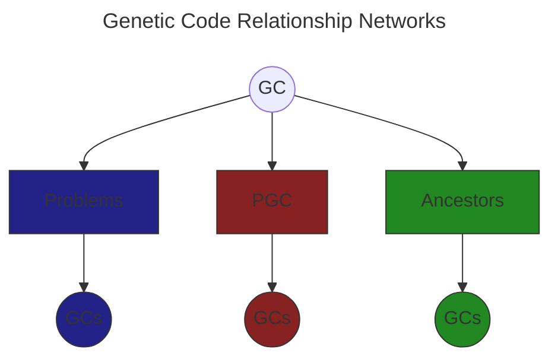

# Genetic Code Relationship Networks

GCs are connected to other GCs by up to 3 relationship networks: the problem network, the PGC network, and the ancestor network. All GCs except codons have ancestors, and by definition they are one step away from their parents and two from their siblings, more so from their half siblings and so on. They are also, more distantly, related to GCs created by their descendants.

