# Connection Graphs

A Genetic Code graph defines how values from the GC input are passed to sub-GC's and outputs from sub-GC's
(and directly from the input) are connected to the GC's outputs. There are 7 types of Connection Graph.

| Type | GC Type | Comments |
|------|---------|----------|
| If-Then | Ordinary | Conditional graph with a single execution path (GCA) chosen when condition is true. |
| If-Then-Else | Ordinary | Conditional graph with two execution paths (GCA/GCB) chosen based on condition. |
| Empty | Ordinary | Defines an interface. Has no sub-GCs and generates no code. Used to seed problems. |
| For-Loop | Ordinary | Loop graph that iterates over an iterable, executing GCA for each element. |
| While-Loop | Ordinary | Loop graph that executes GCA while a condition remains true. |
| Standard | Ordinary | Connects two sub-GC's together to make a new GC. This is by far the most common type. |
| Primitive | Codon, Meta | Simplified graph representing a primitive operator (e.g., addition, logical OR). Has no sub-GC's. |

## Row Requirements

All Connection Graphs may have either an input interface or an output interface or both but cannot have neither.
GC's with just inputs store data in memory, more persistent storage or send it to a peripheral. GC's that
just have an output interface are constants, read from memory, storage or peripherals.

### Row Definitions

- **I** = Input interface (source)
- **F** = Condition evaluation destination (for conditionals)
- **L** = Loop iterable/condition destination (for loops) and loop object source
- **W** = While loop condition destination
- **A** = GCA input (destination) / GCA output (source)
- **B** = GCB input (destination) / GCB output (source)
- **O** = Output interface (destination)
- **P** = Alternate output interface (destination) - used when condition is false or loop has zero iterations
- **U** = Unconnected source endpoints (destination) - JSON format only

| Type | I | F | L | W | A | B | O | P | U |
|------|---|---|---|---|---|---|---|---|---|
| If-Then | X | X | - | - | X | - | m | m | o |
| If-Then-Else | X | X | - | - | X | X | m | m | o |
| Empty | o | - | - | - | - | - | o | - | o |
| For-Loop | X | - | X | - | X | - | m | m | o |
| While-Loop | X | - | X | X | X | - | m | m | o |
| Standard | o | - | - | - | X | X | o | - | o |
| Primitive | o | - | - | - | X | - | o | - | - |

- **X** = Must be present i.e. have at least 1 endpoint for that row.
- **-** = Must _not_ be present
- **o** = Must have at least 1 endpoint in the set of rows.
- **m** = May be present and must be the same on each row.

## Connectivity Requirements

Empty and Primitive graphs have limited connections. If-Then, If-Then-Else, For-Loop, While-Loop, and Standard graphs have connections between row interfaces but not all combinations are permitted. In the matrix below the source of the connection is the column label and the destination of the connection is the row label.

| Dst\Src | I | L | A | B |
|---------|---|---|---|---|
| F | IT,IE | - | - | - |
| L | FL,WL | - | - | - |
| W | - | - | WL | - |
| A | IT,IE,FL,WL,S,P | FL,WL | - | - |
| B | IE,S | - | S | - |
| O | IT,IE,FL,WL,S,P | - | IT,IE,FL,WL,S,P | S |
| P | IT,IE,FL,WL | - | - | IE |
| U | All | All | All | All |

**Legend:**

- **IT** = If-Then graph
- **IE** = If-Then-Else graph
- **FL** = For-Loop graph
- **WL** = While-Loop graph
- **S** = Standard graph
- **P** = Primitive graph
- **-** = Not allowed

Note that required connections are a consequence of the rule that an interface must have at least 1 endpoint and all destination endpoints must be connected to a source. In all of these cases only one row is capable of connecting to the other and so the connection must exist. Note that these rules do allow for a standard graph to have an A and B row that do not connect to each other. The GC is then functionaly equivilent to its sub-GC's. This arrangement is called a _harmony_.

Flow charts of the allowed connectivity for each graph type are below.

### If-Then Connectivity Graph

```mermaid
%% If-Then GC
flowchart TB
    I["[I]nputs"]
    F["i[F] condition"]
    A["GC[A]"]
    O["[O]utputs"]
    P["Out[P]uts (false path)"]
    I --> F
    I --> A --> O
    I --> O
    I --> P
    
classDef Icd fill:#888888,stroke:#333,stroke-width:1px
classDef Fcd fill:#aa6622,stroke:#333,stroke-width:1px
classDef Acd fill:#882222,stroke:#333,stroke-width:1px
classDef Ocd fill:#222222,stroke:#333,stroke-width:1px
classDef Pcd fill:#228888,stroke:#333,stroke-width:1px

class I Icd
class F Fcd
class A Acd
class O Ocd
class P Pcd
```

### If-Then-Else Connectivity Graph

```mermaid
%% If-Then-Else GC
flowchart TB
    I["[I]nputs"]
    F["i[F] condition"]
    A["GC[A] (true)"]
    B["GC[B] (false)"]
    O["[O]utputs"]
    P["Out[P]uts (false path)"]
    I --> F
    I --> A --> O
    I --> B --> P
    I --> O
    I --> P
    
classDef Icd fill:#888888,stroke:#333,stroke-width:1px
classDef Fcd fill:#aa6622,stroke:#333,stroke-width:1px
classDef Acd fill:#882222,stroke:#333,stroke-width:1px
classDef Bcd fill:#222288,stroke:#333,stroke-width:1px
classDef Ocd fill:#222222,stroke:#333,stroke-width:1px
classDef Pcd fill:#228888,stroke:#333,stroke-width:1px

class I Icd
class F Fcd
class A Acd
class B Bcd
class O Ocd
class P Pcd
```

### For-Loop Connectivity Graph

```mermaid
%% For-Loop GC
flowchart TB
    I["[I]nputs"]
    L["[L]oop iterable (dst) / object (src)"]
    A["GC[A] loop body"]
    O["[O]utputs"]
    P["Out[P]uts (zero iteration)"]
    I --> L
    L --> A --> O
    I --> A
    I --> O
    I --> P
    
classDef Icd fill:#888888,stroke:#333,stroke-width:1px
classDef Lcd fill:#228822,stroke:#333,stroke-width:1px
classDef Acd fill:#882222,stroke:#333,stroke-width:1px
classDef Ocd fill:#222222,stroke:#333,stroke-width:1px
classDef Pcd fill:#228888,stroke:#333,stroke-width:1px

class I Icd
class L Lcd
class A Acd
class O Ocd
class P Pcd
```

### While-Loop Connectivity Graph

```mermaid
%% While-Loop GC
flowchart TB
    I["[I]nputs"]
    L["[L]oop object (dst/src)"]
    W["[W]hile condition"]
    A["GC[A] loop body"]
    O["[O]utputs"]
    P["Out[P]uts (zero iteration)"]
    I --> L
    L --> A
    I --> A
    A --> W
    A --> O
    I --> O
    I --> P
    
classDef Icd fill:#888888,stroke:#333,stroke-width:1px
classDef Lcd fill:#228822,stroke:#333,stroke-width:1px
classDef Wcd fill:#888822,stroke:#333,stroke-width:1px
classDef Acd fill:#882222,stroke:#333,stroke-width:1px
classDef Ocd fill:#222222,stroke:#333,stroke-width:1px
classDef Pcd fill:#228888,stroke:#333,stroke-width:1px

class I Icd
class L Lcd
class W Wcd
class A Acd
class O Ocd
class P Pcd
```

### Standard Connectivity Graph

```mermaid
%% Standard GC
flowchart TB
    I["[I]nputs"]
    A["GC[A]"]
    B["GC[B]"]
    O["[O]utputs"]
    A --> O
    I --> A --> B --> O
    I --> B
    I --> O
    
classDef Icd fill:#888888,stroke:#333,stroke-width:1px
classDef Acd fill:#882222,stroke:#333,stroke-width:1px
classDef Bcd fill:#222288,stroke:#333,stroke-width:1px
classDef Ocd fill:#222222,stroke:#333,stroke-width:1px

class I Icd
class A Acd
class B Bcd
class O Ocd
```

### Primitive Connectivity Graph

```mermaid
%% Primitive GC
flowchart TB
    I["[I]nputs"]
    A["GC[A] primitive operation"]
    O["[O]utputs"]
    I --> A --> O
    I --> O
    
classDef Icd fill:#888888,stroke:#333,stroke-width:1px
classDef Acd fill:#882222,stroke:#333,stroke-width:1px
classDef Ocd fill:#222222,stroke:#333,stroke-width:1px

class I Icd
class A Acd
class O Ocd
```

### Empty Connectivity Graph

```mermaid
%% Empty GC
flowchart LR
    I["[I]nputs"]
    O["[O]utputs"]
    
classDef Icd fill:#888888,stroke:#333,stroke-width:1px
classDef Ocd fill:#222222,stroke:#333,stroke-width:1px

class I Icd
class O Ocd
```

## Types

Types are represented by signed 32 bit integer unique identifiers and a unique name string of no more than 128 characters, for example 0x1, "bool" for the builtin python type bool (NB: 0x1 may not actually be the integer UID of the bool type). The integer UIDs are for efficient storage and look up and the strings for import names and generating code. Other data is associated with each type such as the bi-directional inheritence tree. An EGP type may be abstract in the programming sense that it is not completely defined and so cannot be instanciated.

### EGP Defined Types

There are several EGP defined types that can be considered pure abstract types and only exist as a root or low level node in the inheritance tree in order to support future type expansion or error conditions:

- **Any**: The standard 'typing' package 'Any' used to represent that an object may have any type.
- **EGPInvalid**: The invalid type. Used for error conditions and testing.
- **EGPNumber**: A base type that defines the numeric operators which can be inherited by all builtin python and custom numeric types.
- **EGPComplex**: Similar to number but for complex types.
- **EGPRational**: Similar to number but for rational types.
- **EGPReal**: Similar to number but for rational types.
- **EGPIntegral**: Similar to number but for rational types.

### Integer UID Format

The EP Type integer UID value Has the following format:

|    31    | 30:28 |  27:16   | 15:0 |
|:--------:|:-----:|:--------:|:----:|
| Reserved |  TT   | Reserved | XUID |

The Template Types bits, TT, define the number of templated types that need to be defined for the 65536 possible XUID types. TT has a value in the range 0 to 7. A 0 template types object is a scalar object like an _int_ or a _str_ that requires no other type to define it. Template types of 1 or more define various dimensions of containers e.g. a _list_ or _set_ only requires the definition of one template type (TT = 1) for a _list[str]_ or _set[object]_ (**NOTE:** The template type is the type of **all** of the elements hence a list or set etc. only can define one template type. A hetrogeneous container of elements is defined using a type such as _object_ or _Number_ which constrain the type). A dict is an example of a container that requires two template types to be defined e.g. _dict[str, float]_. The UID does not encode the template types directly, a global database maintains the UID to typed container mapping.

### UID Allocation

EGP permits an [infinite number of types](https://g.co/gemini/share/36d4f3b94521) i.e. a Septuple may be typed with Septuples that are not the same type as itself (inifinte recursion is not permitted) and so UID's are allocated on a globally atomic "first come first served" basis. By default all scalar (TT = 0) types plus base typed containers (e.g. "list[Any]", "dict[Hashable, Any]") permutation UIDs are defined for all containers with TT <= 2 and further types UID definitions for TT >= 1 e.g "list[int]" or "Triplet[list[Any], str, Complex]" are defined on demand from the problem definition.

### End Point Types

End Point Types, EPTs, are complete types defined by a sequence (usually a tuple) of types with the format. They are the full definition of a container type (TT > 0) type:

(type[0], \*template_type[1], ..., \*template_type[n])

where _n_ is the value of TT in the type[0] type UID. For scalar types type[0] == scalar_type UID_ and _n == 0_ i.e. _(scalar_type,)_ is the EPT for a scalar type. For container types the template types are EPTs defined in the order of the container definition which permits nested containers of almost arbitary depth to be supported (limited by the number of types that may be defined in an interface). For example:

- list[str]: (list_type, str_type, )
- dict[str, float]: (dict_type, str_type, float_type)
- dict[str, list[int]]: (dict_type, str_type, list_type, int_type)
- dict[tuple[int, ...], list[list[Any]]]: (dict_type, tuple_type, int_type, list_type, list_type, any_type)

NOTE: EPT's are an internal concept. The database storage (e.g. Gene Pool, Genomic Library) define types for ease of look up (SQL expression efficiency).

### End Points

End Points are parameters in a connection graph definition. They have a position, EGP type, row and 0, 1 or more references (connections to other endpoints) depending on their class: Source or destination. Destination endpoints must have 1 and only one reference (source that defines them) as they are input parameters to a GC function. Source endpoints may have 0 or more references as they are output parameters from a GC function. The function result may not be used or may be used in 1 or more places.

### Interfaces

An interface is a list or tuple like container of 0 or more End Points but with no more than a total of 256 types elements.

## JSON Format

TO DO: Explain more
In row U the connections are stored in alphabetical order, then index order. This is specified for reproducablility.

## Rows, Interfaces & Connections

A Genetic Code has two interfaces, the input and the output interface. When viewed from within the
Connection Graph the input interface is a source interface i.e. it is a source of connections
to other rows, and the output interface a destination interface. Row A and row B represent the input
and output interfaces to GCA and GCB reprectively. Within the graph though GCA's input interface is
a destination and its output a source.

### Source Interfaces

Source interface endpoints may have 0, 1 or many connections to destination interface endpoints (but
only one connection to the same destination endpoint).

### Destination Interfaces

All destination interface endpoints must be connected to one (and only one) source interface endpoint.
