# GC Insertion

Insertion of a GC into another GC falls into one of three categories:

- **Stacking**.Stacking one GC on top of the other and wrapping it in a new resultant GC.
- **Wrapping**. The graph of a GC has its IO interface replaced with that of an Empty GC.
- **Restructuring**: A Resultant GC and a Fetal GC will be required.

## Limitations

There are limitations as to which GC's may be stacked, wrapped or restructured. This is determined by the type of graph they have.

| Graph Type | Stack | Wrap | Restructure |
| ------------ | :-----: | :----: | :-----------: |
| Standard | X | X | X |
| Conditional | X | - | - |
| Codon | X | - | - |
| Empty | - | - | - |

- **X** = allowed
- **-** = _not_ allowed

## Definitions

| Term | Definition |
| ------ | ------------ |
| RGC | Resultant GC. The GC product of the insertion operation |
| TGC | Target GC. The GC to be inserted into. |
| IGC | Inerstion GC. The GC inserted into TGC to make RGC. |
| FGC | The fetal GC. A secondary GC created as part of the insertion. |
| xGC[y] | A specific row where x is one of RTIF and y is a row letter. |
| xGC[yc] | Used in an I or O row definition. x & y defined as above. 'c' identifies the original target or insertion GC source or destination interface definition but the interface may be used as either in the resultant or fetal GC. |
| xGC[y] + wGC[z] | Used in an I or O row deinition. x & y defined as above. w & z defined the same as x & y. Interface row is the concatenation, in order, of the specified rows. |
| `#001000` | Background color for the RGC. |
| `#604000` | Background color for a row created from an existing interface. |
| `#300000` | Background color for new row definition. |
| `#000000` | Background color for unchanged row or interface. |

In any insertion event TGC and IGC are not modified RGC and any FGC are new GC's with copies of TGC & IGC data as specified in the following sections.

### Connectivity

When an insertion occurs the Principle of Least Exposure as applied which means that interfaces are preserved and no assumption is made about why the insertion occured nor what is to connect to the input interface of the IGC. In primordial evolution the reason will typically be stablisation and IGC will perfom some role in dealing with unconnected endpoints. The diagrams defining the insertion cases define what interfaces are exposed and only what connections are preserved (which may be through an interafce if an FGC is created). Further connectivity required for stabilisation or genetic code design is the responsibility of the calling function.

## Stacking

There are 2 stacking cases: Stack and Inverse Stack. Stacking cases are symmetrical TGC:IGC or (inverse) IGC:TGC.

### Case 0: Stack

```mermaid
%% Insertion Case 0: Stack
flowchart TB
    I["I: IGC[Is]"]
    subgraph RGC
        direction RL
        GCA["A: IGC"]
        GCB["B: TGC"]
    end
    O["O: TGC[Od]"]
    I --> RGC --> O

classDef newGC fill:#010,stroke:#333,stroke-width:4px
classDef newRow fill:#010,stroke:#333,stroke-width:1px
classDef modified fill:#640,stroke:#333,stroke-width:1px
classDef unchanged fill:#000,stroke:#333,stroke-width:1px

class RGC newGC
class GCA modified
class GCB modified
```

### Case 1: Inverse Stack

```mermaid
%% Insertion Case 1: Inverse Stack
flowchart TB
    I["I: TGC[Is]"]
    subgraph RGC
        direction LR
        GCA["A: TGC"]
        GCB["B: IGC"]
    end
    O["O: IGC[Od]"]
    I --> RGC --> O

classDef newGC fill:#010,stroke:#333,stroke-width:4px
classDef newRow fill:#010,stroke:#333,stroke-width:1px
classDef modified fill:#640,stroke:#333,stroke-width:1px
classDef unchanged fill:#000,stroke:#333,stroke-width:1px

class RGC newGC
class GCA modified
class GCB modified
```

## Wrapping

There is only one wrapping case. An Empty TGC can wrap the graph of a Standard IGC by replacing its input and output interface with its own.

### Case 2

```mermaid
%% Insertion Case 2: Wrap
flowchart TB
    I["I: TGC[Is]"]
    subgraph RGC
        direction TB
        GCA["A: IGC[A]"]
        GCB["B: IGC[B]"]
    end
    O["O: TGC[Od]"]
    I --> RGC --> O
    GCA --Preserved--> GCB

classDef newGC fill:#010,stroke:#333,stroke-width:4px
classDef newRow fill:#010,stroke:#333,stroke-width:1px
classDef modified fill:#640,stroke:#333,stroke-width:1px
classDef unchanged fill:#000,stroke:#333,stroke-width:1px

class RGC newGC
class GCA modified
class GCB modified
```

## Restructuring

### Case 3

Insert IGC above A

```mermaid
%% Insertion Case 3
flowchart TB
    I1["I: TGC[Is]"]
    subgraph RGC
        direction RL
        GCA1["A: FGC"]
        GCB1["B: TGC[B]"]
    end
    O1["O: TGC[Od]"]
    I1 --Preserved-->GCA1
    I1 --Preserved-->GCB1
    GCA1 --Preserved-->GCB1
    GCB1 --Preserved--> O1

    I2["I: TGC[Ad]"]
    subgraph FGC
        direction RL
        GCA2["A: IGC"]
        GCB2["B: TGC[A]"]
    end
    O2["O: TGC[As]"]
    I2 --Preserved--> GCB2
    GCB2 --Preserved--> O2

classDef newGC fill:#010,stroke:#333,stroke-width:4px
classDef newRow fill:#300,stroke:#333,stroke-width:1px
classDef modified fill:#640,stroke:#333,stroke-width:1px
classDef unchanged fill:#000,stroke:#333,stroke-width:1px

class RGC newGC
class GCB1 unchanged
class GCA1 newRow
class FGC newGC
class GCA2 modified
class GCB2 modified
class I1 unchanged
class I2 newRow
class O1 unchanged
class O2 newRow
```

### Case 4

Insert IGC above B

```mermaid
%% Insertion Case 4
flowchart TB
    I1["I: TGC[I]"]
    subgraph RGC
        direction RL
        GCA1["A: TGC[A]"]
        GCB1["B: FGC"]
    end
    O1["O: TGC[O]"]
    I1 --Preserved-->GCA1
    I1 --Preserved-->GCB1
    GCA1 --Preserved-->GCB1
    GCB1 --Preserved--> O1

    I2["I: TGC[Bd]"]
    subgraph FGC
        direction RL
        GCA2["A: IGC"]
        GCB2["B: TGC[B]"]
    end
    O2["O: TGC[Bs]"]
    I2 --Preserved--> GCB2
    GCB2 --Preserved--> O2

classDef newGC fill:#010,stroke:#333,stroke-width:4px
classDef newRow fill:#300,stroke:#333,stroke-width:1px
classDef modified fill:#640,stroke:#333,stroke-width:1px
classDef unchanged fill:#000,stroke:#333,stroke-width:1px

class RGC newGC
class GCB1 newRow
class GCA1 unchanged
class FGC newGC
class GCA2 modified
class GCB2 modified
class I1 unchanged
class I2 newRow
class O1 unchanged
class O2 newRow
```

### Case 5

Insert IGC above O

```mermaid
%% Insertion Case 5
flowchart TB
    I1["I: TGC[I]"]
    subgraph RGC
        direction RL
        GCA1["A: TGC[A]"]
        GCB1["B: FGC"]
    end
    O1["O: TGC[O]"]
    I1 --Preserved-->GCA1
    I1 --Preserved-->GCB1
    GCA1 --Preserved-->GCB1
    GCB1 --Preserved--> O1

    I2["I: TGC[Bd]"]
    subgraph FGC
        direction RL
        GCA2["A: TGC[B]"]
        GCB2["B: IGC"]
    end
    O2["O: TGC[Bs]"]
    I2 --Preserved--> GCA2
    GCA2 --Preserved--> O2

classDef newGC fill:#010,stroke:#333,stroke-width:4px
classDef newRow fill:#300,stroke:#333,stroke-width:1px
classDef modified fill:#640,stroke:#333,stroke-width:1px
classDef unchanged fill:#000,stroke:#333,stroke-width:1px

class RGC newGC
class GCA1 unchanged
class GCB1 newRow
class FGC newGC
class GCA2 modified
class GCB2 modified
class I1 unchanged
class I2 newRow
class O1 unchanged
class O2 newRow
```

