# Mutation

Mutation in the real world is random at the most fundamental level: Energy from somewhere; radiation, electricity, etc. excites an election on an atom which is part of a larger molocule, or nearby one, causing it to ionize and react with the nearest viable thing. A reaction has occured and something new is created. If that event occured in self replicating system then the new thing is a mutation. More often than not, in super sophisticated systems such as life, there are many mechanisms to repair, workaround or discard the mutated material. If there were not, replicating complex systems would not be possible because that stuff happens all the time, and most mutations break things, but this robustness is not inherant it is the product of evolution.

Erasmus tries to mimic the mechanism of mutation at this, the most fundamental level. Mutation of a GC is random. Any connection in a GC connection graph can be broken resulting in an unstable situation that its "physics" abhors and immediately stablizes with whatever is viable nearby. This is called a *steady state exception* or *SSE*.

## Steady State Execptions, SSEs

Steady state exceptions are analogous to the spontaneous creation of a vacuum in the real world or the long term existence of a free radical. Such things are not violations of physics but aberrations to the steady state of things. When a steady state exception occurs, such as an ‘incomplete graph’ exception, events occur immediately to remove the exception. For example, a mutation modifies a target and leaves it with no viable input connections. Such a GC is not valid; it cannot be instantiated to even run. It is like a broken chemical bond where a carbon atom sits at the end of a molecule, short of an electron, connected to nothing. Such a situation can only be transient in nature, something must occur to resource a steady state. In the Erasmus universe an ‘incomplete graph’ exception occurs and handlers go to work to repair the aberration.

The only steady state exception is a destination endpoint in a GC connection graph that is not connected. This is a function that is missing a parameter - which in python is a runtime error. Following the vacuum/free radical analogy the exception must be resolved by connection to a viable source in 'close proximity'. Viable source endpoints have the same type as the destination endpoint and are either sourced:

- **Internally**: An endpoint in the top level GC or any sub-GC that can be connected to the destination without breaking any graph connection rules. Routing connections through output and input interfaces is permitted.
- **Externally**: A source end point of an Insertion GC, iGC, from the Gene Pool. The viability of an iGC is a function of the stability of the insertion, the proximity of the GC and its abundance.

### Choosing an Endpoint Source

There are 3 types of internal endpoint sources:

1. Unused sources higher in the graph (if there is a viable one)
2. A new top level input interface source (if not a wrapping)
3. Reuse a source from higher in the graph (if there is a viable one)

If none of these are viable then an external source must be sought. The algorithm for this is as follows:

```mermaid
%% Destination Endpoint Source Selection Algorithm
flowchart TB
    RC[Uniform
    Random Type
    Choice]
    RC --> US[Unused
    Source]
    RC --> TS[Top
    Level
    Source]
    RC --> RS[Reuse
    Source]
    RC --> ES[External
    Source]

    US --> VS{Viable
    sources?}
    TS --> VS
    RS --> VS

    VS --> |No: Remove
    Choice| RC

    VS --> |Yes| URC[Uniform
    Random Source
    Choice]

    ES --> PS[Proximity
    Selection]:::newGC

    PS --> ICS[Uniform Random
    Insertion
    Case Selection]

    ICS --> SC[Source
    Connection]

    URC --> SC

classDef newGC fill:#444,stroke:#333,stroke-width:4px
```

### Insertion Stability

Inserting an iGC will lead to another SSE as its destination endpoints will also require connecting. The stability of insertion is defined by the number and type of the available source endpoints relative to the destination endpoints. The more destination types not available as sources the less stable the resultant GC will be.

### Proximity

TBD

## Incremental Spontaneous Assembly

Incremental Spontaneous Assembly, ISA, is not necessarily an acybergenesis event but the formation of a potentially viable GC to a problem. It starts with an *EMPTY* genetic code (one that has no graph just the the interface of the specified problem). Empty GC's are inheriently unstable and immediately under go an SSE requiring an externally sourced Insertion GC. Depending on the complexity of the interface several consecutive SSE's, incrementally inserting more GC's, may occur before the GC stabilises with the correct interface. This is Incremental Spontaneous Assembly.

Typically ISA only occurs at initial population generation time and contraints on what insertion GC's can be placed in the population *spontaneous_source* configuration.

Note that ISA is *wrapping* constituant GC's with an empty GC interface and only standard GC's may be wrapped. If the ISA constraints permit codons to be used limited Spontaneous Codon Aggregation (SCA) may also occur to create 1st generation standard GC's with suitable interfaces for ISA.

## Spontaneous Codon Aggregation

Spontaneous Codon Aggregation, SCA, is the most fundamental GC creation mechanism in EGP. SCA is when two codons are *stacked* to form a 1st generation *standard* GC.

