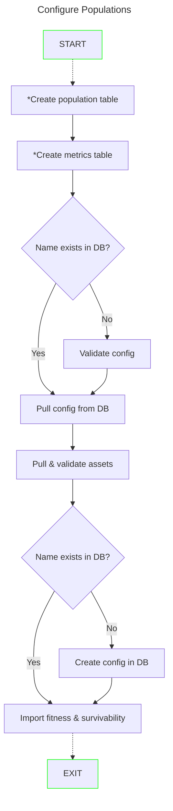

# Populations

A population of individuals work to solve a problem. An individual may be a member of more than one population and/or may provide a solution to more than one problem.

A population in Erasmus refers to a fixed number of active GC's (individuals) evaluated by a fitness function of a problem. A population is identified  by an unsigned integer >1 and a problem definition hash (git hash).

## Implementation Design

