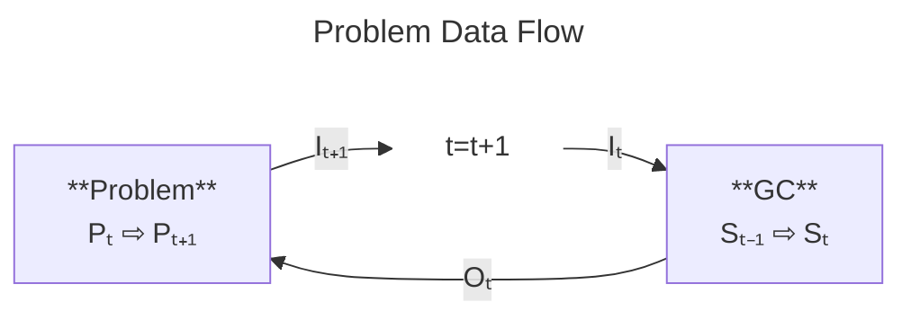
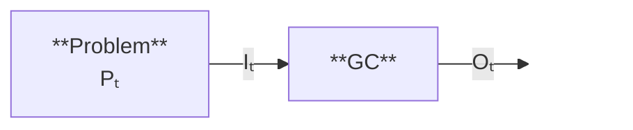

# Problems

A problem in Erasmus is defined by input parameters, expected output parameters and a fitness function. The fitness function calculates a score between 0.0 and 1.0 for an individual GC that was tasked with solving the problem. Because Erasmus generates executable code that could, in theory, be manipulated to have adverse effects the input parameters, output parameters and fitness function are defined by a problem definition hash. A change to any component (even one that does not change the fitness score) results in a different problem hash.

## Problem Data Flow

where:

- **I** = Input data to GC
- **O** = Output data from GC
- **S** = GC internal state
- **P** = Problem internal state (GC external environment)
- **t** = time in arbitary units

The loop is initiated in the _Problem_ stage at **Pₜ₊₁₌₀** which generates the initial input data set into the GC. Note that:

- Pₜ₊₁(Pₜ, Oₜ, ...)
- Iₜ(Pₜ)
- Sₜ₊₁(Sₜ, Iₜ)
- Oₜ(Sₜ, Iₜ)

and **...** represents other problem environmental inputs e.g. other agents impacting the problem environment in that time interval. It is not required that the GC output has any impact on the problem environment nor that the GC maintain an internal state. The simplest problems, in this regard, can be represented with the data flow, e.g. classification problems:

## Problem Properties

Problems have (user defined) properties. These properties are not used by Erasmus.

TBD

## Verified problems

TBD

## Relating Problems

If problem A is related to problem B then population A is related to population B. In the trivial case the fitness function of B may just be a more efficient version of the fitness function of A with no functional differences. The same is true if population A is related to population B and fitness function B is related to fitness function C then population A (or sub-GC’s there of) could be useful to fitness function C and should be considered as a candidate to seed or breed in population C.

A consequence of these relationships is that GC A may have a valid fitness score for problem A, problem B and problem C and this is in fact what happens with PGCs where the problem is the degree of separation of the PGC mutated from the solution GC's, the PGC level.

A problem relates to another problem through a relationsip table as part of its definition. The relationship table maintains several different types of references:

| Relationship | Value | Type   | Definition                                                                                                                                                                                                                                      |
|--------------|-------|--------|-------------------------------------------------------------------------------------------------------------------------------------------------------------------------------------------------------------------------------------------------|
| Hint         | 0     | uint64 | A user hint at the relationship defined by bitfields. See _elsewhere_ for the bitfield definitions. User hints are a means to direct discovery searches that will populate the related problem table further with metric driven relationships.  |
| PGC          | 1     | float  | A value between 0.0 and 1.0 indicating the relative relationship distance between the populations of most effective pGC's for problem solutions.                                                                                                |
| SGC          | 2     | float  | A value between 0.0 and 1.0 indicating the relative relationship distance between the populations of most effective sub-GC's for problem solutions.                                                                                             |
| Fitness      | 3     | float  | A value between 0.0 and 1.0 indicating the relative relationship distance between the populations of most effective problem solution GC's. i.e. GC's that have fitness scores for both problems.                                                |

Note that relationship values from -32768 to -1 and 4 to 32767 are reserved.
