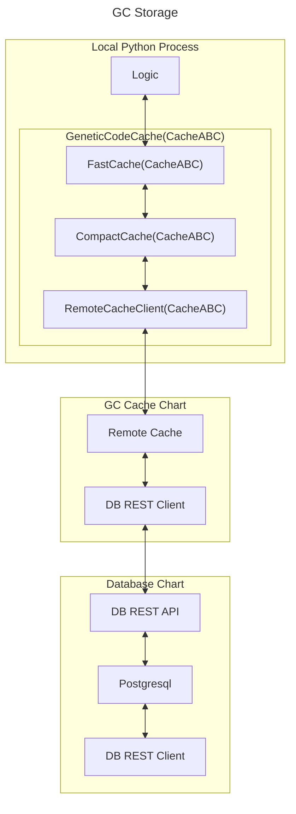

# Genetic Code Storage

The evolution process needs to be fast and scalable. Erasmus GP generates huge numbers of GCs and the balance between accessibility, speed of access and genetic mixing must be considered.

