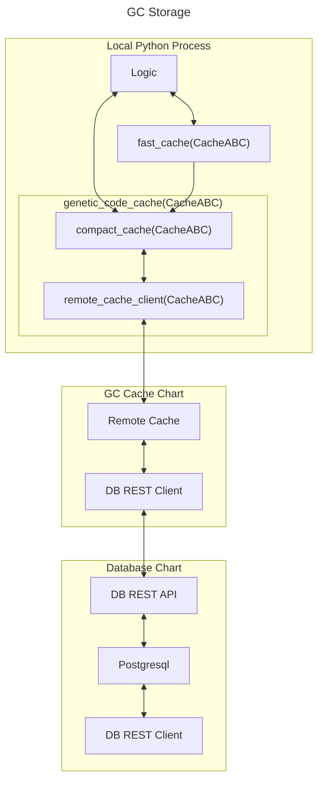

# Genetic Code Storage

The evolution process needs to be fast and scalable. Erasmus GP generates huge numbers of GCs and the balance between accessibility, speed of access and genetic mixing must be considered.

## Stores

Stores are all derived from the Abstract Base Class *StoreABC* which provide a dictionary like interface with a few other store like methods.

## Caches

Caches are all derived from the Abstract Base Class *CacheABC* which provides a dictionary like interface plus a few other cache like methods. CacheABC is derived from StoreABC. A cache is a store that has limited capacity and pushes and pulls to a next level store or cache.

| Class | Base Class | ABC | Description |
|-------|------------|-----|-------------|
| FastCache | dict | CacheABC | Fast, limited function* |
| UserDictCache | UserDict | CacheABC | Quite fast | 

\* A FastCache is a "one-way cache", like a temporary store with some convinient configuration to push data to the next level. It cannot pull data from the next level (see one way arrow between the fast_cache and the compact_cache in the top level store flow diagram). In order to use all the optimized builtin dict methods without wrappers, a FastCache does not track access order or dirty state and has no size limit. It is intended as a "work area" for evolution.

Caches cache genetic code objects derived from the Abstract Base Class *GCABC* keyed by thier signatures.