# The Genetic Code Executor

- Creates an execution context in which to execute GC code.
- Creates the GC code to execute (including imports)
- Executes genetic codes and handles exceptions

## The Execution Context

The execution context contains the execution environment for a specific configuration. The encapsulation the context provides has two uses:

1. It enables complete & definitive clean up of the dynamically created state.
2. Multiple contexts can exist which is useful in proving different configuration result in the same functional behaviour.

The execution context can be thought of as a dictionary of functions where each function is a GC executable. Depending on the configuration of the context not all GC's will become and executable. Unless the size of each function is set very low (the line limit) most GC's will be "inlined" for efficient execution.

## Creating GC Functions

GC functions are written to be between _limit/2_ and _limit_ functional lines in length where _limit_ is >= 4 and <= 2**15-1. The higher limit is pseudo arbitary (signed 16 bit max for efficient storage). In reality memory is the only limit but such large function sizes which may only differ by a few lines of code within them are ineffcient. The lower limit is to ensure at least 2 functional lines exist preventing a chain of functions calling just one function and the stack popping with no work being done. Sensible values of _limit_ trade off the overhead of function calling, readability and the stack depth. The default is 64 lines.

When a GC is written EGP breaks it down into sub-GC's as close to _limit_ as possible. The top level GC function may be < _limit/2_ lines long with a minimum of 2 lines when its GCA and GCB both are functions > _limit/2_ lines each. As evolution occurs what was a top level GC may get wrapped to be a sub-GC. If that, now sub, GC's executable was below the _limit/2_ minimum length then it will be assessed for merger in the top level GC and a new executable, not involving the existing one, may be created. The previous executable remains in the execution scope until the GC will no longer be used as an individual at which point it is deleted.

### Assessing a GC for Function Creation

Assessing a GC is done recursively (it is actaully implemented as a stack to allow for very deep GC's) using the following rules:

| # Lines      | Executable Exists | Operation       | Comments                                                                                                                                                              |
|:------------:|:-----------------:|:---------------:|-----------------------------------------------------------------------------------------------------------------------------------------------------------------------|
| 0            | True              | Error           | Having an executable but no lines is not possible.                                                                                                                    |
| < _limit/2_  | True              | Assess          | Was a "small" top level GC that can be merged into another.                                                                                                           |
| >= _limit/2_ | True              | Terminal        | Meets the criteria for a GC function. No need to analyse further.                                                                                                     |
| > _limit_    | True              | Error           | Should not be possible to have an executable with more than the limit number of lines.                                                                                |
| 0            | False             | Assess          | Has not been assessed yet.                                                                                                                                            |
| <= _limit_ | False             | Assess | Has previously been assessed and wrapped. Must be reassessed to build connection graph for incorpation in new executable. |
| > _limit_    | False             | Error           | This is a logic error is traversing the GC structure.                                                                                                                 |

### Dead Code

When travesing the Connection Graph it is not possible to determine what code will not be executed, "Dead Code". Only when the codon graph with all the connection are resolved is it possible to know the actual number of lines a function will not take.

### Method

This is an overview of the implementation of the _write_gc_executable()_ function. The following is a key to the GC logical structure charts used:

#### Example GC Logical Structure

This GC will be used as the example of how a GC is analysed and the python exectuable functions it represented created.

- Num codons: 24
- Binary signature: b'\x8f(\xde\xf4\x18q\xf2\xcc\xdcK\x9fFKX\xaaZ)\x84\x1fM\xc4X\xe5\tfah<-5\x97<'
- Hex signature: 8f28def41871f2ccdc4b9f464b58aa5a29841f4dc458e5096661683c2d35973c

```mermaid
flowchart TD
    02d35973c(2d35973c):::blue
    a196d8dc96(96d8dc96):::blue
    02d35973c --> a196d8dc96
    b196d8dc96(96d8dc96):::blue
    02d35973c --> b196d8dc96
    a2780051a5(780051a5):::blue
    a196d8dc96 --> a2780051a5
    b2b2f31c0a(b2f31c0a):::blue
    a196d8dc96 --> b2b2f31c0a
    a3780051a5(780051a5):::blue
    b196d8dc96 --> a3780051a5
    b3b2f31c0a(b2f31c0a):::blue
    b196d8dc96 --> b3b2f31c0a
    a42a381aa6(2a381aa6):::blue
    a2780051a5 --> a42a381aa6
    b42a381aa6(2a381aa6):::blue
    a2780051a5 --> b42a381aa6
    a5ef8c752e((ef8c752e)):::green
    b2b2f31c0a --> a5ef8c752e
    b5e030d53c((e030d53c)):::green
    b2b2f31c0a --> b5e030d53c
    a62a381aa6(2a381aa6):::blue
    a3780051a5 --> a62a381aa6
    b62a381aa6(2a381aa6):::blue
    a3780051a5 --> b62a381aa6
    a7ef8c752e((ef8c752e)):::green
    b3b2f31c0a --> a7ef8c752e
    b7e030d53c((e030d53c)):::green
    b3b2f31c0a --> b7e030d53c
    a85779cf61(5779cf61):::blue
    a42a381aa6 --> a85779cf61
    b8b2f31c0a(b2f31c0a):::blue
    a42a381aa6 --> b8b2f31c0a
    a95779cf61(5779cf61):::blue
    b42a381aa6 --> a95779cf61
    b9b2f31c0a(b2f31c0a):::blue
    b42a381aa6 --> b9b2f31c0a
    a125779cf61(5779cf61):::blue
    a62a381aa6 --> a125779cf61
    b12b2f31c0a(b2f31c0a):::blue
    a62a381aa6 --> b12b2f31c0a
    a135779cf61(5779cf61):::blue
    b62a381aa6 --> a135779cf61
    b13b2f31c0a(b2f31c0a):::blue
    b62a381aa6 --> b13b2f31c0a
    a16fbad73d9(fbad73d9):::blue
    a85779cf61 --> a16fbad73d9
    b1649dd8290((49dd8290)):::green
    a85779cf61 --> b1649dd8290
    a17ef8c752e((ef8c752e)):::green
    b8b2f31c0a --> a17ef8c752e
    b17e030d53c((e030d53c)):::green
    b8b2f31c0a --> b17e030d53c
    a18fbad73d9(fbad73d9):::blue
    a95779cf61 --> a18fbad73d9
    b1849dd8290((49dd8290)):::green
    a95779cf61 --> b1849dd8290
    a19ef8c752e((ef8c752e)):::green
    b9b2f31c0a --> a19ef8c752e
    b19e030d53c((e030d53c)):::green
    b9b2f31c0a --> b19e030d53c
    a20fbad73d9(fbad73d9):::blue
    a125779cf61 --> a20fbad73d9
    b2049dd8290((49dd8290)):::green
    a125779cf61 --> b2049dd8290
    a21ef8c752e((ef8c752e)):::green
    b12b2f31c0a --> a21ef8c752e
    b21e030d53c((e030d53c)):::green
    b12b2f31c0a --> b21e030d53c
    a22fbad73d9(fbad73d9):::blue
    a135779cf61 --> a22fbad73d9
    b2249dd8290((49dd8290)):::green
    a135779cf61 --> b2249dd8290
    a23ef8c752e((ef8c752e)):::green
    b13b2f31c0a --> a23ef8c752e
    b23e030d53c((e030d53c)):::green
    b13b2f31c0a --> b23e030d53c
    a24c3d8abd0((c3d8abd0)):::red
    a16fbad73d9 --> a24c3d8abd0
    b24a26e6923((a26e6923)):::green
    a16fbad73d9 --> b24a26e6923
    a28c3d8abd0((c3d8abd0)):::red
    a18fbad73d9 --> a28c3d8abd0
    b28a26e6923((a26e6923)):::green
    a18fbad73d9 --> b28a26e6923
    a32c3d8abd0((c3d8abd0)):::red
    a20fbad73d9 --> a32c3d8abd0
    b32a26e6923((a26e6923)):::green
    a20fbad73d9 --> b32a26e6923
    a36c3d8abd0((c3d8abd0)):::red
    a22fbad73d9 --> a36c3d8abd0
    b36a26e6923((a26e6923)):::green
    a22fbad73d9 --> b36a26e6923
classDef grey fill:#444444,stroke:#333333,stroke-width:2px
classDef red fill:#A74747,stroke:#996666,stroke-width:2px
classDef blue fill:#336699,stroke:#556688,stroke-width:2px
classDef green fill:#576457,stroke:#667766,stroke-width:2px
linkStyle default stroke:#AAAAAA,stroke-width:2px
```

#### Creating the node graph

The node graph is a bidirectional graph of the GC logical structure using _GCNode_ objects as nodes created by the _node_graph()_ function. The node graph structure is an explicit GC logical graph in that GC nodes that are used in more than one place are duplicated rather than just referenced, as they are in the Connection Graph, so that a) a bidirectional graph can be created and b) nodes can have meta data added pursuant thier local environment in the graph. i.e. the node graph looks like the graph above. Note that "unknown" GC's (those that have a GCA and or GCB that is **not** in the cache) are permissable as long as they have an executable defined.

#### Determining line counts

As described in the opening section line counts drive what GC's become executable functions (which affects the line counts of other GC's). The line counts for each not are determined in the _line_count()_ function and the data added to the "num_lines" member of the _GCNode_ along with some analysis meta data. Examples of this logical structure analysed with a _limit_ of 3 and 5 are shown below where node _fbad73d9_ has an executable function predefined.

##### GC Node Graph Structure with Line Limit = 3

```mermaid
flowchart TD
    uid00ac("2d35973c<br>2 lines"):::blue
    subgraph uid00adsd[" "]
    uid00ad("96d8dc96<br>3 lines"):::blue
    subgraph uid00afsd[" "]
    uid00af("780051a5<br>2 lines"):::blue
    subgraph uid00b3sd[" "]
    uid00b3("2a381aa6<br>3 lines"):::blue
    subgraph uid00bbsd[" "]
    uid00bb("5779cf61<br>3 lines"):::blue
    subgraph uid00c3sd[" "]
    uid00c3("fbad73d9<br>2 lines"):::green
    end
    uid00bb --> uid00c3
    uid00c4(("49dd8290<br>1 lines")):::green
    uid00bb --> uid00c4
    end
    uid00b3 --> uid00bb
    uid00bc("b2f31c0a<br>2 lines"):::blue
    uid00b3 --> uid00bc
    uid00c5(("ef8c752e<br>1 lines")):::green
    uid00bc --> uid00c5
    uid00c6(("e030d53c<br>1 lines")):::green
    uid00bc --> uid00c6
    end
    uid00af --> uid00b3
    subgraph uid00b4sd[" "]
    uid00b4("2a381aa6<br>3 lines"):::blue
    subgraph uid00bdsd[" "]
    uid00bd("5779cf61<br>3 lines"):::blue
    subgraph uid00c7sd[" "]
    uid00c7("fbad73d9<br>2 lines"):::green
    end
    uid00bd --> uid00c7
    uid00c8(("49dd8290<br>1 lines")):::green
    uid00bd --> uid00c8
    end
    uid00b4 --> uid00bd
    uid00be("b2f31c0a<br>2 lines"):::blue
    uid00b4 --> uid00be
    uid00c9(("ef8c752e<br>1 lines")):::green
    uid00be --> uid00c9
    uid00ca(("e030d53c<br>1 lines")):::green
    uid00be --> uid00ca
    end
    uid00af --> uid00b4
    end
    uid00ad --> uid00af
    uid00b0("b2f31c0a<br>2 lines"):::blue
    uid00ad --> uid00b0
    uid00b5(("ef8c752e<br>1 lines")):::green
    uid00b0 --> uid00b5
    uid00b6(("e030d53c<br>1 lines")):::green
    uid00b0 --> uid00b6
    end
    uid00ac --> uid00ad
    subgraph uid00aesd[" "]
    uid00ae("96d8dc96<br>3 lines"):::blue
    subgraph uid00b1sd[" "]
    uid00b1("780051a5<br>2 lines"):::blue
    subgraph uid00b7sd[" "]
    uid00b7("2a381aa6<br>3 lines"):::blue
    subgraph uid00bfsd[" "]
    uid00bf("5779cf61<br>3 lines"):::blue
    subgraph uid00cbsd[" "]
    uid00cb("fbad73d9<br>2 lines"):::green
    end
    uid00bf --> uid00cb
    uid00cc(("49dd8290<br>1 lines")):::green
    uid00bf --> uid00cc
    end
    uid00b7 --> uid00bf
    uid00c0("b2f31c0a<br>2 lines"):::blue
    uid00b7 --> uid00c0
    uid00cd(("ef8c752e<br>1 lines")):::green
    uid00c0 --> uid00cd
    uid00ce(("e030d53c<br>1 lines")):::green
    uid00c0 --> uid00ce
    end
    uid00b1 --> uid00b7
    subgraph uid00b8sd[" "]
    uid00b8("2a381aa6<br>3 lines"):::blue
    subgraph uid00c1sd[" "]
    uid00c1("5779cf61<br>3 lines"):::blue
    subgraph uid00cfsd[" "]
    uid00cf("fbad73d9<br>2 lines"):::green
    end
    uid00c1 --> uid00cf
    uid00d0(("49dd8290<br>1 lines")):::green
    uid00c1 --> uid00d0
    end
    uid00b8 --> uid00c1
    uid00c2("b2f31c0a<br>2 lines"):::blue
    uid00b8 --> uid00c2
    uid00d1(("ef8c752e<br>1 lines")):::green
    uid00c2 --> uid00d1
    uid00d2(("e030d53c<br>1 lines")):::green
    uid00c2 --> uid00d2
    end
    uid00b1 --> uid00b8
    end
    uid00ae --> uid00b1
    uid00b2("b2f31c0a<br>2 lines"):::blue
    uid00ae --> uid00b2
    uid00b9(("ef8c752e<br>1 lines")):::green
    uid00b2 --> uid00b9
    uid00ba(("e030d53c<br>1 lines")):::green
    uid00b2 --> uid00ba
    end
    uid00ac --> uid00ae
classDef grey fill:#444444,stroke:#333333,stroke-width:2px
classDef red fill:#A74747,stroke:#996666,stroke-width:2px
classDef blue fill:#336699,stroke:#556688,stroke-width:2px
classDef green fill:#576457,stroke:#667766,stroke-width:2px
linkStyle default stroke:#AAAAAA,stroke-width:2px
```

##### GC Node Graph Structure with Line Limit = 5

```mermaid
flowchart TD
    uid00d3("2d35973c<br>5 lines"):::blue
    subgraph uid00d4sd[" "]
    uid00d4("96d8dc96<br>4 lines"):::blue
    uid00d6("780051a5<br>2 lines"):::blue
    uid00d4 --> uid00d6
    uid00d7("b2f31c0a<br>2 lines"):::blue
    uid00d4 --> uid00d7
    subgraph uid00dasd[" "]
    uid00da("2a381aa6<br>5 lines"):::blue
    uid00e2("5779cf61<br>3 lines"):::blue
    uid00da --> uid00e2
    uid00e3("b2f31c0a<br>2 lines"):::blue
    uid00da --> uid00e3
    subgraph uid00easd[" "]
    uid00ea("fbad73d9<br>2 lines"):::green
    end
    uid00e2 --> uid00ea
    uid00eb(("49dd8290<br>1 lines")):::green
    uid00e2 --> uid00eb
    uid00ec(("ef8c752e<br>1 lines")):::green
    uid00e3 --> uid00ec
    uid00ed(("e030d53c<br>1 lines")):::green
    uid00e3 --> uid00ed
    end
    uid00d6 --> uid00da
    subgraph uid00dbsd[" "]
    uid00db("2a381aa6<br>5 lines"):::blue
    uid00e4("5779cf61<br>3 lines"):::blue
    uid00db --> uid00e4
    uid00e5("b2f31c0a<br>2 lines"):::blue
    uid00db --> uid00e5
    subgraph uid00eesd[" "]
    uid00ee("fbad73d9<br>2 lines"):::green
    end
    uid00e4 --> uid00ee
    uid00ef(("49dd8290<br>1 lines")):::green
    uid00e4 --> uid00ef
    uid00f0(("ef8c752e<br>1 lines")):::green
    uid00e5 --> uid00f0
    uid00f1(("e030d53c<br>1 lines")):::green
    uid00e5 --> uid00f1
    end
    uid00d6 --> uid00db
    uid00dc(("ef8c752e<br>1 lines")):::green
    uid00d7 --> uid00dc
    uid00dd(("e030d53c<br>1 lines")):::green
    uid00d7 --> uid00dd
    end
    uid00d3 --> uid00d4
    uid00d5("96d8dc96<br>4 lines"):::blue
    uid00d3 --> uid00d5
    uid00d8("780051a5<br>2 lines"):::blue
    uid00d5 --> uid00d8
    uid00d9("b2f31c0a<br>2 lines"):::blue
    uid00d5 --> uid00d9
    subgraph uid00desd[" "]
    uid00de("2a381aa6<br>5 lines"):::blue
    uid00e6("5779cf61<br>3 lines"):::blue
    uid00de --> uid00e6
    uid00e7("b2f31c0a<br>2 lines"):::blue
    uid00de --> uid00e7
    subgraph uid00f2sd[" "]
    uid00f2("fbad73d9<br>2 lines"):::green
    end
    uid00e6 --> uid00f2
    uid00f3(("49dd8290<br>1 lines")):::green
    uid00e6 --> uid00f3
    uid00f4(("ef8c752e<br>1 lines")):::green
    uid00e7 --> uid00f4
    uid00f5(("e030d53c<br>1 lines")):::green
    uid00e7 --> uid00f5
    end
    uid00d8 --> uid00de
    subgraph uid00dfsd[" "]
    uid00df("2a381aa6<br>5 lines"):::blue
    uid00e8("5779cf61<br>3 lines"):::blue
    uid00df --> uid00e8
    uid00e9("b2f31c0a<br>2 lines"):::blue
    uid00df --> uid00e9
    subgraph uid00f6sd[" "]
    uid00f6("fbad73d9<br>2 lines"):::green
    end
    uid00e8 --> uid00f6
    uid00f7(("49dd8290<br>1 lines")):::green
    uid00e8 --> uid00f7
    uid00f8(("ef8c752e<br>1 lines")):::green
    uid00e9 --> uid00f8
    uid00f9(("e030d53c<br>1 lines")):::green
    uid00e9 --> uid00f9
    end
    uid00d8 --> uid00df
    uid00e0(("ef8c752e<br>1 lines")):::green
    uid00d9 --> uid00e0
    uid00e1(("e030d53c<br>1 lines")):::green
    uid00d9 --> uid00e1
classDef grey fill:#444444,stroke:#333333,stroke-width:2px
classDef red fill:#A74747,stroke:#996666,stroke-width:2px
classDef blue fill:#336699,stroke:#556688,stroke-width:2px
classDef green fill:#576457,stroke:#667766,stroke-width:2px
linkStyle default stroke:#AAAAAA,stroke-width:2px
```

