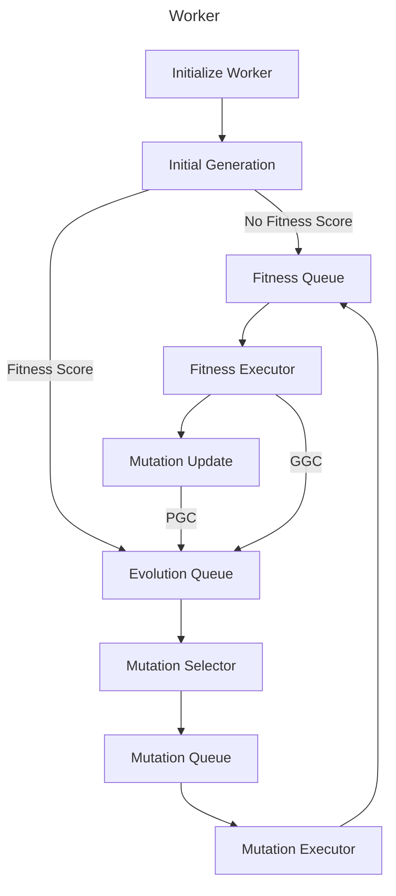
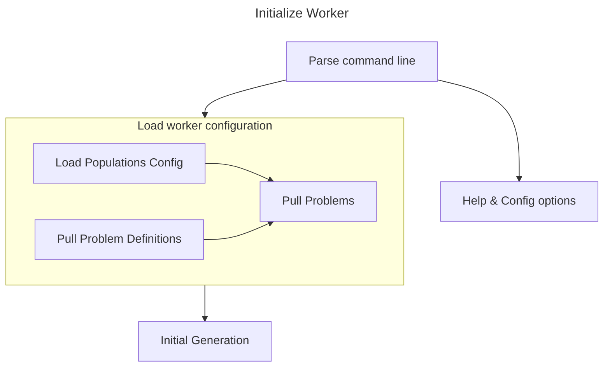
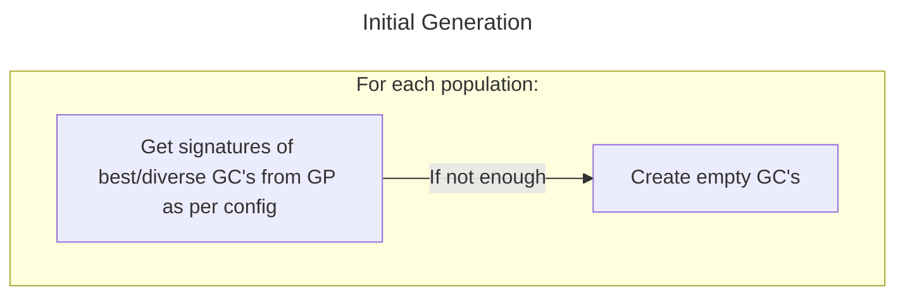
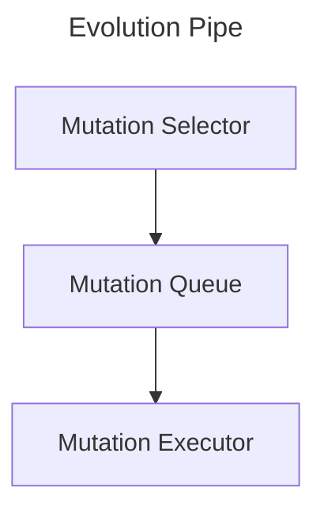
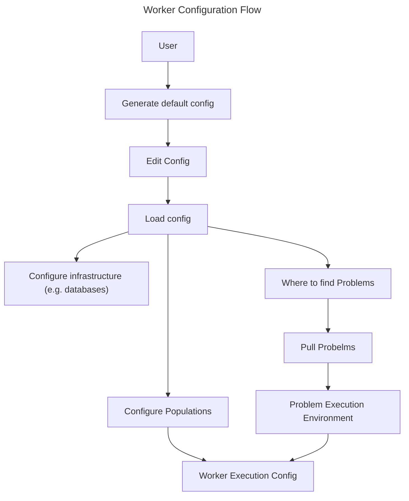

# Worker

A Worker is a generic evolution pipeline. The pipeline may be used to evolve Solutions GC's to Problems GC's, Mutations or Selection GC's.

## Basic Flow

### Initialize Worker

The initialization of the Worker is done from a JSON config file that defines where the genetic code stores are and the populations to work on. The populations specify the problem to solve the details of which can be found in the problem definitions file (also JSON). With this information the worker initalization is complete and the inital generation of the eveolution work can be pulled and/or created.

### Initial Generation

The initial generation is the list of signatures of the phenotype GC's for all of the populations defined in the worker config.

The initial generation for a given population configuration can come from multiple sources:

1. *BEST*: The best problem solutions.
2. *DIVERSE*: The best diverse problem solutions.
3. *RELATED*: Related problem solutions.
4. *UNRELATED*: Identical interface solutions to unrelated problems.
5. *SPONTANEOUS*: Incremental Spontaneous Assembly.

The fraction of the initial population that each source contributes is a matter of configuration and availablility. Each source will be taken from to the limit of what is available or the configuration. If what is available does not reach the configuration limit then the remaining will be added to the next source limit by default (in the order above), may be dropped (the initial population is smaller than specified) or added to a specific source limit. The sources will only be evaluated, in order, twice (by default) to prevent a logically infinite loop.

All sources have the following configuration parameters plus some source specific parameters defined in the sections below.

| Parameter | Type | Default | Constraints                                                                                | Description                                                                                                                                                                                                                                                                                                                                                                                                                                                                   |
|-----------|------|---------|--------------------------------------------------------------------------------------------|-------------------------------------------------------------------------------------------------------------------------------------------------------------------------------------------------------------------------------------------------------------------------------------------------------------------------------------------------------------------------------------------------------------------------------------------------------------------------------|
| scope     | int  | 127     | 0 to 127                                                                                   | The scope to search. Search all the databases upto and including the one specified. 0 = Gene Pool 1 = Genomic Library (Gene Pool source aka Microbiome) 2 to 127 each higher level genomic library. A value of 127 is guaranteed to go up to the master genomic library (Universal Biome) even in the unlikely event that there are more levels to the hierarchy.                                                                                                             |
| limit     | int  | 20      | 0 to 2**31-1                                                                               | The number of solutions to find in this category.                                                                                                                                                                                                                                                                                                                                                                                                                             |
| underflow | str  | NEXT    | One of [BEST, DIVERSE, RELATED, UNRELATED, SPONTANEOUS, NEXT, NONE]  | If the number of solutions found for this source is below the limit the remaining limit may be added to another sources limit as specified by this parameter. Setting underflow for a source to the same source is an error. NEXT adds the remainder to the next source in order unless it is defined for the last source in which case it behaves as NONE. NONE discards any remainder and the initial population size will less by the unused limit.  |

#### The Best Problem Solutions

The best problem solutions are those that have the highest fitness scores for the specific problem set. Typically the highest scoring solutions will be closely related. The best problem solution takes no additional parameters.

#### The Best Diverse Problem Solutions

Diversity in the initial population aids in finding novel solutions and can avoid getting trapped on a local fitness maximum. The (proxy) metric for diversity is relationship distance which assume the mutations that will have occured between the solutions common ancestor and each other make them less alike. Additionally there is a novelty consideration that can also be configured. Local fitness maxima may be sufficiently distant relations to be considered diverse but if many solutions already exist for the maxima then it is possible that the regional solution has been well explored. A more productive use of effort would be to explore novel "maxima" i.e. where the fitness is high but there are proportionally fewer relatives to the local best solution.

| Parameter         | Type  | Default | Constraints  | Description                                                                                                                                                                                                                                                                          |
|-------------------|-------|---------|--------------|--------------------------------------------------------------------------------------------------------------------------------------------------------------------------------------------------------------------------------------------------------------------------------------|
| minimum_distance  | int   | 4       | 1 to 2**31-1 | The minimum relationship distance between solutions to be considered diverse.                                                                                                                                                                                                        |
| fitness_threshold | float | 0.0     | 0.0 to 1.0   | The minimum fraction of the best solutions fitness a diverse solution must have for the problem. Note that setting the fitness_threshold to 1.0 excludes all solutions other than the fittest (best) solution. Setting it to 0.0 accepts all solutions that meet the other criteria. |
| novelty_threshold | float | 0.5     | 0.0 to 1.0   | If N is the number of solutions within floor(minimum_distance / 2) of solutions meeting the other criteria then a solution is considered novel if it has less than novelty_threshold * N similar solutions within the same distance.                                                 |

*TODO: Not sure if these criteria are actually calculable.*

#### Related problem solutions

Related problems must have the same interface and solve a similar but different problem. As such they have no fitness score for this problem must be evaluated which makes them expensive to select. Any solution not returning a valid fitness score will be discarded from consideration. The best (fittest) solutions for each related problem meeting the criteria set out in the parameters below will be selected. The number of solutions selected from each related problem will be as even as possible with a bias toward the least distant related problems in the event the limit for the source is not exactly divisible by the number of considered related problems.

| Parameter                | Type | Default | Constraints  | Description                                                                                             |
|--------------------------|------|---------|--------------|---------------------------------------------------------------------------------------------------------|
| maximum_problem_distance | int  | 4       | 1 to 2**31-1 | The maximum distance a related problem can be from the target problem to have its solutions considered. |
| minimum_distance         | int  | 4       | 1 to 2**31-1 | The minimum relationship distance between any two related problem solutions.                            |
| tolerence                | int  | 10      | 1 to 2**31-1 | The number of consecutive unrelated problem solution fitness evaluations to try before giving up on the problem as a suitable source of potential solutions. |

#### Unrelated Problem Solutions

Unrelated problems must have the same interface as the problem to be solved but are a minimum problem distance away (rather than a maximum distance as with related problems). It is entirely possible for the sources to be configured such that a problem is both related and unrelated which may lead to the same solution being chosen more than once. In this case the solution will be discarded and another solution selected from the eligible unrelated problem solutions. Unrelated problem GC's must also have thier fitness evaluated and any solutions not returning an valid fitness score will not be considered.

| Parameter                | Type | Default | Constraints  | Description                                                                                                                                                  |
|--------------------------|------|---------|--------------|--------------------------------------------------------------------------------------------------------------------------------------------------------------|
| minimum_problem_distance | int  | 5       | 1 to 2**31-1 | The minimum distance for a problem to be considered as unrelated to the target problem.                                                                      |
| minimum_distance         | int  | 4       | 1 to 2**31-1 | The minimum relationship distance between any two unrelated problem solutions.                                                                               |
| tolerence                | int  | 10      | 1 to 2**31-1 | The number of consecutive unrelated problem solution fitness evaluations to try before giving up on the problem as a suitable source of potential solutions. |

#### Incremental Spontaneous Assembly

Pre-cursor GC's are first formed by spontaneous assembly reducing the difference between available GCs interface and properties and the target population interface and properties. Pre-cursor GC's combine with other GC's to eventually create a GC that is stable with the correct interface. The more incremental steps assembly must take to create an appropriate GC the slower evolution will be to find initial partial solutions to the population target problem. Assembled GC's will only be considered as part of the initial generation if they return a valid fitness score for the target problem else they are discarded.

| Parameter | Type | Default | Constraints  | Description                                                                                                                                |
|-----------|------|---------|--------------|--------------------------------------------------------------------------------------------------------------------------------------------|
| sse_limit | int  | 100     | 1 to 2**31-1 | The maximum number of stead state exceptions permitted in the construction of a pre-cursor GC before it is discarded from consideration.   |
| tolerence | int  | 100     | 1 to 2**31-1 | The number of consecutive pre-cursor GC fitness evaluations to try before giving up on being able to build a GC randomly for this problem. |

### Fitness Queue

The Fitness Queue is a FIFO queue of GC's that require evaluation against the fitness function. When a Fitness Executor becomes available it pulls the next GC from the Fitness Queue. The Fitness Queue acts as a channel buffer between the Mutation Executors and Fitness Executors.

### Fitness Executor

Fitness executors run the fitness function using a GC pulled from the fitness manager. Once a score has been recorded it pushes the GC into the evolution queue. There can be 1 or more fitness executors all having identical capabilities.

It is a basic assumption that the fitness function will be the rate determining step in the pipeline and so fitness executors pull the next GC to work with when they are ready and push the result when they are ready. Whether the fitness function actually is the rate determining step or not does not impact the worker pipeline efficiency.

### Evolution Queue

The Evolution Queue is a priority queue rather than a FIFO. Every GC entering the queue has a current fitness score and it evaluated as to what position it should take in the queue to be evolved. The evolution queue logic may be quite sophisticated and dynamic.

### Evolution Pipe

The Mutuation Selector, Queue and Executor make up the block of functions called the Evolution Pipe.

#### Mutation Selector

Mutation Selectors pull GC's from the Evolution Queue and select a mutation to operate on it. Mutation selection is an evolving physical process itself and 1 or more can exist all having identicial capabilities.

#### Mutation Queue

The Mutation Queue is a FIFO queue. It is used to channel and buffer mutation work between the the Mutation Selectors and Mutation Executors

#### Mutation Executor

The Mutation Executors execute the mutations on the GC's resulting in an offspring GC that must be evaluated against the Fitness Function. They pull from the Mutation Queue and push to the Fitness Queue.

### Mutation Updater

Mutations evolve and mutation selectors evolve as solution GC's do. When the fitness function of a solution GC is evaluated its result rolls up to the mutation that created it, the selector that selected the mutation, the mutation that created the mutation, the mutation that created the selector, ... and so on. Physical GC fitness functions are evaluated over multiple uses which practically restricts how many levels of mutation that created the mutation, that created the mutation, that created the mutation...are likely to go on. Initially this value is set at 8 uses thus requiring 82=64 uses of mutation offspring (total) for a mutation of a mutation to evolve again. The 16th level requires 281,474,976,710,656 1st level uses (which is a lot). Note, however, that the number of levels of mutation are not bounded.

Mutations are not bound to levels, as solution GC's are not bound to a single problem. A mutation 4 steps removed from the solution GC its great, great, grandchild created is not required to be evolved by a mutation 5 steps removed. That is a decision for the selectors.

## Worker Configuration Flow

