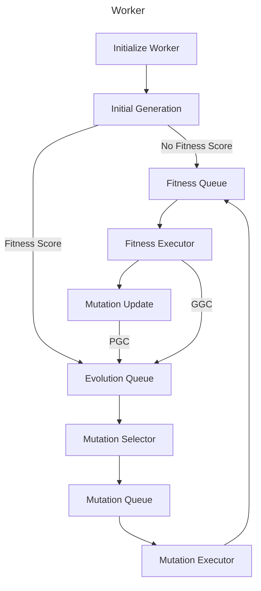
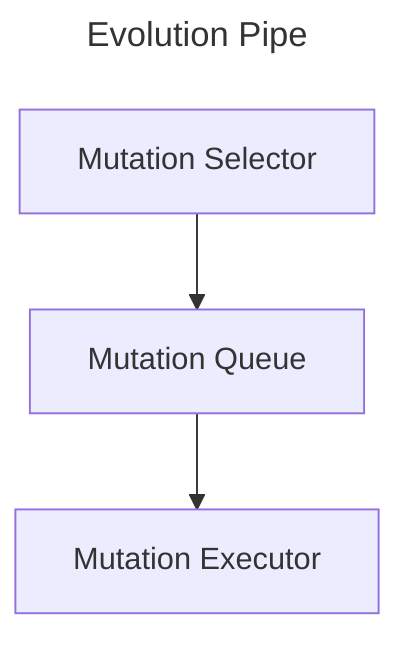
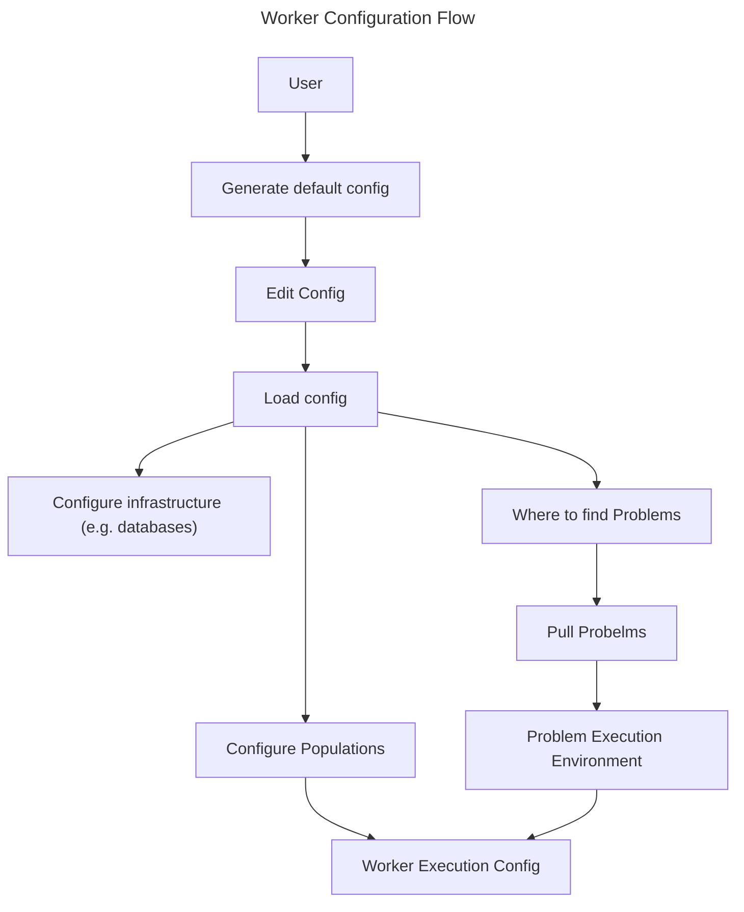

# Worker

A Worker is a generic evolution pipeline. The pipeline may be used to evolve Solutions GC's to Problems GC's, Mutations or Selection GC's. 

## Basic Flow

### Initialize Worker

The initialization of the Worker includes details such as which Gene Pool to draw from, the initial generation, the fitness function used to evaulate the individuals etc.

### Initial Generation

If the GC's in the initial generation do not have a fitness score for the supplied fitness function then they must be evaluated else they can join the evolution queue.

### Fitness Queue

The Fitness Queue is a FIFO queue of GC's that require evaluation against the fitness function. When a Fitness Executor becomes available it pulls the next GC from the Fitness Queue. The Fitness Queue acts as a channel buffer between the Mutation Executors and Fitness Executors.

### Fitness Executor

Fitness executors run the fitness function using a GC pulled from the fitness manager. Once a score has been recorded it pushes the GC into the evolution queue. There can be 1 or more fitness executors all having identical capabilities.

It is a basic assumption that the fitness function will be the rate determining step in the pipeline and so fitness executors pull the next GC to work with when they are ready and push the result when they are ready. Whether the fitness function actually is the rate determining step or not does not impact the worker pipeline efficiency.

### Evolution Queue

The Evolution Queue is a priority queue rather than a FIFO. Every GC entering the queue has a current fitness score and it evaluated as to what position it should take in the queue to be evolved. The evolution queue logic may be quite sophisticated and dynamic. 

### Evolution Pipe

The Mutuation Selector, Queue and Executor make up the block of functions called the Evolution Pipe.

#### Mutation Selector

Mutation Selectors pull GC's from the Evolution Queue and select a mutation to operate on it. Mutation selection is an evolving physical process itself and 1 or more can exist all having identicial capabilities.

#### Mutation Queue

The Mutation Queue is a FIFO queue. It is used to channel and buffer mutation work between the the Mutation Selectors and Mutation Executors

#### Mutation Executor

The Mutation Executors execute the mutations on the GC's resulting in an offspring GC that must be evaluated against the Fitness Function. They pull from the Mutation Queue and push to the Fitness Queue.

### Mutation Updater

Mutations evolve and mutation selectors evolve as solution GC's do. When the fitness function of a solution GC is evaluated its result rolls up to the mutation that created it, the selector that selected the mutation, the mutation that created the mutation, the mutation that created the selector, ... and so on. Physical GC fitness functions are evaluated over multiple uses which practically restricts how many levels of mutation that created the mutation, that created the mutation, that created the mutation...are likely to go on. Initially this value is set at 8 uses thus requiring 82=64 uses of mutation offspring (total) for a mutation of a mutation to evolve again. The 16th level requires 281,474,976,710,656 1st level uses (which is a lot). Note, however, that the number of levels of mutation are not bounded.

Mutations are not bound to levels, as solution GC's are not bound to a single problem. A mutation 4 steps removed from the solution GC its great, great, grandchild created is not required to be evolved by a mutation 5 steps removed. That is a decision for the selectors.

## Worker Configuration Flow

