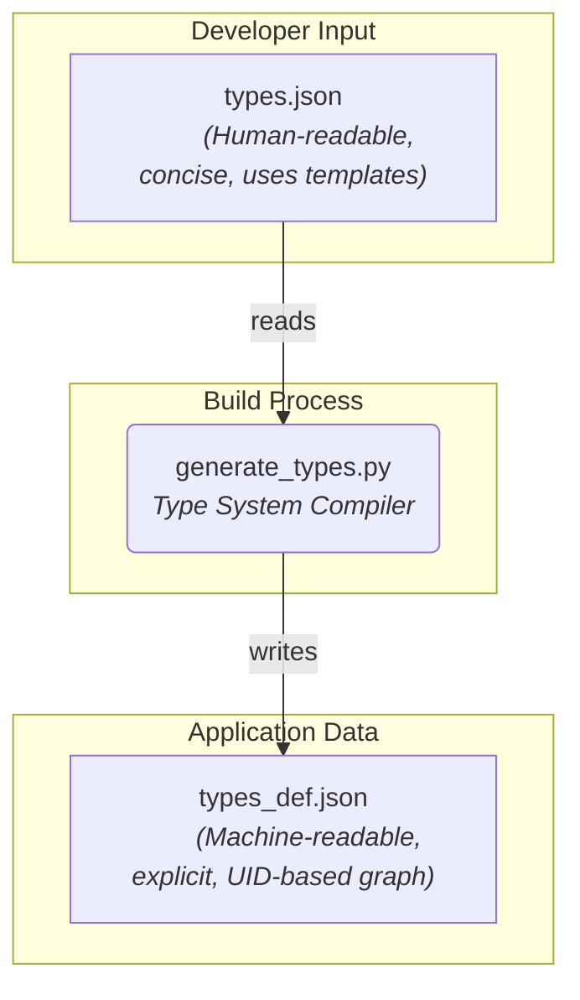
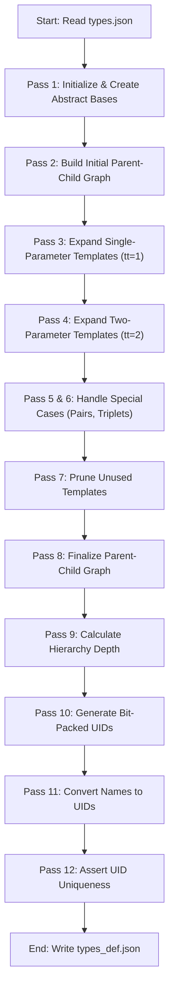

# Design Analysis of the `generate_types.py` Module

## 1. Overview

This report details the design and architecture of the `generate_types.py` script, located in the `egpseed` package. This script is not part of the runtime application; instead, it is a crucial **build-time tool** or **code generator**. Its primary purpose is to act as a "type system compiler." It reads a high-level, human-friendly type definition file (`types.json`) and compiles it into a comprehensive, machine-readable, and fully resolved type graph stored in `types_def.json`.

This generated file is then likely consumed by the main `egppy` application to perform static and runtime type checking, analysis, and other operations central to a genetic programming framework.

## 2. Architectural Role and Design Philosophy

The script's architecture is centered around the **Compiler design pattern**. It decouples the complex, low-level representation of the type system from the simple, high-level definitions that developers interact with.

This design provides several key advantages:

* **Simplicity:** Developers can define new types in `types.json` using a simple, template-based syntax without worrying about implementation details like unique IDs or explicitly listing all subtypes.
* **Complexity Management:** The script handles the combinatorial explosion of concrete types generated from templates, keeping the core application logic cleaner.
* **Performance:** The output `types_def.json` is optimized for machine consumption. Using integer UIDs for relationships creates a compact and efficient graph structure that is faster to parse and process at runtime than string-based names.
* **Single Source of Truth:** `types.json` becomes the single source of truth for type definitions, and the generation process ensures the detailed `types_def.json` is always consistent with it.

## 3. The Multi-Pass Compilation Strategy

The core of the script is its multi-pass approach, which is essential for resolving the complex dependencies inherent in a type system. The script iteratively builds up the final type dictionary (`new_tdd`) over a series of distinct passes.

Each pass builds upon the work of the previous ones, allowing for a gradual resolution of the type hierarchy, from basic inheritance to complex generic instantiations.

## 4. Core Mechanisms and Features

### a. Template Expansion

The script's most powerful feature is its ability to expand generic type templates.

* **`tt` field:** A field named `tt` (likely "template type") in `types.json` controls this behavior.
* **`tt == 1`:** For a type like `Iterable[-Any0]`, the script finds all subtypes of `Any` (which is almost every type) and generates a concrete `Iterable` for each one (e.g., `Iterable[int]`, `Iterable[str]`, etc.).
* **`tt == 2`:** For a type like `dict[-Hashable0, -Any1]`, the script performs a Cartesian product, combining all subtypes of `Hashable` with all subtypes of `Any` to generate a vast number of concrete dictionary types (e.g., `dict[str, int]`, `dict[int, float]`). It intelligently filters out abstract types to manage the scale.

### b. UID Generation via Bit Fields

A highly sophisticated feature is the generation of Unique Identifiers (UIDs).

* **`bitdict` library:** It uses the external `bitdict` library.
* **`TYPESDEF_CONFIG`:** This configuration defines a bit-level structure for the UID. The integer UID is not just a number; it's a packed data structure containing fields like `tt` (the template type) and `xuid` (a unique ID within that template type).
* **Benefit:** This allows the application to extract information directly from a type's UID using bitwise operations, which is extremely fast. For example, one could quickly determine if a type is a container type just by inspecting its UID.

### c. Hierarchy and Graph Construction

The script meticulously constructs a directed acyclic graph (DAG) of types.

* It resolves parent-child relationships for all generated types.
* It calculates the `depth` of each type relative to the root (`object`), which is useful for inheritance-related logic.
* In the final pass, it replaces all string-based names in the `parents` and `children` lists with their corresponding integer UIDs, creating the final, efficient graph representation.

## 5. Conclusion

The `generate_types.py` script is a well-engineered solution to the problem of managing a complex type system. It employs a robust, multi-pass compilation strategy to transform simple, high-level type definitions into a detailed, optimized, and machine-readable format. Its use of template expansion and information-rich, bit-packed UIDs demonstrates a clear focus on both developer convenience and runtime performance. This script is a foundational component that enables the broader Erasmus-GP system to handle its domain-specific type logic in a scalable and maintainable way.
