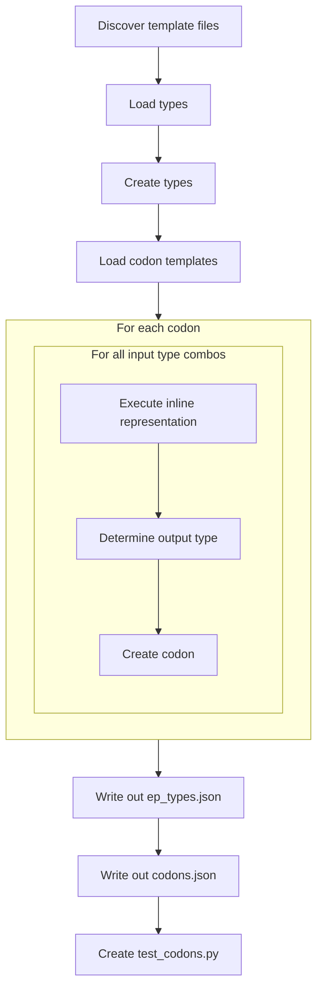

# EGP Seed

EGP Seed is an unpacked python application to generate the seeding codons for Erasmus GP. As it is unpublished it is not as neat and tidy as other parts of Erasmus and cruft from its design legacy can be found through out. As EGP was originally intended (and still could in the future) support multiple languages in each codon Seed was designed to extend to multiple language. So far only python has been implemented and the generality of the design may have waned.

## Design

EGP Seed is a monolithic python module. The file *[test_initialize.py](../tests/test_initialize.py)* runs the initialize.py script configured for python.



### Discover Template Files

Language template files are stored under *[data/languages](../egpspeed/data/languages)*. **NOTE: only python is implemented at this time.**

The *[python](../data/languages/python)* folder has the following structure:

```bash
.
├── builtins
├── containers
├── misc
├── mutations
├── numbers
├── exceptions.json
└── types.json
```

Codon templates are stored in JSON files in subfolders. Codons are just class methods and functions that operate on/with types. The naming and depth of the folders is arbitary for the application but useful for organisation. The JSON files named within them are named after the End Point type they represent (python object type). EP types in the types.json templates inherit methods & functions from thier parent types.

The role of *[exceptions.json](../egpseed/data/languages/python/exceptions.json)* is currently legacy. It is not simple, obvious nor entirely consistent on how to determine what the output type of some (many) operations are in python depending on the input types. To avoid complex logic and errors EGP seed executes all defined combinations of input types to a method/operator and records the output type. Ideally no exceptions occur when running the inline executable code to determine the output types but some hard to avoid combinations of input parameters may occur resulting in a corner case exception that must be ignored rather than crash the application. The *[exceptions.json](../egpseed/data/languages/python/exceptions.json)* file records these specific instances so they can be ignored in the future.

### Load Types

The *[types.json](../egpseed/data/languages/python/types.json)* file contains type definitions. It makes several assumptions:

1. Every type name has an equivilent [type name].json file in a subdirectory containing method/function definitions.
2. If the type has no default i.e. default is None, then the type is not instanciable.
3. If default is not None then the default is not a literal e.g. an int default cannot be "7" it must be "(7)" or "int(7)"
4. With the exception of "object" if a type does not inherit i.e. inherits is None, then it is an EGP meta-type.
5. All instanciable types have a zero-argument constructor defined in thier codon *.json* file.
6. UID are, in fact, unique and within a signed 32 bit twos complement range.
7. Type names are unique.

