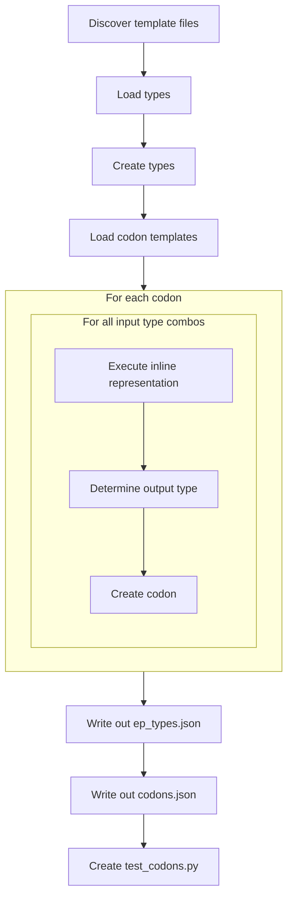

# EGP Seed

EGP Seed is an unpacked python application to generate the seeding codons for Erasmus GP. As it is unpublished it is not as neat and tidy as other parts of Erasmus and cruft from its design legacy can be found through out. As EGP was originally intended (and still could in the future) support multiple languages in each codon Seed was designed to extend to multiple language. So far only python has been implemented and the generality of the design may have waned.

## Design

EGP Seed is a monolithic python module. The file *[test_initialize.py](../tests/test_initialize.py)* runs the initialize.py script configured for python.



### Discover Template Files

Language template files are stored under *[data/languages](../egpspeed/data/languages)*. **NOTE: only python is implemented at this time.**

The *[python](../data/languages/python)* folder has the following structure:

```bash
.
├── builtins
├── containers
├── misc
├── mutations
├── numbers
├── exceptions.json
└── types.json
```

Codon templates are stored in JSON files in subfolders. Codons are just class methods and functions that operate on/with types. The naming and depth of the folders is arbitary for the application but useful for organisation. The JSON files named within them are named after the End Point type they represent (python object type). EP types in the types.json templates inherit methods & functions from thier parent types.

The role of *[exceptions.json](../egpseed/data/languages/python/exceptions.json)* is currently legacy. It is not simple, obvious nor entirely consistent on how to determine what the output type of some (many) operations are in python depending on the input types. To avoid complex logic and errors EGP seed executes all defined combinations of input types to a method/operator and records the output type. Ideally no exceptions occur when running the inline executable code to determine the output types but some hard to avoid combinations of input parameters may occur resulting in a corner case exception that must be ignored rather than crash the application. The *[exceptions.json](../egpseed/data/languages/python/exceptions.json)* file records these specific instances so they can be ignored in the future.

### Load Types

The *[types.json](../egpseed/data/languages/python/types.json)* file contains type definitions. It makes several assumptions:

1. Every type name has an equivilent [type name].json file in a subdirectory containing method/function definitions.
2. If the type has no default i.e. default is None, then the type is not instanciable.
3. If default is not None then the default is not a literal e.g. an int default cannot be "7" it must be "(7)" or "int(7)"
4. With the exception of "object" if a type does not inherit i.e. inherits is None, then it is an EGP meta-type.
5. All instanciable types have a zero-argument constructor defined in thier codon *.json* file. [**WHY?**]
6. UID are, in fact, unique and within a signed 32 bit twos complement range. See [End point types](../../egppy/egppy/c_graph/docs/graph.md)
7. Type names are unique.

#### A Word on EGP Types

EGP only deals in concrete types to support reduce the complexity of Gene Pool searching (SQL expression and search time). However, this means there is a lot of codons with type combinations. To efficiently generate these codons meta-types such as **egp_highest**: An output type that matches the highest (closest to 'object') type of the inputs, exist to generate arithmetic operation codons etc. or **x_y** where x is an integer from 0 to 255 referencing a position of an input and y is an integer in the range 0 to 7 that references the type within that type (the same as TT) for example. if input 3 was of type 'list[dict[str, int]]' then 3_0 would be 'list[dict[str, int]]', 3_1 would be 'dict[str, int]', 3_2 would be 'str' and 3_3 would be 'int'. In practice y's of values > 1 are rarely as codons do not perform compound functions. The exceptions are special objects like Quadruplet (a 4 element tuple).

### Type (Class) Methods

All a types methods (codons) are defined in their respective .json file.

1. Method names are used as dictionary keys and must not be the same as any parent class methods i.e. inheritence is strict - no overiding with different method signatures.
2. Where methods have multiple signatures the next integer in the sequence 1...N is appended to the method name in the dictionary key. Signatures may differ by using defaults for parameters or taking and returning different types.
3. Where a parameter is a set of literals e.g. with the bytes type 'little' or 'big' endian a new type shall be defined of which only the literal codons exist.
4. Methods that define (or default to) abstract type parameters will have all combinations of concrete type variants defined including all abstract variants. Abstract variants are called Abstract Codons which may be used to construct Abstract Genetic Codes, AGC's. Abstract Codons and AGC's are not instanciable but accumulate the evolutionary data from all derived concrete codons and GC's to inform the viabiloity of of not-yet-instanciated variants e.g. the expression "variable or []" does not need to by type locked to lists but may be used for any object type. Its value should not be overlooked for dict[str, list[int]] types just because that type has not been widely used.
5. By default:
    - A codon takes 2 input parameters and returns 1 output parameter all of the type of the .json file. For containers all elements are assumed to be 'object' type.
    - Requires no import(s)
    - Has the following properties set True (all others are set False)
        - Deterministic

## Special Cases

1. Code and detailed class introspection and manipluation builtins are not implemented: e.g. 'dir', 'exec', 'compile', 'var', 'delattr' etc. However, simple tests like 'callable' are implemented.
2. 'Sequence' concatentation and repitition (+ and * operators) are not implemented due to the special case with 'range' etc. and the performance overhead. See [Common Sequence Operations](https://docs.python.org/3/library/stdtypes.html#typesseq-common) notes 6 & 7.
3. _Bytes.json has the common methods for bytes and bytearray objects. Python does not have a common abstract type for these methods (after 3.11).
4. Set union, intersection, difference & symmetric_difference methods are not implmented as operators (as the methods are more flexible taking Iterable[Hashable] rather than just Set). It is the same case for the MutableSet *_update equivilents.
5. == and != are implemented in object.json as they are always available (NB: So not implemented elsewhere).
