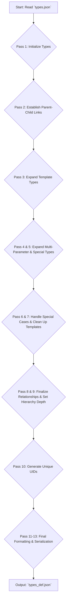

# EGP Seed

EGP Seed is an unpacked python application to generate the seeding codons for Erasmus GP. Since codons are immutable this script is only used during development but can serve as a reference or inspiration for future codon addition. As it is unpublished it is not as neat and tidy as other parts of Erasmus and cruft from its design legacy can be found through out. As EGP was originally intended (and still could in the future) support multiple languages in each codon Seed has some vestiges that hint at multiple languages. So far only python has been implemented and the generality of the design may have waned.

## Generate Types

This script, `generate_types.py`, is responsible for creating a detailed type definition file named `types_def.json` from a simpler input file, `types.json`.

The main goal is to process the raw type information, expand any generic or template types (like `Iterable[Any]` or `dict[Hashable, Any]`) into all their possible concrete forms, establish the inheritance relationships (parent and child types), and assign a unique identifier (UID) to every single type. This final `types_def.json` file is used by other parts of the system for tasks related to genetic programming and type analysis.

### Load Types

The *[types.json](../egpseed/data/languages/python/types.json)* file contains type definitions. It makes several assumptions:

1. Every type name has an equivilent [type name].json file in a subdirectory containing method/function definitions.
2. If the type has no default i.e. default is None, then the type is not instanciable.
3. If default is not None then the default is not a literal e.g. an int default cannot be "7" it must be "(7)" or "int(7)"
4. With the exception of "object" if a type does not inherit i.e. inherits is None, then it is an EGP meta-type.
5. All instanciable types have a zero-argument constructor defined in thier codon *.json* file. [**WHY?**]
6. UID are, in fact, unique and within a signed 32 bit twos complement range. See [End point types](../../egppy/egppy/c_graph/docs/graph.md)
7. Type names are unique.
8. All tt > 0 types have a tt == 0 type e.g. 'dict[Hashable, Any]' (tt == 2) has an equivilent 'dict' type (tt == 0) which is implicitly the same.
9. Sub-type strings are templated with a '-' prefix and '[0-9]' postfix. This enables them to be uniquely identified and referenced where parent types depends on them.

#### A Word on EGP Types

EGP only deals in concrete types to support reduce the complexity of Gene Pool searching (SQL expression and search time). However, this means there is a lot of codons with type combinations. To efficiently generate these codons meta-types such as **EGPhighest**: An output type that matches the highest (closest to 'object') type of the inputs, exist to generate arithmetic operation codons etc. Some EGP types like **EGPIntegral** exist as a base class placeholder to enable other non-standard class hierarchies to derive from the same base class (and this share codon definitions) e.g. numpy types.

### Workflow

The script operates in a series of passes to build the final type definitions. This multi-pass approach ensures that complex relationships and template expansions are handled correctly.



### Key Steps

1. **Parse & Initialize**: Reads the basic type definitions from `types.json`.
2. **Expand Templates**: Creates concrete instances from template types (e.g., generating `list[int]`, `list[str]`, etc., from a generic list definition).
3. **Build Hierarchy**: Establishes parent-child relationships between all types.
4. **Handle Special Cases**: Manages complex types like `Pair` and `Triplet`.
5. **Assign UIDs**: Generates a unique, bit-field-based UID for each type, which is crucial for efficient downstream processing.
6. **Serialize Output**: Writes the final, comprehensive type structure to `types_def.json`.

## Codon Generation


### Discover Template Files

Language template files are stored under *[data/languages](../egpspeed/data/languages)*. **NOTE: only python is implemented at this time.**

The *[python](../data/languages/python)* folder has the following structure:

```bash
.
├── builtins
├── containers
├── misc
├── mutations
├── numbers
├── exceptions.json
└── types.json
```

Codon templates are stored in JSON files in subfolders. Codons are just class methods and functions that operate on/with types. The naming and depth of the folders is arbitary for the application but useful for organisation. The JSON files named within them are named after the End Point type they represent (python object type). EP types in the types.json templates inherit methods & functions from thier parent types.

The role of *[exceptions.json](../egpseed/data/languages/python/exceptions.json)* is currently legacy. It is not simple, obvious nor entirely consistent on how to determine what the output type of some (many) operations are in python depending on the input types. To avoid complex logic and errors EGP seed executes all defined combinations of input types to a method/operator and records the output type. Ideally no exceptions occur when running the inline executable code to determine the output types but some hard to avoid combinations of input parameters may occur resulting in a corner case exception that must be ignored rather than crash the application. The *[exceptions.json](../egpseed/data/languages/python/exceptions.json)* file records these specific instances so they can be ignored in the future.


### Type (Class) Methods

All a types methods (codons) are defined in their respective .json file.

1. Method names are used as dictionary keys and must not be the same as any parent class methods i.e. inheritence is strict - no overiding with different method signatures.
2. Where methods have multiple signatures the next integer in the sequence 1...N is appended to the method name in the dictionary key. Signatures may differ by using defaults for parameters or taking and returning different types.
3. Where a parameter is a set of literals e.g. with the bytes type 'little' or 'big' endian a new type shall be defined of which only the literal codons exist.
4. Methods that define (or default to) abstract type parameters will have all combinations of concrete type variants defined including all abstract variants. Abstract variants are called Abstract Codons which may be used to construct Abstract Genetic Codes, AGC's. Abstract Codons and AGC's are not instanciable but accumulate the evolutionary data from all derived concrete codons and GC's to inform the viabiloity of of not-yet-instanciated variants e.g. the expression "variable or []" does not need to by type locked to lists but may be used for any object type. Its value should not be overlooked for dict[str, list[int]] types just because that type has not been widely used.
5. By default:
    - A codon takes 2 input parameters and returns 1 output parameter all of the type of the .json file. For containers all elements are assumed to be 'object' type.
    - Requires no import(s)
    - Has the following properties set True (all others are set False)
        - Deterministic

## Special Cases

1. Code and detailed class introspection and manipluation builtins are not implemented: e.g. 'dir', 'exec', 'compile', 'var', 'delattr' etc. However, simple tests like 'callable' are implemented.
2. 'Sequence' concatentation and repitition (+ and * operators) are not implemented due to the special case with 'range' etc. and the performance overhead. See [Common Sequence Operations](https://docs.python.org/3/library/stdtypes.html#typesseq-common) notes 6 & 7.
3. _Bytes.json has the common methods for bytes and bytearray objects. Python does not have a common abstract type for these methods (after 3.11).
4. Set union, intersection, difference & symmetric_difference methods are not implmented as operators (as the methods are more flexible taking Iterable[Hashable] rather than just Set). It is the same case for the MutableSet *_update equivilents.
5. == and != are implemented in object.json as they are always available (NB: So not implemented elsewhere).

## Design Notes

### parse_toplevel_args()

The function `parse_toplevel_args` is designed to parse a string that represents a generic type, such as those used in Python's `typing` module (e.g., `dict[str, int]`). Its specific goal is to extract the comma-separated arguments from within the outermost square brackets.

The function employs a two-step strategy:

1. **Regex Extraction**: It first uses a greedy regular expression `r"\[(.*)\]"` to find and isolate the entire substring between the first opening square bracket `[` and the last closing square bracket `]`. The greedy nature of `.*` is key here, as it ensures that for a string like `Callable[[A, B], C]`, it captures the content `[A, B], C` correctly.

2. **Manual Parsing**: Instead of trying to use a complex regex to split the arguments (which is difficult with nested structures), the function wisely switches to a manual, character-by-character parsing loop. It maintains a `bracket_level` counter. A comma is only treated as a top-level delimiter if it is encountered when `bracket_level` is zero. This elegantly ignores commas within nested bracketed expressions (e.g., the comma in `dict[str, int]`).

The code correctly handles stripping whitespace from the resulting arguments and manages the final argument after the last comma.

### Suggested Test Inputs and Expected Outputs

Here is a suite of test cases to validate the function. The tests are categorized to cover basic functionality, handling of nested structures, and various edge cases.

---

#### 1. Basic Cases

These tests verify the core functionality with simple, non-nested arguments.

| Test Case Description | Input (`type_string`) | Expected Output | Rationale |
| :--- | :--- | :--- | :--- |
| **Standard two arguments** | `'dict[str, int]'` | `['str', 'int']` | Checks basic splitting with a comma. |
| **Single argument** | `'list[str]'` | `['str']` | Ensures the logic works correctly when there are no commas to split by. |
| **Multiple arguments** | `'tuple[str, int, bool]'` | `['str', 'int', 'bool']` | Verifies correct parsing of more than two arguments. |

---

#### 2. Nested Brackets

These are the most critical tests to confirm the main purpose of the function: correctly handling nested structures.

| Test Case Description | Input (`type_string`) | Expected Output | Rationale |
| :--- | :--- | :--- | :--- |
| **Nested type as last arg** | `'dict[str, list[int]]'` | `['str', 'list[int]']` | The comma within `list[int]` must be ignored. |
| **Nested type as first arg** | `'tuple[dict[str, str], int]'` | `['dict[str, str]', 'int']`| Confirms the parser works when the nested type is the first argument. |
| **Multiple nested types** | `'Callable[[str, int], list[bool]]'` | `['[str, int]', 'list[bool]']` | A common `typing` pattern. The inner list `[str, int]` should be treated as a single argument. |
| **Deeply nested types** | `'A[B, C[D, E[F, G]]]'` | `['B', 'C[D, E[F, G]]']` | Tests if the `bracket_level` counter correctly handles multiple levels of nesting. |

---

#### 3. Edge Cases

These tests probe the function's behavior at the boundaries and with unusual or empty inputs.

| Test Case Description | Input (`type_string`) | Expected Output | Rationale |
| :--- | :--- | :--- | :--- |
| **No brackets** | `'typing.Any'` | `[]` | The initial regex search should fail to find a match. |
| **Empty brackets** | `'list[]'` | `[]` | The regex finds a match, but the captured group is empty. |
| **Whitespace in brackets** | `'tuple[   ]'` | `[]` | The logic should not produce an argument consisting of only whitespace. |
| **Leading/trailing spaces** | `'dict[ str ,  int ]'` | `['str', 'int']` | Verifies that `.strip()` is correctly applied to each argument. |
| **Trailing comma** | `'tuple[str, int, ]'` | `['str', 'int']` | The final argument will be an empty string, which should be discarded. |
| **Leading comma** | `'tuple[, str, int]'` | `['', 'str', 'int']` | An empty string is a valid argument. The function should capture it. |
| **No content outside brackets** | `'[str, int]'` | `['str', 'int']` | Ensures the function works without any prefix before the brackets. |
| **Content outside brackets**| `'MyType[str, int]Suffix'` | `['str', 'int']` | Confirms that any text outside the first and last brackets is ignored. |
| **Empty Input String** | `''` | `[]` | The function should handle an empty string gracefully. |

---

#### 4. Malformed Inputs

These tests check how the function behaves with invalid or mismatched bracket inputs. The function is not designed to be a validator, but its behavior should be predictable.

| Test Case Description | Input (`type_string`) | Expected Output | Rationale |
| :--- | :--- | :--- | :--- |
| **Mismatched (more open)**| `'dict[str, list[int'` | `['str', 'list[int']` | The regex matches to the end. The parser doesn't validate matching, so it processes the content as is. |
| **Mismatched (more close)**| `'dict[str, int]]'` | `['str', 'int]']` | The greedy regex `\[(.*)\]` will match from the first `[` to the very last `]`. The parser then processes `str, int]]`. |
