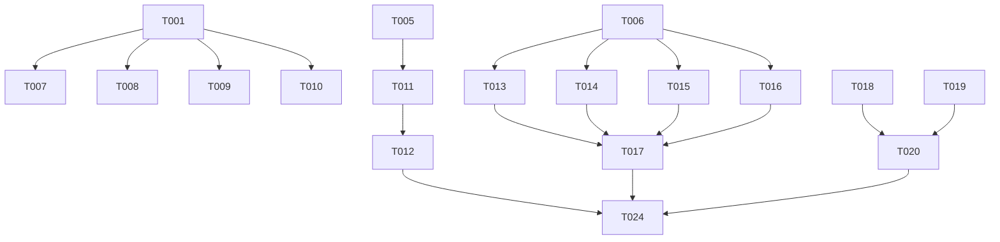

# Tasks: Bootstrap Mutations Implementation

**Feature**: Bootstrap Mutations Implementation
**Branch**: `003-bootstrap-mutations`
**Date**: 2026-03-15

## Implementation Strategy

We will follow an incremental delivery approach, starting with the core mutation primitives and their supporting connection processes. Each user story will be implemented as a complete slice including its respective unit tests. We prioritize structural correctness and atomicity (copy-on-write) as per the non-functional requirements.

1.  **Phase 1 & 2**: Establish the directory structure and foundational helpers (Primary Source logic, CGraph deep copy).
2.  **Phase 3 (US1)**: Implement the full set of 8 mutation primitives.
3.  **Phase 4 (US2)**: Implement the 4 connection processes that govern idiomatic wiring.
4.  **Phase 5 (US3)**: Implement structural optimizations (DCE, Parameter Removal).
5.  **Phase 6**: Final polish, logging integration, and validation.

## Phase 1: Setup

- [ ] T001 Initialize `egppy/egppy/physics/mutations/` package and move existing mutation files (`create.py`, `wrap.py`, `insert.py`, `crossover.py`) into it.
- [ ] T002 Create stub file for connection processes in `egppy/egppy/physics/processes.py`.
- [ ] T003 Create stub file for optimizations in `egppy/egppy/physics/optimization.py`.
- [ ] T004 Initialize test files in `tests/test_egppy/test_physics/` for mutations, processes, and optimization.

## Phase 2: Foundational

- [ ] T005 [P] Implement `CGraph` deep copy helper in `egppy/egppy/physics/mutations/common.py` to ensure transactional atomicity (FR-010).
- [ ] T006 [P] Define `PrimarySource` mapping and `ForcePrimary` connection logic in `egppy/egppy/physics/processes.py` (FR-003).

## Phase 3: User Story 1 - Full Set of Mutation Primitives (Priority: P1)

**Story Goal**: Complete the library of 8 mutation primitives.
**Independent Test**: Verify each primitive individually transforms the `CGraph` topology as expected.

- [ ] T007 [P] [US1] Implement `Rewire` mutation in `egppy/egppy/physics/mutations/rewire.py`.
- [ ] T008 [P] [US1] Implement `Delete` mutation in `egppy/egppy/physics/mutations/delete.py`.
- [ ] T009 [P] [US1] Implement `Split` mutation in `egppy/egppy/physics/mutations/split.py`.
- [ ] T010 [P] [US1] Implement `Iterate` mutation in `egppy/egppy/physics/mutations/iterate.py`.
- [ ] T011 [US1] Update `Create`, `Wrap`, `Insert`, and `Crossover` to use the atomicity pattern, verified interface compatibility, and defensive validation calls (`verify()`, `consistency()`) in `egppy/egppy/physics/mutations/`.
- [ ] T012 [US1] Implement unit tests for all 8 mutation primitives, including edge cases (Empty Mutations, Graph Disconnection, Interface Mismatch) in `tests/test_egppy/test_physics/test_mutations.py`.

## Phase 4: User Story 2 - Idiomatic Wiring via Connection Processes (Priority: P1)

**Story Goal**: Implement wiring logic that encourages functional architectures.
**Independent Test**: Perform an `Insertion` and verify that `Force Primary` correctly establishes or re-routes connections.

- [ ] T013 [P] [US2] Implement the `Create` connection process in `egppy/egppy/physics/processes.py`.
- [ ] T014 [P] [US2] Implement the `Wrap` connection process in `egppy/egppy/physics/processes.py`.
- [ ] T015 [P] [US2] Implement the `Insertion` connection process in `egppy/egppy/physics/processes.py`.
- [ ] T016 [P] [US2] Implement the `Crossover` connection process in `egppy/egppy/physics/processes.py`.
- [ ] T017 [US2] Implement unit tests for all connection processes, ensuring "Force Primary" correctly handles already-connected interfaces, in `tests/test_egppy/test_physics/test_processes.py`.

## Phase 5: User Story 3 - Structural Optimization (Priority: P2)

**Story Goal**: Prune dead code and unused parameters from genetic structures.
**Independent Test**: Verify that optimized graphs are functionally equivalent but strictly smaller.

- [ ] T018 [P] [US3] Implement `Dead Code Elimination` (DCE) using bottom-up reachability in `egppy/egppy/physics/optimization.py`.
- [ ] T019 [P] [US3] Implement `Unused Parameter Removal` in `egppy/egppy/physics/optimization.py`.
- [ ] T020 [US3] Implement unit tests for optimizations in `tests/test_egppy/test_physics/test_optimization.py`.

## Phase 6: Polish & Cross-Cutting Concerns

- [ ] T021 [P] Integrate `DEBUG` level logging for detailed topology changes across all mutation functions (FR-009).
- [ ] T021.5 [P] Implement maximum graph size enforcement (FR-008) in `egppy/egppy/physics/mutations/common.py`.
- [ ] T022 Ensure all mutation primitives explicitly verify interface type compatibility and enforce graph size limits (FR-008, FR-011).
- [ ] T023 Verify that chained mutation sequences stabilize correctly with `sfss()` in integration tests.
- [ ] T024 Final validation of all Success Criteria (SC-001 to SC-004).

## Dependency Graph

## Parallel Execution Examples

### User Story 1 (Mutations)
- Terminal 1: `T007 Rewire`, `T008 Delete`
- Terminal 2: `T009 Split`, `T010 Iterate`

### User Story 2 (Processes)
- Terminal 1: `T013 Create`, `T014 Wrap`
- Terminal 2: `T015 Insertion`, `T016 Crossover`
